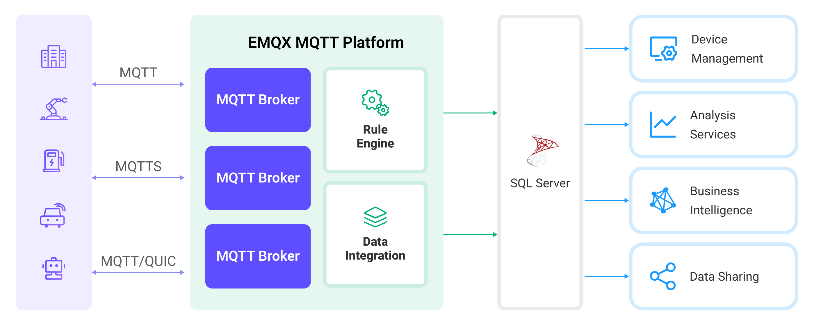

# Ingest MQTT Data into Apache IoTDB

[Apache IoTDB](https://iotdb.apache.org/) is a high-performance and scalable time series database designed to handle massive amounts of time series data generated by various IoT devices and systems. EMQX Platform supports data integration with Apache IoTDB, enabling you to seamlessly forward data via the lightweight MQTT protocol to Apache IoTDB using their [REST API V2](https://iotdb.apache.org/UserGuide/Master/API/RestServiceV2.html). The data integration ensures a single-directional flow. MQTT messages from EMQX Platform are written into the IoTDB database, leveraging both EMQX Platform's exceptional real-time data ingestion capabilities and IoTDB's specialized time-series data storage and query performance. This powerful combination is a solid foundation for businesses looking to manage their IoT data effectively.

This page provides a comprehensive introduction to the data integration between EMQX Platform and Apache IoTDB with practical instructions on creating and validating the data integration.

## How It Works

The Apache IoTDB data integration is an out-of-the-box feature in EMQX Platform designed to bridge the gap between raw MQTT-based time series data and IoTDB's powerful data storage capabilities. With a built-in [rule engine](./rules.md) component, the integration simplifies the process of ingesting data from EMQX Platform to IoTDB for storage and query, eliminating the need for complex coding.

The diagram below illustrates a typical architecture of data integration between EMQX and IoTDB. <!-- This image needs to be modified to be IoTDB specific-->



The workflow of the data integration is as follows:

1. **Message publication and reception**: Devices, whether they are part of connected vehicles, IIoT systems, or energy management platforms, establish successful connections to EMQX Platform through the MQTT protocol and send messages via MQTT based on their operational states, readings, or triggered events. When EMQX Platform receives these messages, it initiates the matching process within its rules engine.
2. **Message data processing:** When a message arrives, it passes through the rule engine and is then processed by the rule defined in EMQX Platform. The rules, based on predefined criteria, determine which messages need to be routed to IoTDB. If any rules specify payload transformations, those transformations are applied, such as converting data formats, filtering out specific information, or enriching the payload with additional context.
3. **Data buffering**: EMQX provides an in-memory message buffer to prevent data loss when the IoTDB is unavailable. Data is temporarily held in the buffer, and may be offloaded to disk to prevent memory overload. Note that data is not preserved if the data integration or the EMQX node is restarted.
4. **Data ingestion into IoTDB**: Once the rule engine identifies a message for IoTDB storage, it triggers an action of forwarding the messages to IoTDB. Processed data will be seamlessly written into the IoTDB in a time series manner.
5. **Data Storage and Utilization**: With the data now stored in IoTDB, businesses can harness its querying power for various use cases. For instance, in the realm of connected vehicles, this stored data can inform fleet management systems about vehicle health, optimize route planning based on real-time metrics, or track assets. Similarly, in IIoT settings, the data might be used to monitor machinery health, forecast maintenance, or optimize production schedules.

## Features and Benefits

The data integration with IoTDB offers a range of features and benefits tailored to ensure effective data handling and storage:

- **Efficient Data Collection**

  By integrating EMQX Platform with IoTDB, IoT time-series data can be efficiently collected through the lightweight MQTT messaging protocol from IoT devices with limited resources and ingested into the database, ensuring reliable and efficient data collection.

- **Flexible Data Transformation**

  EMQX Platform provides a powerful SQL-based Rule Engine, allowing organizations to pre-process data before storing it in IoTDB. It supports various data transformation mechanisms, such as filtering, routing, aggregation, and enrichment, enabling organizations to shape the data according to their needs.

- **Scalability and High Throughput**

  EMQX Platform is architected for horizontal scalability, effortlessly managing the surging message traffic generated by an ever-expanding fleet of IoT devices. This solution effortlessly adapts to expanding data volumes and supports high-concurrency access. As a result, IoT time-series workloads can effortlessly manage the increasing requirements of data ingestion, storage, and processing as IoT deployments scale to unprecedented levels.

- **Optimized Time-Series Storage**:

  IoTDB provides optimized storage for time-stamped data. It leverages time-partitioning, compression, and data retention policies to efficiently store and manage large volumes of time-series data. This ensures a minimal storage footprint while maintaining high performance, which is essential for IoT workloads that generate massive amounts of time-series data.

- **Fast and Complex Querying**

  IoTDB has rich query semantics, supporting time alignment for timeseries data accross devices and sensors, computation in timeseries field (frequency domain transformation) and rich aggregation function support in time dimension. It also deeply integrates with Apache Hadoop, Spark and Flink, providing more powerful analytics capabilities. EMQX seamlessly integrates with IoTDB, providing a unified solution for storing and analyzing MQTT data.

## Before You Start

This section introduces the preparatory work needed to create Apache IoTDB Data Integration in EMQX Platform.

### Prerequisites

- Understand [rules](./rules.md).
- Understand [data integration](./introduction.md).

### Set up Network

<!--@include: ./network-setting.md-->

### Start an Apache IoTDB Server

This section introduces how to start an Apache IoTDB server using [Docker](https://www.docker.com/). Make sure to have `enable_rest_service=true` in your IoTDB's configuration.

Run the following command to start an Apache IoTDB server with its REST interface enabled:

```bash
docker run -d --name iotdb-service \
              --hostname iotdb-service \
              -p 6667:6667 \
              -p 18080:18080 \
              -e enable_rest_service=true \
              -e cn_internal_address=iotdb-service \
              -e cn_target_config_node_list=iotdb-service:10710 \
              -e cn_internal_port=10710 \
              -e cn_consensus_port=10720 \
              -e dn_rpc_address=iotdb-service \
              -e dn_internal_address=iotdb-service \
              -e dn_target_config_node_list=iotdb-service:10710 \
              -e dn_mpp_data_exchange_port=10740 \
              -e dn_schema_region_consensus_port=10750 \
              -e dn_data_region_consensus_port=10760 \
              -e dn_rpc_port=6667 \
              apache/iotdb:1.1.0-standalone
```

You can find more information about running [IoTDB in Docker on Docker Hub](https://hub.docker.com/r/apache/iotdb).

## Create a Apache IoTDB Connector

Before creating data integration rules, you need to first create a Apache IoTDB connector to access the Apache IoTDB server.

1. Go to your deployment. Click **Data Integration** from the left-navigation menu.

2. If it is the first time for you to create a connector, select **Apache IoTDB** under the **Data Persistence** category. If you have already created connectors, select **New Connector** and then select **Apache IoTDB** under the **Data Persistence** category.

3. Enter the connection information:

   - **IoTDB REST Service Base URL**: IP address and port of the server.
   - **Username** and **Password**: Enter the username and password for the Connector to access the Apache IoTDB server. Use default username `root` and default password `root` here.

4. Leave the other options as default. For the configuration of **Advanced Settings** (optional): See [Advanced Configurations](https://docs.emqx.com/en/enterprise/latest/data-integration/data-bridge-iotdb.html#advanced-configurations).

5. Click the **Test** button. If the Apache IoTDB service is accessible, a success prompt will be returned.

6. Click the **New** button to complete the creation.

## Create Rules

Next, you need to create a rule to specify the data to be written and add corresponding actions in the rule to forward the processed data to Apache IoTDB.

1. Click **New Rule** in Rules area or click the New Rule icon in the **Actions** column of the connector you just created.

2. Enter the rule matching SQL statement in the **SQL editor**. In the following rule, we read the time when the message was reported `up_timestamp`, client ID, payload via `temp_hum/emqx` topic. Also, we can read temperature and humidity from this topic.

   ```sql
   SELECT
    payload.temp as temp,
    payload.hum as hum,
    payload.device_id as device_id
   FROM
    "temp_hum/emqx"
   ```

   ::: tip

   If you are a beginner user, click **SQL Examples** and **Enable Test** to learn and test the SQL rule.

   :::

3. Click **Next** to add an action.

4. Select the connector you just created from the **Connector** dropdown box.

5. **Device ID** (optional): Enter a specific device ID to be used as the device name for forwarding and inserting timeseries data into the IoTDB instance.

   :::tip

   If left empty, the device ID can still be specified in the published message or configured within the rule. For example, if you publish a JSON-encoded message with a `device_id` field, the value of that field will determine the output device ID. To extract this information using the rule engine, you can use SQL similar to the following:

   ```sql
   SELECT
     payload,
     `my_device` as payload.device_id
   ```

   However, the fixed device ID configured in this field takes precedence over any previously mentioned methods.

   :::

6. **Align Timeseries**: Disabled by default. Once enabled, the timestamp columns of a group of aligned timeseries are stored only once in IoTDB, rather than duplicating them for each individual timeseries within the group. For more information, see [Aligned timeseries](https://iotdb.apache.org/UserGuide/V1.1.x/Data-Concept/Data-Model-and-Terminology.html#aligned-timeseries).

7. Configure the **Write Data**

With this approach, you can define a template in the **Write Data** section, including as many items as needed, each with the required contextual information per row. When this template is provided, the system will generate IoTDB data by applying it to the MQTT message. The template for writing data supports batch setting via CSV file. For details, refer to [Batch Setting](#batch-setting).

For example, consider this template:

| Timestamp | Measurement | Data Type | Value   |
| --------- | ----------- | --------- | ------- |
|           | temp        | text      | ${temp} |
|           | hum         | text      | ${hum}  |

:::tip

Each column supports placeholder syntax to fill it with variables.

If the Timestamp is omitted, it will be automatically filled with the current system time in milliseconds.

:::

Then, your MQTT message can be structured as follows:

```json
{
  "temp": "27.5",
  "hum": "41.8"
}
```

8. Advanced settings (optional): See [Advanced Configurations](https://docs.emqx.com/en/enterprise/latest/data-integration/data-bridge-iotdb.html#advanced-configurations).

9. Click the **Confirm** button to complete the rule creation.

10. In the **Successful new rule** pop-up, click **Back to Rules**, thus completing the entire data integration configuration chain.

### Batch Setting

In Apache IoTDB, writing hundreds of data entries simultaneously can be challenging when configuring on the Dashboard. To address this issue, EMQX offers a functionality for batch setting data writes.

When configuring **Write Data**, you can use the batch setting feature to import fields for insertion operations from a CSV file.

1. Click the **Batch Setting** button in the **Write Data** table to open the **Import Batch Setting** popup.

2. Follow the instructions to download the batch setting template file, then fill in the data writing configuration in the template file. The default template file content is as follows:

   | Timestamp | Measurement | Data Type | Value             | Remarks (Optional)                                                                                                           |
   | --------- | ----------- | --------- | ----------------- | ---------------------------------------------------------------------------------------------------------------------------- |
   | now       | temp        | FLOAT     | ${payload.temp}   | Fields, values, and data types are mandatory. Available data type options include BOOLEAN, INT32, INT64, FLOAT, DOUBLE, TEXT |
   | now       | hum         | FLOAT     | ${payload.hum}    |                                                                                                                              |
   | now       | status      | BOOLEAN   | ${payload.status} |                                                                                                                              |
   | now       | clientid    | TEXT      | ${clientid}       |                                                                                                                              |

   - **Timestamp**: Supports placeholders in ${var} format, requiring timestamp format. You can also use the following special characters to insert system time:
     - now: Current millisecond timestamp
     - now_ms: Current millisecond timestamp
     - now_us: Current microsecond timestamp
     - now_ns: Current nanosecond timestamp
   - **Measurement**: Field name, supports constants or placeholders in ${var} format.
   - **Data Type**: Data type, with options including BOOLEAN, INT32, INT64, FLOAT, DOUBLE, TEXT.
   - **Value**: The data value to be written, supports constants or placeholders in ${var} format, and must match the data type.
   - **Remarks**: Used only for notes within the CSV file, cannot be imported into EMQX Platform.

   Note that only CSV files under 1M and with data not exceeding 2000 lines are supported.

3. Save the filled template file and upload it to the **Import Batch Setting** popup, then click **Import** to complete the batch setting.

4. After importing, you can further adjust the data in the **Write Data** table.

## Test the Rule

You are recommended to use [MQTTX](https://mqttx.app/) to simulate temperature and humidity data reporting, but you can also use any other client.

1. Use MQTTX to connect to the deployment and send messages to the following Topic.

   - topic: `temp_hum/emqx`

   - payload:

     ```json
     {
       "temp": "27.5",
       "hum": "41.8",
       "device_id": "root.sg27" // Device ID
     }
     ```

2. Check if the message has been forwarded to Apache IoTDB.

   - Check the messages by using IoTDB's command line interface. If you're using it from docker as shown above, you can connect to the server by using the following command from your terminal:

     ```bash
     $ docker exec -ti iotdb-service /iotdb/sbin/start-cli.sh -h iotdb-service
     ```

   - Query data:

     ```bash
       IoTDB> select * from root.sg27
       +------------------------+-------------+--------------+
       |                    Time|root.sg27.hum|root.sg27.temp|
       +------------------------+-------------+--------------+
       |2024-03-25T08:45:19.541Z|         41.8|          27.5|
       +------------------------+-------------+--------------+
       Total line number = 1
       It costs 0.166s
     ```

3. View operational data in the console. Click the rule ID in the rule list, and you can see the statistics of the rule and the statistics of all actions under this rule.
