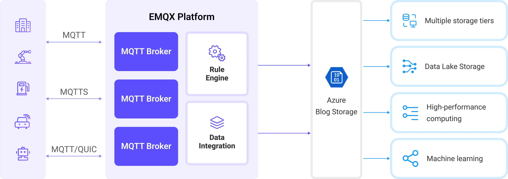
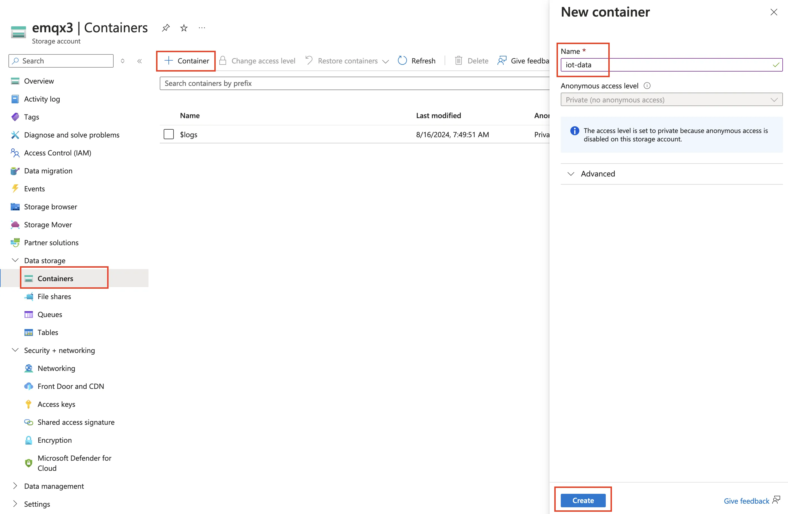
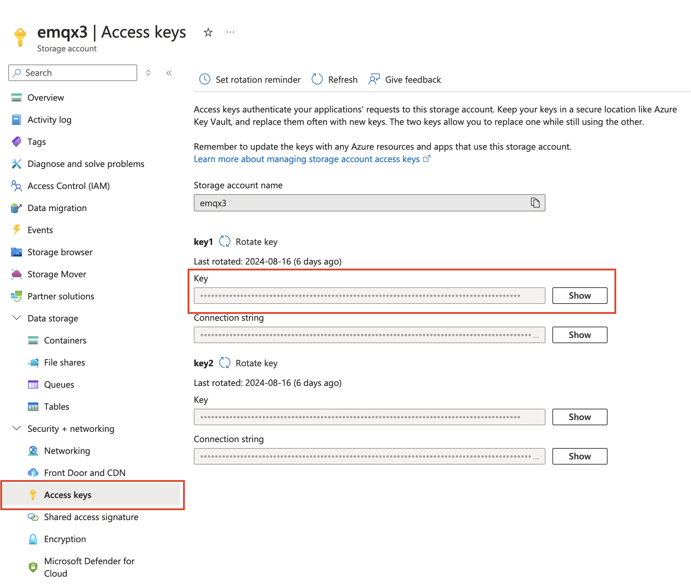

# Ingest MQTT Data into Azure Blob Storage

[Azure Blob Storage](https://azure.microsoft.com/en-us/products/storage/blobs/) is Microsoft's cloud-based object storage solution, designed specifically for handling large volumes of unstructured data. Unstructured data refers to data types that do not follow a specific data model or format, such as text files or binary data. EMQX Platform can efficiently store MQTT messages in Blob Storage containers, providing a versatile solution for storing Internet of Things (IoT) data.

This page provides a detailed introduction to the data integration between EMQX Platform and Azure Blob Storage and offers practical guidance on the rule and Sink creation.

## How It Works

Azure Blob Storage data integration in the EMQX Platform is a ready-to-use feature that can be easily configured for complex business development. In a typical IoT application, the EMQX Platform acts as the IoT platform responsible for device connectivity and message transmission, while Azure Blob Storage serves as the data storage platform, handling message data storage.



EMQX Platform utilizes rules engines and Sinks to forward device events and data to Azure Blob Storage. Applications can read data from Azure Blob Storage for further data applications. The specific workflow is as follows:

1. **Device Connection to EMQX Platform**: IoT devices trigger an online event upon successfully connecting via the MQTT protocol. The event includes device ID, source IP address, and other property information.
2. **Device Message Publishing and Receiving**: Devices publish telemetry and status data through specific topics. EMQX Platform receives the messages and compares them within the rules engine.
3. **Rules Engine Processing Messages**: The built-in rules engine processes messages and events from specific sources based on topic matching. It matches corresponding rules and processes messages and events, such as data format transformation, filtering specific information, or enriching messages with context information.
4. **Writing to Azure Blob Storage**: The rule triggers an action to write the message to the Storage Container. Using the Azure Blob Storage Sink, users can extract data from processing results and send it to Blob Storage. Messages can be stored in text or binary format, or multiple lines of structured data can be aggregated into a single CSV file, depending on the message content and the Sink configuration.

After events and message data are written to the Storage Container, you can connect to Azure Blob Storage to read the data for flexible application development, such as:

- Data archiving: Store device messages as objects in Azure Blob Storage for long-term preservation to meet compliance requirements or business needs.
- Data analysis: Import data from Storage Container into analytics services like Snowflake for predictive maintenance, device efficiency evaluation, and other data analysis services.

## Features and Advantages

Using Azure Blob Storage data integration in the EMQX Platform can bring the following features and advantages to your business:

- **Message Transformation**: Messages can undergo extensive processing and transformation in EMQX Platform rules before being written to Azure Blob Storage, facilitating subsequent storage and use.
- **Flexible Data Operations**: With the Azure Blob Storage Sink, specific fields of data can be conveniently written into Azure Blob Storage containers, supporting the dynamic setting of containers and object keys for flexible data storage.
- **Integrated Business Processes**: The Azure Blob Storage Sink allows device data to be combined with the rich ecosystem applications of Azure Blob Storage, enabling more business scenarios like data analysis and archiving.
- **Low-Cost Long-Term Storage**: Compared to databases, Azure Blob Storage offers a highly available, reliable, and cost-effective object storage service, suitable for long-term storage needs.

These features enable you to build efficient, reliable, and scalable IoT applications and benefit from business decisions and optimizations.

## Before You Start

This section introduces the preparations required before creating an Azure Blob Storage Sink in EMQX.

### Prerequisites

- Understand [Data Integration](./introduction.md).
- Familiarize yourself with [Rules](./rules.md).
- Enable the [NAT Gateway](../vas/nat-gateway.md) to support public access to Azure Storage.
### Create a Container in Azure Storage

1. To access Azure Storage, you'll need an Azure subscription. If you don't already have a subscription, create a [free account](https://azure.microsoft.com/free/) before you begin.

2. All access to Azure Storage takes place through a storage account. For this quickstart, create a storage account using the [Azure portal](https://portal.azure.com/), Azure PowerShell, or Azure CLI. For help creating a storage account, see [Create a storage account](https://learn.microsoft.com/en-us/azure/storage/common/storage-account-create).

3. To create a container in the Azure portal, navigate to your new storage account in the Azure portal. In the left menu for the storage account, scroll to the Data storage section, then select Containers. Select the + **Container** button, use `iot-data` as a name for your new container, and click **Create** to create the container.

   

4. Navigate to **Security+Networking** -> **Access keys** in the storage account, and copy the **Key**. You will need this key to configure the Sink in EMQX.

   

## Create a Connector

Before adding the Azure Blob Storage Sink, you need to create the corresponding connector.

1. In the deployment menu, select **Data Integration**, then choose Azure Blob Storage service under the data persistence services category. If you have already created other connectors, click **New Connector**, then select Azure Blob Storage service under the data persistence services category.

2. **Connector Name**: The system will automatically generate a name for the connector.

3. Enter the connection information:

   - **Account Name**: Your Storage Account name
   - **Account Key**: Your Storage Account key from the previous step
   - **Advanced Settings (Optional)**: Refer to [Advanced Configuration](https://docs.emqx.com/en/emqx/latest/data-integration/azure-blob-storage.html#advanced-settings)。

4. Click the **Test Connection** button; if the Azure Blob Storage can be accessed normally, a success message will be returned.

5. Click the **Create** button to complete the creation of the connector.

## Create a Rule

Next, you need to create a rule that specifies the data to be written and add response actions to forward the processed data to Azure Blob Storage.

1. Click the new rule icon under the **Actions** column in the connector list or click **New Rule** in the **Rules List** to enter the **Create New Rule** step page.

2. Input the following rule SQL in the SQL editor:

   ```sql
   SELECT
     *
   FROM
       "t/#"
   ```

   ::: tip

   If you're new to SQL, you can click **SQL Examples** and **Enable Test** to learn and test the results of the rule SQL.

   :::

3. Click **Next** to start creating actions.

4. From the **Use Connector** dropdown, select the connector you previously created.

5. Set the **Container** by entering `iot-data`.

6. Select the **Upload Method**. The differences between the two methods are as follows:

   - **Direct Upload**: Each time the rule is triggered, data is uploaded directly to Azure Storage according to the preset object key and content. This method is suitable for storing binary or large text data. However, it may generate a large number of files.
   - **Aggregated Upload**: This method packages the results of multiple rule triggers into a single file (such as a CSV file) and uploads it to Azure Storage, making it suitable for storing structured data. It can reduce the number of files and improve write efficiency.

   The configuration parameters differ for each method. Please configure according to the selected method:

   :::: tabs type

   ::: tab Direct Upload

   Direct Upload requires configuring the following fields:

   - **Blob Name**: Defines the object's location to be uploaded to the container. It supports placeholders in the format of `${var}` and can use `/` to specify storage directories. It's also necessary to set the object's suffix for management and differentiation. Here, enter `msgs/${clientid}_${timestamp}.json`, where `${clientid}` is the client ID and `${timestamp}` is the timestamp of the message. This ensures that each device's messages are written to different objects.
   - **Object Content**: By default, this is in JSON text format containing all fields. It supports placeholders in the format of `${var}`. Here, enter `${payload}` to use the message body as the object content. The storage format of the object depends on the format of the message body, supporting compressed files, images, or other binary formats.

   :::

   ::: tab Aggregate Upload

   Aggregate Upload requires configuring the following parameters:

   - **Blob Name**: Used to specify the storage path of the object. The following variables can be used:

     - **`${action}`**: Action name (required).
     - **`${node}`**: Name of the EMQX node performing the upload (required).
     - **`${datetime.{format}}`**: Start date and time of the aggregation, with the format specified by the `{format}` string (required):
       - **`${datetime.rfc3339utc}`**: RFC3339 date and time in UTC format.
       - **`${datetime.rfc3339}`**: RFC3339 date and time in local time zone format.
       - **`${datetime.unix}`**: Unix timestamp.
     - **`${datetime_until.{format}}`**: End date and time of the aggregation, with format options as above.
     - **`${sequence}`**: Sequence number for aggregated uploads within the same time interval (required).

     Note that if all placeholders marked as required are not used in the template, these placeholders will be automatically added to the Blob Name as path suffixes to avoid duplication. All other placeholders are considered invalid.

   - **Aggregation Type**: Currently, only CSV is supported. Data will be written to Azure Storage in comma-separated CSV format.

   - **Column Order**: Adjust the order of rule result columns through a dropdown selection. The generated CSV file will first be sorted by the selected columns, with unselected columns sorted alphabetically following the selected columns.

   - **Max Records**: When the maximum number of records is reached, the aggregation of a single file will be completed and uploaded, resetting the time interval.

   - **Time Interval**: When the time interval is reached, even if the maximum number of records has not been reached, the aggregation of a single file will be completed and uploaded, resetting the maximum number of records.

   ::: 

   ::::

7. Configure advanced settings options as needed (optional), details can be found in [Advanced Settings](https://docs.emqx.com/en/emqx/latest/data-integration/azure-blob-storage.html#advanced-settings)。

8. Click the **Confirm** button to complete the action configuration.

9. In the popup success message box, click **Return to Rule List** to complete the data integration configuration.

## Test the Rule

This section shows how to test the rule configured with the direct upload method.

1. Use MQTTX to publish a message to the topic `t/1`:

```bash
mqttx pub -i emqx_c -t t/1 -m '{ "msg": "Hello Azure" }'
```

2. After sending a few messages, log in to the [Azure portal](https://portal.azure.com/), navigate to the storage account, and open the `iot-data` container. You should see the uploaded objects in the container.

3. Check the runtime data in the EMQX Platform Console. Click on the rule ID in the rules list, and you can view the statistics of the rule and all actions under this rule on the runtime statistics page.
