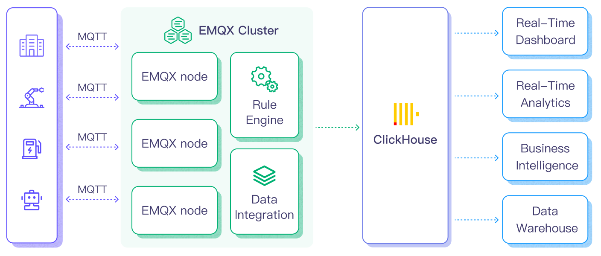

# Ingest MQTT Data into ClickHouse

[ClickHouse](https://clickhouse.com/) is a high-performance, column-oriented SQL database management system (DBMS) for online analytical processing (OLAP), that excels in processing and analyzing large volumes of data with minimal latency. It features excellent query performance, a flexible data model, and scalable distributed architecture, making it suitable for various data analytics scenarios. EMQX Platform supports integration with ClickHouse, which enables you to ingest the MQTT messages and events data into ClickHouse for further analysis and processing.

## How It Works

ClickHouse data integration is an out-of-the-box feature in EMQX Platform designed to combine the MQTT's real-time data capturing and transmission capabilities with ClickHouse's powerful data processing functionality. With a built-in rule engine component, the integration simplifies the process of ingesting data from EMQX Platform to ClickHouse for storage and analysis, eliminating the need for complex coding.

The diagram below illustrates a typical architecture of data integration between EMQX Platform and ClickHouse.



Ingesting MQTT data into ClickHouse works as follows:

1. **Message publication and reception**: Industrial IoT devices establish successful connections to EMQX Platform through the MQTT protocol and publish real-time MQTT data from machines, sensors, and product lines based on their operational states, readings, or triggered events to EMQX Platform. When EMQX Platform receives these messages, it initiates the matching process within its rules engine.
2. **Message data processing:** When a message arrives, it passes through the rule engine and is then processed by the rule defined in EMQX Platform. The rules, based on predefined criteria, determine which messages need to be routed to ClickHouse. If any rules specify payload transformations, those transformations are applied, such as converting data formats, filtering out specific information, or enriching the payload with additional context.
3. **Data ingestion into ClickHouse**: Once the rule engine identifies a message for ClickHouse storage, it triggers an action of forwarding the messages to ClickHouse. Processed data will be seamlessly written into the collection of the ClickHouse database.
4. **Data Storage and Utilization**: With the data now stored in ClickHouse, businesses can harness its querying power for various use cases. For instance, in logistics and supply chain management fields, data from IoT devices such as GPS trackers, temperature sensors, and inventory management systems can be monitored and analyzed for real-time tracking, route optimization, demand forecasting, and efficient inventory management.

## Features and Benefits

The data integration with ClickHouse offers a range of features and benefits tailored to ensure efficient data transmission, storage, and utilization:

- **Real-time Data Streaming**: EMQX Platform is built for handling real-time data streams, ensuring efficient and reliable data transmission from source systems to ClickHouse. It enables organizations to capture and analyze data in real-time, making it ideal for use cases requiring immediate insights and actions.
- **High Performance and Scalability**: EMQX Platform's distributed architecture and ClickHouse's columnar storage format enable seamless scalability as data volumes increase. This ensures consistent performance and responsiveness, even with large datasets.
- **Flexibility in Data Transformation:** EMQX Platform provides a powerful SQL-based Rule Engine, allowing organizations to pre-process data before storing it in ClickHouse. It supports various data transformation mechanisms, such as filtering, routing, aggregation, and enrichment, enabling organizations to shape the data according to their needs.
- **Easy Deployment and Management:** EMQX Platform provides a user-friendly interface for configuring data sources, pre-processing data rules, and ClickHouse storage settings. This simplifies the setup and ongoing management of the data integration process.
- **Advanced Analytics:** ClickHouse's powerful SQL-based query language and support for complex analytical functions empower users to gain valuable insights from IoT data, enabling predictive analytics, anomaly detection, and more.

## Before You Start

This section describes the preparations you need to complete before you start to create the ClickHouse data integration in EMQX Platform Console.

### Prerequisites

- Knowledge about [data integration](./introduction.md)
- Knowledge about data integration [rules](./rules.md)

### Start a ClickHouse Server

You can start a ClickHouse server and create a database either using [Docker](https://www.docker.com/) or using ClickHouse Cloud.

#### Start a ClickHouse Server using Docker

1. Create a file called `init.sql` using the following initialization SQL statements. This file helps to initialize the database when the container starts up.

   ```bash
   cat >init.sql <<SQL_INIT
   CREATE DATABASE IF NOT EXISTS mqtt_data;
   CREATE TABLE IF NOT EXISTS mqtt_data.messages (
      data String,
      arrived TIMESTAMP
   ) ENGINE = MergeTree()
   ORDER BY arrived;
   SQL_INIT
   ```

2. Start a ClickHouse server using the following command. The command defines the database name, port number, user name, and password. It will also mount the `init.sql` file in the current directory to the docker directory.

   ```bash
   docker run \
   --rm \
   -e CLICKHOUSE_DB=mqtt_data \
   -e CLICKHOUSE_USER=emqx \
   -e CLICKHOUSE_DEFAULT_ACCESS_MANAGEMENT=1 \
   -e CLICKHOUSE_PASSWORD=public \
   -p 18123:8123 \
   -p 19000:9000 \
   --ulimit nofile=262144:262144 \
   -v $pwd/init.sql:/docker-entrypoint-initdb.d/init.sql \
   clickhouse/clickhouse-server
   ```

You can find more information about running ClickHouse in docker [on dockerhub](https://hub.docker.com/r/clickhouse/clickhouse-server).

#### Start a ClickHouse Server using ClickHouse Cloud

1. Visit https://clickhouse.cloud/ and sign up to create a service.
2. Learn how to use ClickHouse quickly from the official documentation: [ClickHouse Cloud - Quick Start](https://clickhouse.com/docs/en/cloud-quick-start)
3. After you have created your ClickHouse Cloud, go to the **Services** page, click on your service, and then open the SQL Console.
4. In the SQL Console, on the left side, click **Queries**, and then click **+New query**.
5. Create a database named `mqtt_data`.
   ```bash
   CREATE DATABASE IF NOT EXISTS mqtt_data;
   CREATE TABLE IF NOT EXISTS mqtt_data.messages (
      data String,
      arrived TIMESTAMP
   ) ENGINE = MergeTree()
   ORDER BY arrived;
   ```

## Create a Connector

Before creating data integration rules, you need to first create a ClickHouse connector to access the ClickHouse server.

1.  Go to your deployment. Click **Data Integration** from the left-navigation menu. If it is the first time for you to create a connector, select **ClickHouse** under the **Data Persistence** category. If you have already created connectors, select **New Connector** and then select **ClickHouse** under the **Data Persistence** category.

2.  **Connector Name**: The system will automatically generate a connector name.

3.  Enter the connection information:

    - **Connector name**: Enter a name for the connector, which should be a combination of upper and lower-case letters and numbers, for example: `my_clickhouse`.
    - **Server URL**: `http://{host}:{port}`
    - **Database Name**: `mqtt_data`
    - **Username**: `emqx`
    - **Password**: `public`
    - Configure advanced settings according to your business needs (optional).

4.  Click the **Test** button. If the ClickHouse service is accessible, a prompt indicating **connector available** will be returned.

5.  Click the **New** button to complete the creation.

## Create a Rule

This section demonstrates how to create a ClickHouse Rule and add action to the rule via the EMQX Platform Console.

1. Click **New Rule** in the Rules area or click the New Rule icon in the **Actions** column of the connector you just created.

2. Set the rules in the **SQL Editor** based on the feature to use, Our goal is to trigger the engine when the client sends a temperature and humidity message to the `temp_hum/emqx` topic. Here you need a certain process of SQL:

   ```sql
     SELECT
      timestamp div 1000 as up_timestamp,
      clientid as client_id,
      payload
     FROM
      "temp_hum/emqx"
   ```

   ::: tip

   If you are a beginner user, click **SQL Examples** and **Enable Test** to learn and test the SQL rule.

   :::

3. Click **Next** to add an action.

4. Select the connector you just created from the **Connector** dropdown box.

5. **Batch Value Separator**To distinguish between multiple input items, in this example, you can retain the default `,`. 

   Note: the default is a comma ',', which is suitable for VALUES format. You can also use other separators, please refer to the [ClickHouse data formats](https://clickhouse.com/docs/en/sql-reference/statements/insert-into).

6. Enter the following command in the SQL template (You can use the [Rule Engine](./rules.md) to ensure that strings in the input SQL statement are properly escaped to prevent SQL injection attacks):

   ```sql
   INSERT INTO messages(data, arrived) VALUES ('${payload}', ${up_timestamp})
   ```

   Here, `${payload}` and `${up_timestamp}` represent the message content and timestamp, respectively, which will be configured later in the rules for message forwarding. EMQX Platform will replace them with the corresponding content before forwarding the message.

7. Advanced settings (optional): See [Advanced Configurations](#advanced-configurations).

8. Click the **Confirm** button to complete the rule creation.

9. In the **Successful new rule** pop-up, click **Back to Rules**, thus completing the entire data integration configuration chain.

## Test the Rule

You are recommended to use [MQTTX](https://mqttx.app/) to simulate temperature and humidity data reporting, but you can also use any other client.

1. Use MQTTX to connect to the deployment and send messages to the following Topic.

   - topic: `temp_hum/emqx`

   - client id: `test_client`

   - payload:

     ```json
     {
       "temp": "27.5",
       "hum": "41.8"
     }
     ```

2. Click **Publish** to send the message. An entry should have been inserted in the table `messages` in the database `mqtt_data` in the ClickHouse server. You can check this by running the following command from a terminal:

   ```bash
   curl -u emqx:public -X POST -d "SELECT * FROM mqtt_data.messages" http://{host}:18123
   ```

   If everything is working correctly the command above should print something like this (obviously, the timestamp will be different):

   ```bash
   {\n  "temp": "27.5",\n  "hum": "41.8"\n}        2024-03-27 09:35:11
   ```

## Advanced Configurations

This section delves deeper into the advanced configuration options available for the EMQX Platform ClickHouse Connector. When configuring the Connector in the Console, navigate to **Advanced Settings** to tailor the following parameters to meet your specific needs.

| **Fields**                | **Descriptions**                                             | **Recommended Value** |
| ------------------------- | ------------------------------------------------------------ | --------------------- |
| **Connection Pool Size**  | Specifies the number of concurrent connections that can be maintained in the connection pool when interfacing with the ClickHouse service. This option helps in managing the application's scalability and performance by limiting or increasing the number of active connections between EMQX Platform and ClickHouse.<br/>**Note**: Setting an appropriate connection pool size depends on various factors such as system resources, network latency, and the specific workload of your application. Too large a pool size may lead to resource exhaustion, while too small a size may limit throughput. | `8`                   |
| **Clickhouse Timeout**    | Specifies the maximum amount of time, in seconds, that the Connector will wait while attempting to establish a connection with the ClickHouse server.<br/>**Note**: A carefully chosen timeout setting is crucial for balancing system performance and resource utilization. It is advisable to test the system under various network conditions to find the optimal timeout value for your specific use case. | `15`                  |
| **Start Timeout**         | Determines the maximum time interval, in seconds, that the Connector will wait for an auto-started resource to reach a healthy state before responding to resource creation requests. This setting helps ensure that the Connector does not proceed with operations until it verifies that the connected resource—such as a database instance in ClickHouse—is fully operational and ready to handle data transactions. | `5`                   |
| **Buffer Pool Size**      | Specifies the number of buffer worker processes that will be allocated for managing data flow in egress-type between EMQX Platform and ClichHouse. These worker processes are responsible for temporarily storing and handling data before it is sent to the target service. This setting is particularly relevant for optimizing performance and ensuring smooth data transmission in egress (outbound) scenarios. For bridges that only deal with ingress (inbound) data flow, this option can be set to "0" as it is not applicable. | `16`                  |
| **Request TTL**           | The "Request TTL" (Time To Live) configuration setting specifies the maximum duration, in seconds, that a request is considered valid once it enters the buffer. This timer starts ticking from the moment the request is buffered. If the request stays in the buffer for a period exceeding this TTL setting or if it is sent but does not receive a timely response or acknowledgment from ClickHouse, the request is deemed to have expired. | `45`                  |
| **Health Check Interval** | Specifies the time interval, in seconds, at which the Connector will perform automated health checks on the connection to ClickHouse. | `15`                  |
| **Max Buffer Queue Size** | Specifies the maximum number of bytes that can be buffered by each buffer worker in the ClickHouse Connector. Buffer workers temporarily store data before it is sent to ClickHouse, serving as an intermediary to handle data flow more efficiently. Adjust the value according to your system's performance and data transfer requirements. | `256`                 |
| **Batch Size**            | Specifies the maximum size of data batches that can be transmitted from EMQX Platform to ClickHouse in a single transfer operation. By adjusting the size, you can fine-tune the efficiency and performance of data transfer between EMQX Platform and ClickHouse.<br />If the "Max Batch Size" is set to "1," data records are sent individually, without being grouped into batches. | `1`                   |
| **Query Mode**            | Allows you to choose `asynchronous` or `synchronous` query modes to optimize message transmission based on different requirements. In asynchronous mode, writing to ClickHouse does not block the MQTT message publish process. However, this might result in clients receiving messages ahead of their arrival in ClickHouse. | `Async`               |
| **Inflight Window**       | An "in-flight query" refers to a query that has been initiated but has not yet received a response or acknowledgment. This setting controls the maximum number of in-flight queries that can exist simultaneously when the Connector is communicating with ClickHouse.<br/>When the **Query Mode** is set to `async` (asynchronous), the "Inflight Window" parameter gains special importance. If it is crucial for messages from the same MQTT client to be processed in strict order, you should set this value to 1. | `100`                 |

## More Information

Check out the following links to learn more:

**Blogs**:

- [EMQX + ClickHouse implements IoT data collection and analysis](https://www.emqx.com/en/blog/emqx-and-clickhouse-for-iot-data-access-and-analysis)
- [MQTT to ClickHouse Integration: Fueling Real-Time IoT Data Analytics](https://www.emqx.com/en/blog/mqtt-to-clickhouse-integration)
