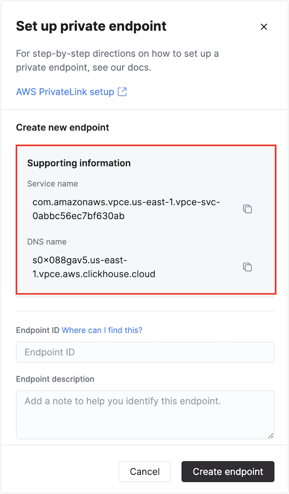
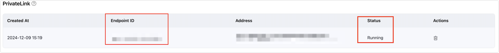
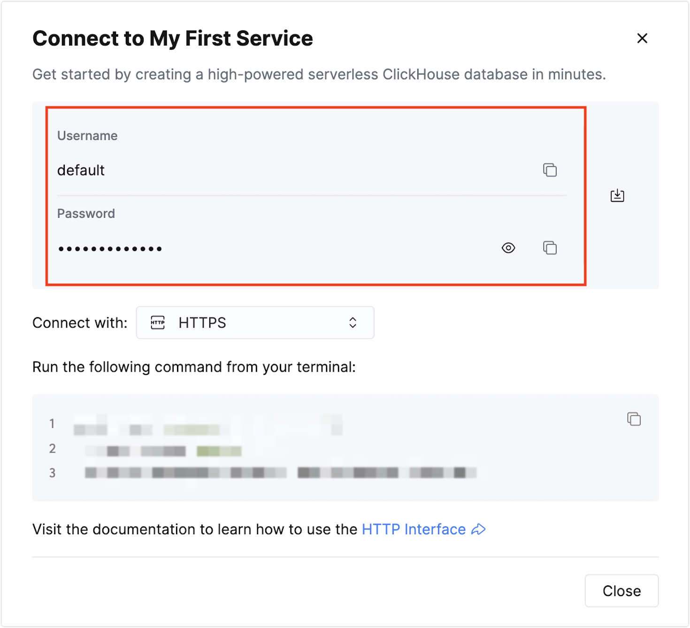

# Ingest MQTT Data into ClickHouse Cloud

[ClickHouse Cloud](https://clickhouse.com/cloud) is the fully managed cloud service officially provided by ClickHouse. It inherits all the powerful features of ClickHouse while eliminating the complexity of deploying and maintaining database infrastructure. ClickHouse Cloud allows you to quickly launch database instances, benefit from high availability, automatic scaling, and built-in security, and take advantage of pay-as-you-go pricing, helping you focus on data analysis and business growth.
The EMQX Platform supports integration with ClickHouse Cloud, enabling you to ingest MQTT messages and event data into ClickHouse Cloud for further analysis and processing.  

## How It Works

The integration of ClickHouse Cloud into the EMQX Platform is an out-of-the-box feature designed to merge the real-time data capture and transmission capabilities of MQTT with the robust data processing functionalities of ClickHouse Cloud. By utilizing a built-in rule engine, this integration simplifies the ingestion process from the EMQX Platform to ClickHouse, facilitating efficient data storage and analysis while eliminating the need for complex coding.

The diagram below illustrates a typical architecture of data integration between the EMQX Platform and ClickHouse Cloud.

**EMQX Platform-ClickHouse Integration**

Ingesting MQTT data into ClickHouse Cloud operates as follows:

1. **Message Publishing and Reception**: Industrial IoT devices establish successful connections to the EMQX Platform via the MQTT protocol, publishing real-time data based on their operational states, readings, or triggered events. When the EMQX Platform receives these messages, it initiates a matching process within its rule engine.

2. **Message Data Processing**: Upon message arrival, it traverses the rule engine where predefined rules dictate which messages should be routed to ClickHouse Cloud. If any rules specify payload transformations, such as data format conversion, filtering, or enriching the payload with additional context, those transformations are executed.

3. **Data Ingestion into ClickHouse Cloud**: Once the rule engine identifies messages for ClickHouse storage, it triggers the action to forward these messages to ClickHouse Cloud. The processed data is seamlessly written into the ClickHouse database.

4. **Data Storage and Utilization**: With data securely stored in ClickHouse Cloud, businesses can leverage its powerful querying capabilities for diverse applications. For instance, in logistics and supply chain management, IoT data from GPS trackers, temperature sensors, and inventory systems can be monitored and analyzed for real-time tracking, route optimization, demand forecasting, and effective inventory management.

## Features and Benefits

The integration with ClickHouse Cloud offers a multitude of features and benefits tailored to ensure efficient data transmission, storage, and utilization:

- **Real-time Data Streaming**: The EMQX Platform is engineered to handle real-time data streams, guaranteeing efficient and reliable transmission from source systems to ClickHouse Cloud. This capability allows organizations to capture and analyze data in real-time, making it ideal for use cases that demand immediate insights and actions.

- **High Performance and Scalability**: The distributed architecture of the EMQX Platform, combined with the columnar storage format of ClickHouse Cloud, enables seamless scalability as data volumes increase. This design ensures consistent performance and responsiveness, even with extensive datasets.

- **Flexibility in Data Transformation**: The EMQX Platform features a powerful SQL-based rule engine that enables organizations to preprocess data before it is stored in ClickHouse Cloud. This flexibility supports various transformation mechanisms, including filtering, routing, aggregation, and enrichment, allowing organizations to shape the data according to their specific needs.

- **Easy Deployment and Management**: The EMQX Platform offers a user-friendly interface for configuring data sources, setting up preprocessing rules, and managing ClickHouse Cloud storage settings. This simplifies the setup and ongoing management of the data integration process.

- **Advanced Analytics**: ClickHouse Cloud’s powerful SQL-based query language, along with support for complex analytical functions, empowers users to extract valuable insights from IoT data. This capability enables predictive analytics, anomaly detection, and more.

By integrating with ClickHouse Cloud, organizations can leverage its powerful cloud storage and processing capabilities along with simplified operational processes to build an efficient and flexible IoT data architecture, enabling real-time data analysis and insights.


## Before You Start

This section describes the preparations you need to complete before you start to create the ClickHouse Cloud data integration in EMQX Platform Console.

### Prerequisites

- Knowledge about [data integration](./introduction.md)
- Knowledge about data integration [rules](./rules.md)

### Start a ClickHouse Cloud Service

1. Visit [ClikeHouse Cloud](https://clickhouse.cloud/) and sign up to create a service.
2. Learn how to use ClickHouse quickly from the official documentation: [ClickHouse Cloud - Quick Start](https://clickhouse.com/docs/en/cloud-quick-start)
3. After you have created your ClickHouse Cloud, go to the **Services** page, click on your service, and then open the SQL Console.
4. In the SQL Console, on the left side, click **Queries**, and then click **+New query**.
5. Create a database named `mqtt_data`.
   ```bash
   CREATE DATABASE IF NOT EXISTS mqtt_data;
   CREATE TABLE IF NOT EXISTS mqtt_data.messages (
      data String,
      arrived TIMESTAMP
   ) ENGINE = MergeTree()
   ORDER BY arrived;
   ```
## Configure Networking

Before connecting to ClickHouse Cloud, you need to create a PrivateLink in the EMQX Platform and configure a PrivateLink endpoint service in ClickHouse Cloud to establish a private network connection between your EMQX deployment and the ClickHouse Cloud server.  


**Steps to Configure:**

1. Log in to the [EMQX Platform console](https://cloud-intl.emqx.com/console/) and go to the overview page of your desired deployment.

2. Navigate to **Network Management**, and under the **PrivateLink** section, click the **"+ Private Connection"** button.

3. Confirm the prompt and click the **Next Step**.

4. Log in to the ClickHouse Cloud platform, open your ClickHouse Cloud service. Click **Settings** from the left navigation menu and find the **Private endpoints**, click **Set up private endpoint**. Find the **Service Name** and **DNS Name**, and save them for later.


5. Enter the **Service Name** into the EMQX Platform as the endpoint service name. Click **Create Private Connection**.

6. Wait for the connection status to change to **Running** on the deployment details page. Save the **Endpoint ID** for later.


7. Go back to the ClickHouse Cloud platform, add the **Endpoint ID** from the EMQX Platform to **Private Endpoints**, provide a description (optional), and click **Create Endpoint**.

8. Wait for the "success" message to appear. Then, check the **Private endpoints** section in ClickHouse Cloud to confirm that the newly configured Endpoint ID is displayed, indicating that the PrivateLink between the EMQX Platform and ClickHouse Cloud has been successfully established.


## Create a Connector

Before creating data integration rules, you need to first create a ClickHouse connector to access the ClickHouse server.

1. Go to your deployment. Click **Data Integration** from the left navigation menu. If it is your first time creating a connector, select **ClickHouse** under the **Data Persistence** category. If you have already created connectors, select **New Connector** and then select **ClickHouse** under the **Data Persistence** category.

2. **Connector Name**: The system generates a connector name automatically.

3. Enter the connection information:

   - **Server URL**: Prefix the URL with `https://`, using the DNS name information of the Private endpoint in ClickHouse Cloud that you previously saved, along with port number 8443. (e.g., `https://{ClickHouse Cloud DNS name}:8443`).
   - **Database Name**: `mqtt_data`
   - **Username and Password**: On the left navigation menu of your ClickHouse Cloud page, click on **Connect** to find your current username and password for ClickHouse Cloud, and fill them in on the EMQX Platform page.  
     
   - Configure advanced settings based on your business requirements (optional).
     
   ::: tip

   Note that the DNS Name entered here is the private address, which differs from the public IP available in the Connect section.

   :::

4.  Click the **Test** button. If the ClickHouse service is accessible, a prompt indicating **connector available** will be returned.

5.  Click the **New** button to complete the creation.

## Create a Rule

This section demonstrates how to create a ClickHouse Rule and add action to the rule via the EMQX Platform Console.

1. Click **New Rule** in the Rules area or click the New Rule icon in the **Actions** column of the connector you just created.

2. Set the rules in the **SQL Editor** based on the feature to use, Our goal is to trigger the engine when the client sends a temperature and humidity message to the `temp_hum/emqx` topic. Here you need a certain process of SQL:

   ```sql
     SELECT
      timestamp div 1000 as up_timestamp,
      clientid as client_id,
      payload
     FROM
      "temp_hum/emqx"
   ```

   ::: tip

   If you are a beginner user, click **SQL Examples** and **Enable Test** to learn and test the SQL rule.

   :::

3. Click **Next** to add an action.

4. Select the connector you just created from the **Connector** dropdown box.

5. **Batch Value Separator**To distinguish between multiple input items, in this example, you can retain the default `,`. 

   Note: the default is a comma ',', which is suitable for VALUES format. You can also use other separators, please refer to the [ClickHouse data formats](https://clickhouse.com/docs/en/sql-reference/statements/insert-into).

6. Enter the following command in the SQL template (You can use the [Rule Engine](./rules.md) to ensure that strings in the input SQL statement are properly escaped to prevent SQL injection attacks):

   ```sql
   INSERT INTO messages(data, arrived) VALUES ('${payload}', ${up_timestamp})
   ```

   Here, `${payload}` and `${up_timestamp}` represent the message content and timestamp, respectively, which will be configured later in the rules for message forwarding. EMQX Platform will replace them with the corresponding content before forwarding the message.

   If a placeholder variable is undefined in the SQL template, you can toggle the **Undefined Vars as Null** switch above the **SQL template** to define the rule engine behavior:

   - **Disabled** (default): The rule engine can insert the string `undefined` into the database.

   - **Enabled**: Allow the rule engine to insert `NULL` into the database when a variable is undefined.

     ::: tip

     If possible, this option should always be enabled; disabling the option is only used to ensure backward compatibility.

     :::

7. Advanced settings (optional): See [Advanced Configurations](#advanced-configurations).

8. Click the **Confirm** button to complete the rule creation.

9. In the **Successful new rule** pop-up, click **Back to Rules**, thus completing the entire data integration configuration chain.

## Test the Rule

You are recommended to use [MQTTX](https://mqttx.app/) to simulate temperature and humidity data reporting, but you can also use any other client.

1. Use MQTTX to connect to the deployment and send messages to the following topic.

   - Topic: `temp_hum/emqx`
   - Client ID: `test_client`
   - Payload:

     ```json
     {
       "temp": "27.5",
       "hum": "41.8"
     }
     ```

2. Click **Publish** to send the message. An entry should have been inserted in the `messages` table in the `mqtt_data` database on the ClickHouse Cloud server. You can verify this by checking the `messages` table under the `mqtt_data` database using the SQL Console.


This section delves deeper into the advanced configuration options available for the EMQX Platform ClickHouse Connector. When configuring the Connector in the Console, navigate to **Advanced Settings** to tailor the following parameters to meet your specific needs.

| **Fields**                | **Descriptions**                                             | **Recommended Value** |
| ------------------------- | ------------------------------------------------------------ | --------------------- |
| **Connection Pool Size**  | Specifies the number of concurrent connections that can be maintained in the connection pool when interfacing with the ClickHouse service. This option helps in managing the application's scalability and performance by limiting or increasing the number of active connections between EMQX Platform and ClickHouse.<br/>**Note**: Setting an appropriate connection pool size depends on various factors such as system resources, network latency, and the specific workload of your application. Too large a pool size may lead to resource exhaustion, while too small a size may limit throughput. | `8`                   |
| **Clickhouse Timeout**    | Specifies the maximum amount of time, in seconds, that the Connector will wait while attempting to establish a connection with the ClickHouse server.<br/>**Note**: A carefully chosen timeout setting is crucial for balancing system performance and resource utilization. It is advisable to test the system under various network conditions to find the optimal timeout value for your specific use case. | `15`                  |
| **Start Timeout**         | Determines the maximum time interval, in seconds, that the Connector will wait for an auto-started resource to reach a healthy state before responding to resource creation requests. This setting helps ensure that the Connector does not proceed with operations until it verifies that the connected resource—such as a database instance in ClickHouse—is fully operational and ready to handle data transactions. | `5`                   |
| **Buffer Pool Size**      | Specifies the number of buffer worker processes that will be allocated for managing data flow in egress-type between EMQX Platform and ClichHouse. These worker processes are responsible for temporarily storing and handling data before it is sent to the target service. This setting is particularly relevant for optimizing performance and ensuring smooth data transmission in egress (outbound) scenarios. For bridges that only deal with ingress (inbound) data flow, this option can be set to "0" as it is not applicable. | `16`                  |
| **Request TTL**           | The "Request TTL" (Time To Live) configuration setting specifies the maximum duration, in seconds, that a request is considered valid once it enters the buffer. This timer starts ticking from the moment the request is buffered. If the request stays in the buffer for a period exceeding this TTL setting or if it is sent but does not receive a timely response or acknowledgment from ClickHouse, the request is deemed to have expired. | `45`                  |
| **Health Check Interval** | Specifies the time interval, in seconds, at which the Connector will perform automated health checks on the connection to ClickHouse. | `15`                  |
| **Max Buffer Queue Size** | Specifies the maximum number of bytes that can be buffered by each buffer worker in the ClickHouse Connector. Buffer workers temporarily store data before it is sent to ClickHouse, serving as an intermediary to handle data flow more efficiently. Adjust the value according to your system's performance and data transfer requirements. | `256`                 |
| **Batch Size**            | Specifies the maximum size of data batches that can be transmitted from EMQX Platform to ClickHouse in a single transfer operation. By adjusting the size, you can fine-tune the efficiency and performance of data transfer between EMQX Platform and ClickHouse.<br />If the "Max Batch Size" is set to "1," data records are sent individually, without being grouped into batches. | `1`                   |
| **Query Mode**            | Allows you to choose `asynchronous` or `synchronous` query modes to optimize message transmission based on different requirements. In asynchronous mode, writing to ClickHouse does not block the MQTT message publish process. However, this might result in clients receiving messages ahead of their arrival in ClickHouse. | `Async`               |
| **Inflight Window**       | An "in-flight query" refers to a query that has been initiated but has not yet received a response or acknowledgment. This setting controls the maximum number of in-flight queries that can exist simultaneously when the Connector is communicating with ClickHouse.<br/>When the **Query Mode** is set to `async` (asynchronous), the "Inflight Window" parameter gains special importance. If it is crucial for messages from the same MQTT client to be processed in strict order, you should set this value to 1. | `100`                 |
