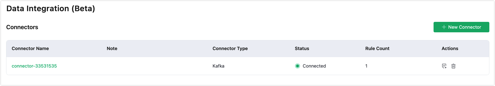
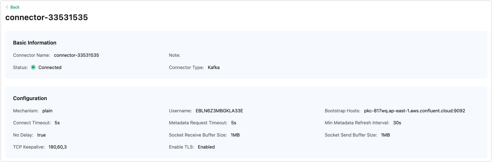

# Connector

Connectors are used to connect EMQX Cloud to cloud resources, which are services provided by cloud service providers or services operated by yourself. Connectors are only concerned with the connection to cloud resources, and users can create different connectors for different cloud resources. EMQX Cloud currently supports connections to two types of resources: `HTTP Server` and `Kafka`, so you can create the following connectors:

- [HTTP Server Connector](./http_server.md#creating-an-http-server-connector), for forwarding data to an HTTP service.
- [Kafka Connector](./kafka.md#creating-a-kafka-connector), for forwarding data to Kafka service as a producer.

## Create a Connector

::: tip Prerequisite

Before creating a connector, make sure the current deployment is running.

:::

1. If you are creating a connector for the first time, select the resource you want to connect to on the Data Integration Connectors page, such as **Kafka**. If you have created connectors before, you can create a new connector by clicking the **New Connector** button in the upper right corner of the page.
2. Fill in the corresponding resource configuration and click the **Test** button. If the connection is successful, a success prompt will be displayed, and you can click to view it. If it fails, check the connector configuration.

## View Connector List and Details

The information on the newly created connector will be displayed in the **Connector List**, including the connector's name, type, status, and the number of associated rules. One connector can correspond to multiple rules.

Click on the connector ID to view details. The basic information and configuration information display the default configuration and the content you filled in during configuration.

## Delete a Connector

1. Make sure to clear all rules under the connector before deleting it.
2. In the **Connector List**, click the **Delete** button to delete a connector.
3. You must enter the connector's ID to confirm the deletion.
