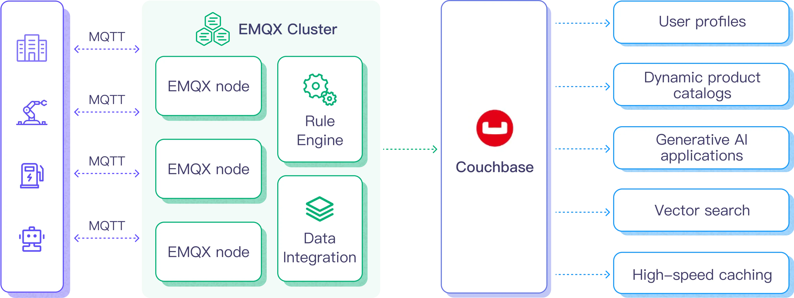

# Ingest MQTT Data into Couchbase

[Couchbase](https://couchbase.com/) is a versatile distributed database that combines the advantages of relational databases (such as SQL and ACID transactions) with the flexibility of JSON. Couchbase's architecture is high-performance and scalable, widely used across industries for user profiles, dynamic product catalogs, generative AI applications, vector searches, caching, and more.

This page provides a comprehensive introduction to integrating EMQX Platform with Couchbase and offers practical guidance for creating and validating data integration.

## How It Works

Couchbase data integration is an out-of-the-box feature in EMQX Platform, designed to combine the real-time data capture and transmission capabilities of MQTT with the powerful data processing capabilities of Couchbase. Through the built-in [rules engine](https://docs.emqx.com/en/emqx/latest/data-integration/rules.html) component, this integration simplifies the process of importing data from EMQX Platform into Couchbase for storage and analysis, without complex coding.

The diagram below illustrates a typical architecture for EMQX Platform and Couchbase data integration.



The workflow for importing MQTT data into Couchbase is as follows:

1. **Message Publishing and Receiving**: Industrial IoT devices successfully connect to the EMQX Platform via the MQTT protocol and publish real-time MQTT data from machines, sensors, and production lines to the EMQX Platform based on their operational status, readings, or triggered events. When the EMQX Platform receives these messages, it initiates the matching process in its rules engine.
2. **Message Data Processing**: Once a message arrives, it is processed through the rules engine based on rules defined in the EMQX Platform. These rules, based on predefined conditions, determine which messages should be routed to Couchbase. If a rule specifies a payload transformation, appropriate conversions such as data format conversion, filtering specific information, or enriching the payload with additional context are applied.
3. **Data Import to Couchbase**: When the rules engine identifies a message that needs to be stored in Couchbase, it triggers an action to forward the message to Couchbase. The processed data is seamlessly written into the Couchbase database's dataset.
4. **Data Storage and Utilization**: Once stored in Couchbase, businesses can leverage its powerful query capabilities to support various use cases. For example, in the dynamic product catalog scenario, companies can efficiently manage and retrieve product information using Couchbase, support real-time inventory updates, and provide personalized recommendations to customers, enhancing the shopping experience and increasing sales.

## Features and Benefits

Couchbase data integration has the following features and benefits:

- **Real-time Data Stream**: EMQX Platform is designed for handling real-time data streams, ensuring efficient and reliable data transfer from source systems to Couchbase. This enables organizations to capture and analyze data in real time, making it ideal for use cases that require immediate insights and actions.
- **High Performance and Scalability**: The distributed architecture of EMQX and the columnar storage format of Couchbase allow for seamless scalability as data volumes increase. This ensures consistent performance and responsiveness even when processing large datasets.
- **Flexibility in Data Transformation**: EMQX Platform provides a powerful SQL-based rules engine that allows organizations to preprocess data before storing it in Couchbase. It supports various data transformation mechanisms such as filtering, routing, aggregation, and enrichment, helping organizations tailor data according to their needs.
- **Ease of Deployment and Management**: EMQX Platform offers a user-friendly interface for configuring data sources, preprocessing data rules, and Couchbase storage settings, simplifying the setup and ongoing management of the data integration process.
- **Advanced Analytics Capabilities**: Couchbase’s powerful SQL-based query language and support for complex analytical capabilities enable users to gain valuable insights from IoT data, facilitating predictive analytics, anomaly detection, and more.

## Before You Start

This section outlines the preparations needed before creating Couchbase data integration in the EMQX Platform.

### Prerequisites

- Understand [Data Integration](./introduction.md).
- Familiarize yourself with [Rules](./rules.md).

### Set up Network

<!--@include: ./network-setting.md-->

### Install Couchbase

You can choose to install Couchbase using Docker, or you can create a Couchbase service with the Couchbase Cloud.

#### Install Couchbase via Docker

You can find more information about running Couchbase in Docker on the [official documentation](https://docs.couchbase.com/server/current/getting-started/do-a-quick-install.html) page.

1. Start the Couchbase server with the following command.
   The server needs to have these ports open: 8093 (for connecting and inserting data), and 8091 (for accessing the Web UI).

    ```bash
    docker run -t --name db -p 8091-8096:8091-8096 -p 11210-11211:11210-11211 couchbase/server:enterprise-7.2.0
    ```

    When you run this command, Docker will download and install the Couchbase server. After the Couchbase server starts in the Docker virtual environment, you should see the following message:

    ```bash
    Starting Couchbase Server -- Web UI available at http://<ip>:8091
    and logs available in /opt/couchbase/var/lib/couchbase/logs
    ```

2. Open the Couchbase Web console in your browser at http://x.x.x.x:8091.

2. Click **Setup New Cluster** and name your cluster. For ease of getting started, set the full admin credentials to admin and password.

    Then accept the terms and conditions and click **Finish with Defaults** to complete the configuration using default values.


4. After entering the configuration information, click the **Save & Finish** button at the bottom right. This will set up the server according to the configuration and open the Couchbase Web console dashboard.

5. In the left navigation panel, select **Buckets**, then click the **ADD BUCKET** button, enter a name for the bucket, such as `emqx`, and click **Create** to create the bucket.

6. Create a primary index for the default collection:

   ```bash
   docker exec -t db /opt/couchbase/bin/cbq -u admin -p password -engine=http://127.0.0.1:8091/ -script "create primary index on default:emqx._default._default;"
   ```

#### Create a Couchbase Service with Couchbase Cloud

1. Log in to [Couchbase Cloud](https://cloud.couchbase.com/sign-in).

2. Open the Couchbase UI, click **Create Cluster** on the Operational page, and select a Project.

3. On the Create Cluster page, choose the cluster type, enter the cluster name, select the cloud provider, keep other options as default, and click continue to create the cluster.

4. After creating the cluster, go to the **Home** page, click on the cluster name to access management, and create a **Bucket**, **Scope**, and **Collection** on the **Data Tools** page.

5. Click **Connect**, find the **Public Connection String**, and record it for connection.

6. Go to **Cluster Access**, fill in the Cluster access name and Password for authentication, then click **Bucket-Level Access** to grant appropriate permissions to the Bucket created in step four.

7. Navigate to **Allowed IP Addresses**, click **Add Allowed IP**, and add an IP whitelist.

Now, you have successfully created a Couchbase Cloud instance.

## Create a Couchbase Connector

Before creating the rules for data integration, you need to create a Couchbase connector to access the Couchbase server.

1. In the deployment menu, select **Data Integration**, then choose Couchbase service under the data persistence services category. If you have already created other connectors, click **New Connector**, then select Couchbase service under the data persistence services category.

2. **Connector Name**: The system will automatically generate a name for the connector.

3. Enter the connection information:

   - **Server Address**: Fill in the server's IP address and port. For Couchbase Cloud instances, remove the `couchbases://` prefix. The default port is `18093`, and TLS must be enabled.
   - **Authentication Information**: Complete the **Username** and **Password** settings according to the installation of Cosuchbase.
   - **Advanced Settings (Optional)**: Refer to [Advanced Configuration](https://docs.emqx.com/en/emqx/latest/data-integration/data-bridge-couchbase.html#advanced-configuration).

4. Click the **Test Connection** button; if the Couchbase service can be accessed normally, a success message will be returned.

5. Click the **Create** button to complete the creation of the connector.

## Create a Rule

Next, you need to create a rule that specifies the data to be written and add response actions to forward the processed data to Couchbase.

1. Click the new rule icon under the **Actions** column in the connector list or click **New Rule** in the **Rules List** to enter the **Create New Rule** step page.

2. In the SQL editor, enter the rule SQL. For example, to make the rule engine triggered when clients send temperature and humidity messages to the `temp_hum/emqx` topic, you can enter the SQL as follows:

   ```sql
    SELECT 
    timestamp,
    clientid, 
    payload.temp as temp, 
    payload.hum as hum

    FROM
    "temp_hum/emqx"
   ```

   ::: tip

   If you're new to SQL, you can click **SQL Examples** and **Enable Test** to learn and test the results of the rule SQL.

   :::

3. Click **Next** to start creating actions.

4. From the **Use Connector** dropdown, select the connector you previously created.

5. In the SQL template, enter the following command:

   ```bash
    insert into emqx(key, value) values(${.clientid}, {"Timestamp": ${.timestamp}, "Temp": ${.temp}, "Hum": ${.hum}})
   ```

6. Configure advanced settings options as needed (optional), details can be found in [Advanced Settings](https://docs.emqx.com/en/enterprise/latest/data-integration/data-bridge-Couchbase.html#advanced-settings).

7. Click the **Confirm** button to complete the action configuration.

8. In the popup success message box, click **Return to Rule List** to complete the entire data integration configuration link.

## Test the Rule

It is recommended to use [MQTTX](https://mqttx.app/) to simulate temperature and humidity data reporting, but you can also use any other client to complete this.

1. Use MQTTX to connect to the deployment and send messages to the following Topic.

   - topic: `temp_hum/emqx`

   - payload:

     ```json
     {
       "temp": "27.5",
       "hum": "41.8"
     }
     ```

2. Click the publish button to send the message. An entry should now be inserted into the `emqx` bucket in the Couchbase server. You can verify this by running the following command in the terminal:

   ```bash
     docker exec -t db /opt/couchbase/bin/cbq -u admin -p password -engine=http://127.0.0.1:8091/ -script "SELECT * FROM emqx._default._default LIMIT 5;"
   ```

   If everything is working correctly, the command should output something similar to the following (the `requestID` and metrics may vary):

   ```bash
   {
       "requestID": "858b9a9a-986e-467f-b9ed-9d585bce43be",
       "signature": {
           "*": "*"
       },
       "results": [
       {
           "_default": {
               "Hum": "41.8",
               "Temp": "27.5",
               "Timestamp": 1727322935145
           }
       }
       ],
       "status": "success",
       "metrics": {
           "elapsedTime": "2.662873ms",
           "executionTime": "2.590901ms",
           "resultCount": 1,
           "resultSize": 133,
           "serviceLoad": 12
       }
   }
   ```

3. Check the runtime data in the EMQX Platform Console. Click on the rule ID in the rules list, and you can view the statistics of the rule and all actions under this rule on the runtime statistics page.
