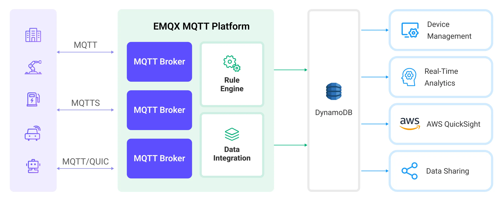

# Stream MQTT Data into DynamoDB

[DynamoDB](https://www.amazonaws.cn/en/dynamodb/) is a fully managed, high-performance, serverless key-value store database service on AWS. It is designed for applications that require fast, scalable, and reliable data storage. EMQX supports integration with DynamoDB, enabling you to save MQTT messages and client events to DynamoDB, facilitating the registration and management of IoT devices, as well as the long-term storage and real-time analysis of device data. Through the DynamoDB data integration, MQTT messages and client events can be stored in DynamoDB, and events can also trigger updates or deletions of data within DynamoDB, thereby enabling the recording of information such as device online status and connection history.

This page provides a detailed introduction to the functional features of DynamoDB Data Integration and offers practical guidance for creating it. The content includes creating DynamoDB connectors, creating rules, and testing rules. It demonstrates how to report simulated temperature and humidity data to EMQX Platform via the MQTT protocol and store the data in DynamoDB through configured data integration.

## How It Works

DynamoDB data integration is an out-of-the-box feature in EMQX Platform that combines EMQX's device connectivity and message transmission capabilities with DynamoDB's powerful data storage capabilities. With a built-in data integration component, the integration simplifies the process of ingesting data from EMQX to DynamoDB for storage and management, eliminating the need for complex coding.

The diagram below illustrates a typical architecture of data integration between EMQX and DynamoDB:



Ingesting MQTT data into DynamoDB works as follows:

1. **Message publication and reception**: IoT devices, whether they are part of connected vehicles, IIoT systems, or energy management platforms, establish successful connections to EMQX through the MQTT protocol and publish MQTT messages to specific topics. When EMQX receives these messages, it initiates the matching process within its rules engine.
2. **Message data processing**: When a message arrives, it passes through the rule engine and is then processed by the rule defined in EMQX. The rules, based on predefined criteria, determine which messages need to be routed to DynamoDB. If any rules specify payload transformations, those transformations are applied, such as converting data formats, filtering out specific information, or enriching the payload with additional context.
3. **Data ingestion into DynamoDB**: Once the rule engine identifies a message for DynamoDB storage, it triggers an action of forwarding the messages to DynamoDB. Processed data will be seamlessly written into the collection of the DynamoDB database.
4. **Data storage and utilization**: With the data now stored in DynamoDB, businesses can harness its querying power for various use cases. For instance, in the realm of connected vehicles, this stored data can inform fleet management systems about vehicle health, optimize route planning based on real-time metrics, or track assets. Similarly, in IIoT settings, the data might be used to monitor machinery health, forecast maintenance, or optimize production schedules.

## Features and Advantages

The data integration with DynamoDB offers a range of features and benefits tailored to ensure efficient data transmission, storage, and utilization:

- **Real-time Data Streaming**: EMQX Platform is built for handling real-time data streams, ensuring efficient and reliable data transmission from source systems to DynamoDB. It enables organizations to capture and analyze data in real-time, making it ideal for use cases requiring immediate insights and actions.
- **Flexibility in Data Transformation**: EMQX Platform provides a powerful SQL-based Rule Engine, allowing organizations to pre-process data before storing it in DynamoDB. It supports various data transformation mechanisms, such as filtering, routing, aggregation, and enrichment, enabling organizations to shape the data according to their needs.
- **Flexible Data Model**: DynamoDB uses key-value and document data models, suitable for storing and managing structured device events and message data, allowing for easy storage of different MQTT message structures.
- **Powerful Scalability**: EMQX Platform offers cluster scalability, capable of seamless horizontal scaling based on device connections and message volume; DynamoDB, requiring no server or infrastructure management, automatically handles underlying resource management and scaling. The combination of both provides high-performance and highly reliable data storage and scalability.

## Before You Start

This section introduces the preparatory work needed to create DynamoDB Data Integration in EMQX Platform.

### Prerequisites

- Understand [rules](./rules.md).
- Understand [data integration](./introduction.md).

### Set Up AWS DynamoDB Instance

For the creation of AWS DynamoDB, you have the option to install it either in the cloud or using Docker.

#### Create DynamoDB Instance and Table in Console

If you are creating a DynamoDB instance for the first time, you can refer to the [AWS help document](https://docs.aws.amazon.com/amazondynamodb/latest/developerguide/GettingStartedDynamoDB.html).

1. Go to the DynamoDB console and click Create Table `temp_hum`.
2. Fill in key information such as table name, partition key, and other defaults, which can be set according to your actual needs.
3. Until the status of the table is active, it means that you have successfully created the table `temp_hum`.

#### Install DynamoDB Local Server and Create Table

1. Prepare a docker-compose file, dynamo.yaml, to set up the Dynamodb local server.

    ```bash
    version: '3.8'
    services:
    dynamo:
        command: "-jar DynamoDBLocal.jar -sharedDb"
        image: "amazon/dynamodb-local:latest"
        container_name: dynamo
        ports:
        - "8000:8000"
        environment:
        AWS_ACCESS_KEY_ID: root 
        AWS_SECRET_ACCESS_KEY: public
        AWS_DEFAULT_REGION: us-west-2
    ```

2. Start the server.

    ```bash
    docker-compose -f dynamo.yaml up
    ```

3. Prepare a table definition and save it to your home directory as temp_hum.json.

    ```bash
    {
        "TableName": "temp_hum",
        "KeySchema": [
            { "AttributeName": "id", "KeyType": "HASH" }
        ],
        "AttributeDefinitions": [
            { "AttributeName": "id", "AttributeType": "S" }
        ],
        "ProvisionedThroughput": {
            "ReadCapacityUnits": 5,
            "WriteCapacityUnits": 5
        }
    }
    ```

4. Create a new table via this file.

    ```bash
    docker run --rm -v ${HOME}:/dynamo_data -e AWS_ACCESS_KEY_ID=root -e AWS_SECRET_ACCESS_KEY=public -e AWS_DEFAULT_REGION=us-west-2 amazon/aws-cli dynamodb create-table --cli-input-json file:///dynamo_data/temp_hum.json --endpoint-url http://host.docker.internal:8000
    ```

5. Check if the table was created successfully.

    ```bash
    docker run --rm -e AWS_ACCESS_KEY_ID=root -e AWS_SECRET_ACCESS_KEY=public -e AWS_DEFAULT_REGION=us-west-2 amazon/aws-cli dynamodb list-tables --endpoint-url http://host.docker.internal:8000
    ```

    The following JSON will be printed if the table was created successfully.

    ```bash
        {
            "TableNames": [
                "temp_hum"
            ]
        }
    ```

## Create a DynamoDB Connector

Before creating data integration rules, you need to first create a DynamoDB connector to access the DynamoDB server.

1. Go to your deployment. Click **Data Integration** from the left-navigation menu.
2. If it is the first time for you to create a connector, select **DynamoDB** under the **Data Persistence** category. If you have already created connectors, select **New Connector** and then select **DynamoDB** under the **Data Forward** category.
3. On the **New Connector** page, configure the following options:
   - **DynamoDB Endpoint**: Enter the [Endpoint](https://docs.aws.amazon.com/general/latest/gr/ddb.html) for the DynamoDB service. Make sure to include the prefix "https://". If you are using LocalStack, use `http://localhost:8000`.
   - **AWS Access Key ID**: Enter the [Access key ID](https://docs.aws.amazon.com/powershell/latest/userguide/creds-idc.html).
   - **AWS Secret Access Key**: Enter the [secret access key](https://docs.aws.amazon.com/powershell/latest/userguide/creds-idc.html).
   - Use default values for other settings, or configure them according to your business needs.
4. Click the **Test** button. If the DynamoDB service is accessible, a success prompt will be returned.
5. Click the **New** button to complete the creation.

## Create a Rule

Next, you need to create a rule to specify the data to be written and add corresponding actions in the rule to forward the processed data to DynamoDB.

1. Click **New Rule** in Rules area or click the New Rule icon in the **Actions** column of the connector you just created.

2. Enter the rule matching SQL statement in the **SQL editor**. The following SQL example reads the message reporting time `up_timestamp`, client ID, and message body (Payload) from messages sent to the `temp_hum/emqx` topic, extracting temperature and humidity.

   ```sql
    SELECT 
    id as msgid,
    topic, 
    payload 
    
    FROM
    "temp_hum/emqx"
   ```

    To create a rule for online/offline status recording, input the following statement:

   ```sql
    SELECT
    str(event) + timestamp as id, *
    FROM 
    "$events/client_connected", "$events/client_disconnected"
   ```

   You can use **Enable Test** to simulate data input and test the results.

3. Click **Next** to add an action.

4. Select the connector you just created from the **Connector** dropdown box.

5. Configure the following information:

   - **Action Name**: The system will automatically generate an action name.

   - **Table Name**: Input `temp_hum`.

   - **Message Template**: When this value is empty the whole message will be stored in the database. The template can be any valid JSON with placeholders and make sure all keys for table are here, example: `{"id" : "${id}", "clientid" : "${clientid}", "data" : "${payload.data}"}`.

   - Use default values for other settings, or configure them according to your business needs.

6. Click the **Confirm** button to complete the rule creation.

7. In the **Successful new rule** pop-up, click **Back to Rules**, thus completing the entire data integration configuration chain.

## Test the Rule

You are recommended to use [MQTTX](https://mqttx.app/) to simulate temperature and humidity data reporting, but you can also use any other client.

1. Use MQTTX to connect to the deployment and send messages to the following Topic.

   - topic: `temp_hum/emqx`

   - payload:

     ```json
     {
       "temp": "27.5",
       "hum": "41.8"
     }
     ```

2. Check if the message has been forwarded to DynamoDB.

   - View results in NoSQL Workbench (Optional).

     **[NoSQL Workbench](https://docs.aws.amazon.com/amazondynamodb/latest/developerguide/workbench.settingup.html)** for Amazon DynamoDB is a cross-platform client-side GUI application for modern database development and operations. You can reach out to it to connect to DynamoDB. Go to the **Operation Builder** page. Select the table 'temp_hum'. Here you can see the results of the temperature and humidity data forwarding.

   -  Check whether the data is written into the data table (Optional).

     ```bash
     docker run --rm -e AWS_ACCESS_KEY_ID=root -e AWS_SECRET_ACCESS_KEY=public -e AWS_DEFAULT_REGION=us-west-2 amazon/aws-cli dynamodb scan --table-name=temp_hum --endpoint-url http://host.docker.internal:8000
     ```

3. View operational data in the console. Click the rule ID in the rule list, and you can see the statistics of the rule and the statistics of all actions under this rule.
