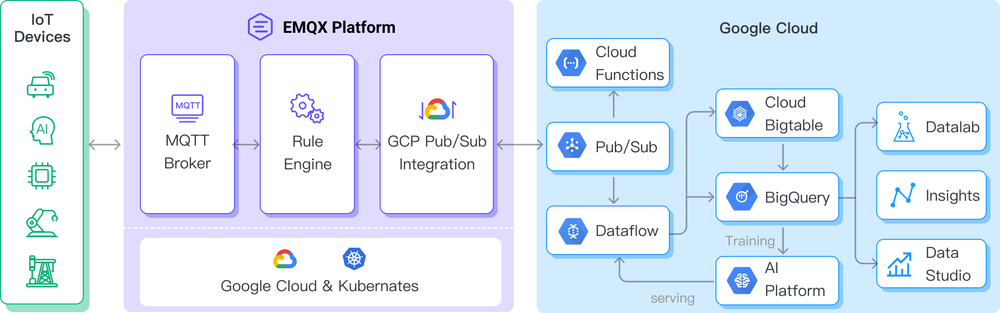

# Stream MQTT Data into GCP Pub/Sub

Google Cloud Pub/Sub is an asynchronous messaging service designed to achieve extremely high reliability and scalability. EMQX Cloud supports seamless integration with Google Cloud Pub/Sub for real-time extraction, processing, and analysis of MQTT data. It can push data to various Google Cloud services such as Cloud Functions, App Engine, Cloud Run, Kubernetes Engine, and Compute Engine. Alternatively, it can also distribute data from Google Cloud to MQTT, helping users rapidly build IoT applications on GCP.

This page provides a comprehensive introduction to the data integration between EMQX Cloud nand GCP Pub/Sub with practical instructions on creating and validating the data integration.

## How It Works

GCP Pub/Sub data integration is an out-of-the-box feature of EMQX Cloud designed to help users seamlessly integrate MQTT data streams with Google Cloud and leverage its rich services and capabilities for IoT application development.



EMQX Cloud forwards MQTT data to GCP Pub/Sub through the rule engine and Sink. Taking the example of a GCP Pub/Sub producer role, the complete process is as follows:

1. **IoT Devices Publish Messages**: Devices publish telemetry and status data through specific topics, triggering the rule engine.
2. **Rule Engine Processes Messages**: Using the built-in rule engine, MQTT messages from specific sources are processed based on topic matching. The rule engine matches corresponding rules and processes messages, such as converting data formats, filtering specific information, or enriching messages with contextual information.
3. **Bridging to GCP Pub/Sub**: The rule triggers the action of forwarding messages to GCP Pub/Sub, allowing easy configuration of data properties, ordering keys, and mapping of MQTT topics to GCP Pub/Sub topics. This provides richer context information and order assurance for data integration, enabling flexible IoT data processing.

After MQTT message data is written to GCP Pub/Sub, you can perform flexible application development, such as:

- Real-time Data Processing and Analysis: Utilize powerful Google Cloud data processing and analysis tools like Dataflow, BigQuery, and Pub/Sub's own streaming capabilities to perform real-time processing and analysis of message data, obtaining valuable insights and decision support.
- Event-Driven Functionality: Trigger Google Cloud event handling, such as Cloud Functions and Cloud Run, to achieve dynamic and flexible function triggering and processing.
- Data Storage and Sharing: Transmit message data to Google Cloud storage services like Cloud Storage and Firestore for secure storage and management of large volumes of data. This allows you to share and analyze this data with other Google Cloud services to meet various business needs.

## Features and Advantages

The data integration with GCP Pub/Sub offers a range of features and benefits:

- **Robust Messaging Service**: Both EMQX and GCP Pub/Sub possess high availability and scalability features, ensuring the reliable reception, delivery, and processing of large-scale message streams. They support IoT data sequencing, message quality assurance, and persistence, ensuring the dependable transmission and handling of messages.
- **Flexible Rules Engine**: With the built-in rules engine, specific source messages and events can be processed based on topic matching. Messages and events can be manipulated, such as data format conversion, filtering out specific information, or enriching messages with context information. Combining this with GCP Pub/Sub allows for further processing and analysis.
- **Rich Contextual Information**: Through the GCP Pub/Sub data integration, you can add richer contextual information to messages, mapping client attributes to Pub/Sub attributes, sorting keys, and more. This aids in performing more precise analysis and processing in subsequent application development and data handling.

In summary, integrating EMQX Cloud and GCP Pub/Sub enables highly reliable, scalable message delivery, along with extensive tools and services for data analysis and integration. This empowers you to build robust IoT applications and implement flexible business logic based on event-driven capabilities.

## Before You Start

This section describes the preparations you need to complete before you start to create the GCP Pub/Sub data integration.

### Prerequisites

- Understand [rules](./rules.md).
- Understand [data integration](./introduction.md).

#### Create Service Account Key in GCP

You need to create a service account and a service account key to use the GCP PubSub service.

1. Create a [Service Account](https://developers.google.com/identity/protocols/oauth2/service-account#creatinganaccount) in your GCP account. Ensure that the Service Account has permission to at least publish messages to the topic of interest.

2. Click the email address for the service account you created. Click the Key tab. In the Add key drop-down list, select **Create new key** to create a Service Account key for that account and download it in JSON format.

#### Create and Manage Topics in GCP

Before configuring the GCP Pub/Sub data integration on EMQX, you need to create a topic and be familiar with the basic management operation in GCP.

1. In the Google Cloud console, go to the **Pub/Sub ->Topics** page. For detailed instructions, see [Create and manage topics](https://cloud.google.com/pubsub/docs/create-topic).

    ::: tip
    The Service Account must have permission to publish that topic.
    :::

2. In the **Topic ID** field, enter an ID for your topic. Click **Create topic**.

3. Go to the **Subscriptions** page. Click the **Topic ID** in the list. Create a subscription to the topic.

   - Select Pull in **Delivery type**.
   - Select 7 Days for **Message retention duration**.

   For detailed instructions, see [GCP Pub/Sub Subscription](https://cloud.google.com/pubsub/docs/subscriber).

4. Click **Subscription ID -> Messages -> Pull** can view the message sent to the topic.

## Create a Rule for Google PubSub

Before creating data integration rules, you need to first create a Google PubSub connector to access the server.

1. Go to your deployment. Click **Data Integration** from the left-navigation menu.
2. If it is the first time for you to create a connector, select **Google PubSub** under the **Data Forward** category. If you have already created connectors, select **New Connector** and then select **Google PubSub** under the **Data Forward** category.
3. On the **New Connector** page, configure the following options:
   - **Connector Name**: The system will automatically generate a connector name.
   - **GCP Service Account Credentials**: Upload the Service Account credentials in JSON format you exported in Create Service Account Key in GCP.
   - Use default values for other settings, or configure them according to your business needs.
4. Click the **Test** button. If the Google PubSub service is accessible, a success prompt will be returned.
5. Click the **New** button to complete the creation.

## Create Rules

Next, you need to create a rule to specify the data to be written and add corresponding actions in the rule to forward the processed data to GCP PubSub.

1. Click **New Rule** in Rules area or click the New Rule icon in the **Actions** column of the connector you just created.

2. Enter the rule matching SQL statement in the **SQL editor**. The following SQL example reads the message reporting time `up_timestamp`, client ID, and message body (Payload) from messages sent to the `temp_hum/emqx` topic, extracting temperature and humidity.

   ```sql
    SELECT 
    timestamp as up_timestamp, 
    clientid as client_id, 
    payload.temp as temp,
    payload.hum as hum
    FROM
    "temp_hum/emqx"
   ```

   You can use **Enable Test** to simulate data input and test the results.

3. Click **Next** to add an action.

4. Select the connector you just created from the **Connector** dropdown box.

5. Configure the following information:

   - **Action Name**: The system will automatically generate an action name, or you can name it yourself.

   - **GCP PubSub Topic**: Enter the topic ID xxx you created in Create and Manage Topic in GCP.
  
   - **Payload Template**: Leave it blank or define a template.
     - If left blank, it will encode all visible inputs from the MQTT message using JSON format, such as clientid, topic, payload, etc.
     - If using the defined template, placeholders of the form ${variable_name} will be filled with the corresponding value from the MQTT context. For example, ${topic} will be replaced with my/topic if such is the MQTT message topic.

    In this example, we'll utilize the following GCP Pub/Sub topic and message template.

   ```sql
        # GCP Pub/Sub message template 
    {"up_timestamp": ${up_timestamp}, "client_id": ${client_id}, "temp": ${temp}, "hum": ${hum}}
    ```

   - **Attributes Template and Ordering Key Template**(optional): Similarly, you can define templates for formatting the attributes and/or ordering key of the outgoing message.
     - For Attributes, both keys and values may use placeholders of the form ${variable_name}. Such values will be extracted from the MQTT context. If a key template resolves to an empty string, that key is omitted from the outgoing message to GCP PubSub.
     - For Ordering Key, placeholders of the form ${variable_name} may be used. If the resolved value is an empty string, the orderingKey field will not be set for the GCP PubSub outgoing message.
   - Advanced settings (optional): Use default values for other settings, or configure them according to your business needs.

6. Click the **Confirm** button to complete the rule creation.

7. In the **Successful new rule** pop-up, click **Back to Rules**, thus completing the entire data integration configuration chain.

## Test Rules

You are recommended to use [MQTTX](https://mqttx.app/) to simulate temperature and humidity data reporting, but you can also use any other client.

1. Use MQTTX to connect to the deployment and send messages to the following Topic.

   - topic: `temp_hum/emqx`

   - payload:

     ```json
     {
       "temp": "27.5",
       "hum": "41.8"
     }
     ```

2. Go to GCP Pub/Sub -> Subscriptions, click MESSAGES tab. You should see the message.

3. View operational data in the console. Click the rule ID in the rule list, and you can see the statistics of the rule and the statistics of all actions under this rule.
