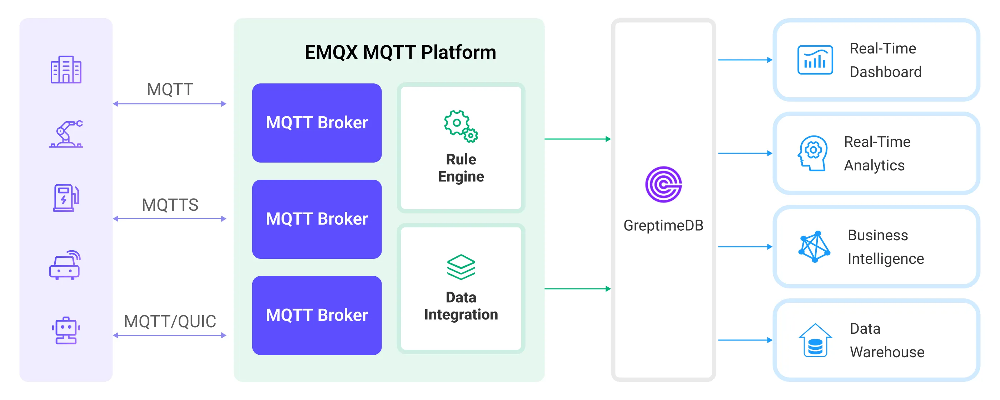

# Ingest MQTT Data into GreptimeDB

[GreptimeDB](https://github.com/GreptimeTeam/greptimedb) is an open-source time-series database with a special focus on scalability, analytical capabilities and efficiency. It's designed to work on the infrastructure of the cloud era, and users benefit from its elasticity and commodity storage. EMQX Platform now supports connection to mainstream versions of GreptimeDB, GreptimeCloud or GreptimeDB Enterprise.

This page provides a comprehensive introduction to the data integration between the EMQX Platform and GreptimeDB with practical instructions on creating and validating the data integration.

## How It Works

GreptimeDB data integration is a built-in feature in the EMQX Platform that combines the real-time data capturing and transmission capabilities of the EMQX Platform with the data storage and analysis capabilities of GreptimeDB. With a built-in [rule engine](./rules.md) component, the integration simplifies the process of ingesting data from the EMQX Platform to GreptimeDB for storage and analysis, eliminating the need for complex coding. The workflow is as follows:

The diagram below illustrates a typical architecture of data integration between the EMQX Platform and GreptimeDB:



1. **Message publication and reception**: Industrial devices establish successful connections to EMQX Platform through the MQTT protocol and regularly publish energy consumption data using the MQTT protocol. This data includes production line identifiers and energy consumption values. When EMQX Platform receives these messages, it initiates the matching process within its rules engine.  
2. **Rule Engine Processes Messages**: The built-in rule engine processes messages from specific sources based on topic matching. When a message arrives, it passes through the rule engine, which matches it with corresponding rules and processes the message data. This can include transforming data formats, filtering specific information, or enriching messages with context information.
3. **Data ingestion into GreptimeDB**: Rules defined in the rule engine trigger operations to write messages to GreptimeDB. The GreptimeDB action provides Line Protocol templates that allow flexible definitions of the data format to write specific message fields to the corresponding tables and columns in GreptimeDB.

After energy consumption data is written to GreptimeDB, you can flexibly use SQL statements or Prometheus query language to analyze the data. For example:

- Connect to visualization tools such as Grafana to generate charts and display energy consumption data.
- Connect to application systems such as ERP for production analysis and production plan adjustments.
- Connect to business systems to perform real-time energy usage analysis, facilitating data-driven energy management.

## Features and Benefits

The data integration with GreptimeDB brings the following features and advantages to your business:

- **Ease of Use**: EMQX Platform and GreptimeDB both offer a user-friendly experience in development. EMQX Platform provides the standard MQTT protocol along with ready-to-use various authentication, authorization, and clustering features. GreptimeDB offers user-friendly designs like Time-Series Tables and schemaless architecture. The integration of both can accelerate the process of business integration and development.
- **Efficient Data Handling**: EMQX Platform can handle a large number of IoT device connections and message throughput efficiently. GreptimeDB excels in data writing, storage, and querying, meeting the data processing needs of IoT scenarios without overwhelming the system.
- **Message Transformation**: Messages can undergo rich processing and transformation within EMQX Platform rules before being written to GreptimeDB.
- **Efficient Storage and Scalability**: EMQX Platform and GreptimeDB both have cluster scaling capabilities, allowing flexible horizontal scaling as your business grows to meet expanding demands.
- **Advanced Querying Capabilities**: GreptimeDB provides optimized functions, operators, and indexing techniques for efficient querying and analysis of timestamp data, enabling precise insights to be extracted from IoT time-series data.

## Before You Start

This section describes the preparations you need to complete before you start to create a GreptimeDB data integration, including how to install a GreptimeDB server.

### Prerequisites

- Knowledge about [data integration](./introduction.md)
- Knowledge about EMQX Platform data integration [rules](./rules.md)

### Install GreptimeDB Server

1. [Install GreptimeDB](https://greptime.com/download) via Docker, and then run the docker image.

   ```bash
   # TO start the GreptimeDB docker image
   docker run -p 4000-4004:4000-4004 \
   -p 4242:4242 -v "$(pwd)/greptimedb:/tmp/greptimedb" \
   --name greptime --rm \
   greptime/greptimedb standalone start \
   --http-addr 0.0.0.0:4000 \
   --rpc-addr 0.0.0.0:4001 \
   --mysql-addr 0.0.0.0:4002 \
   --user-provider=static_user_provider:cmd:greptime_user=greptime_pwd
   ```

2. The `user-provider` parameter configures the GreptimeDB authentication. You can configure it by file. For more information, refer to the [documentation](https://docs.greptime.com/user-guide/clients/authentication#authentication).
3. With GreptimeDB running, visit [http://localhost:4000/dashboard](http://localhost:4000/dashboard) to use the GreptimeDB dashbaord. The username and password are `greptime_user` and `greptime_pwd`.

## Create a Connector

Before creating data integration rules, you need to first create a GreptimeDB connector to access the GreptimeDB server.

1.  Go to your deployment. Click **Data Integration** from the left-navigation menu. If it is the first time for you to create a connector, select **GreptimeDB** under the **Data Persistence** category. If you have already created connectors, select **New Connector** and then select **GreptimeDB** under the **Data Persistence** category.

2. **Connector Name**: The system will automatically generate a connector name.

3. Enter the connection information:

   - **Server Host**: Enter `{host}:4001`. If you are creating a connection to GreptimeCloud, use 443 as the port by entering `{url}:443`.
   - **Database**: Enter `public`. If you are connecting to GreptimeCloud, enter the service name instead.
   - **Username** and **Password**: Enter `greptime_user` and `greptime_pwd`, which are set in the [Install GreptimeDB Server](#install-greptimedb-server). If you are connecting to GreptimeCloud, enter the service username and password.
   - **Enable TLS**: If you want to establish an encrypted connection, click the toggle switch. 
   - Configure advanced settings according to your business needs (optional).

4. Click the **Test** button. If the GreptimeDB service is accessible, a prompt indicating **connector available** will be returned.

5. Click the **New** button to complete the creation.

## Create a Rule

This section demonstrates how to create a GreptimeDB Rule and add action to the rule via the EMQX Platform Console.

1. Click **New Rule** in the Rules area or click the New Rule icon in the **Actions** column of the connector you just created.

2. Set the rules in the **SQL Editor** based on the feature to use, Our goal is to trigger the engine when the client sends a temperature and humidity message to the `temp_hum/emqx` topic. Here you need a certain process of SQL:

   ```sql
    SELECT
     timestamp, clientid, payload
    FROM
      "temp_hum/emqx"
   ```

   ::: tip

   If you are a beginner user, click **SQL Examples** and **Enable Test** to learn and test the SQL rule.

   :::

3. Click **Next** to add an action.


4. Select the connector you just created from the **Connector** dropdown box.

5. Configure **Write Syntax**. Specify a text-based format that provides the measurement, tags, fields, and timestamp of a data point, and placeholder supported according to the [InfluxDB line protocol](https://docs.influxdata.com/influxdb/v2.3/reference/syntax/line-protocol/) syntax. GreptimeDB supports data formats compatible with InfluxDB. 
This tutorial examples syntax:
   ```sql
    myMeasurement,tag1=${clientid} fieldKey=${payload}
   ```
<!--Select the data format as **JSON** or **Line Protocol**,-->

   <!--For **JSON** format, define data parsing method, including **Measurement**, **Timestamp**, **Fields,** and **Tags**. Note: All key values can be variables and you can also follow the [InfluxDB line protocol](https://docs.influxdata.com/influxdb/v2.5/reference/syntax/line-protocol/) to set them.-->

   <!--For **Line Protocol** format, specify a text-based format that provides the measurement, tags, fields, and timestamp of a data point, and placeholder supported according to the [InfluxDB line protocol](https://docs.influxdata.com/influxdb/v2.3/reference/syntax/line-protocol/) syntax.-->

   ::: tip

   - To write a signed integer type value to GreptimeDB, add `i` as the type identifier after the placeholder, for example, `${payload.int}i`.
   - To write an unsigned integer type value to GreptimeDB, add `u` as the type identifier after the placeholder, for example, `${payload.int}u`. 

   :::

6. Specify the **Time Precision**: Select `millisecond` by default. 

7. Expand **Advanced Settings** to configure Sync/Async mode, queue and batch, and other parameters as appropriate Advanced Settings Options (optional)

8. Click the **Confirm** button to complete the rule creation.
   
9. In the **Successful new rule** pop-up, click **Back to Rules**, thus completing the entire data integration configuration chain.

## Test the Rule

You are recommended to use [MQTTX](https://mqttx.app/) to simulate temperature and humidity data reporting, but you can also use any other client.

1. Use MQTTX to connect to the deployment and send messages to the following Topic.

   - topic: `temp_hum/emqx`

   - client id: `test_client`

   - payload:

     ```json
     {
       "temp": "27.5",
       "hum": "41.8"
     }
     ```


2. Check the running status of the rule, there should be one new incoming and one new outgoing message.

3. In the GreptimeDB dashboard, you can confirm whether the message is written into the GreptimeDB via `SQL`.