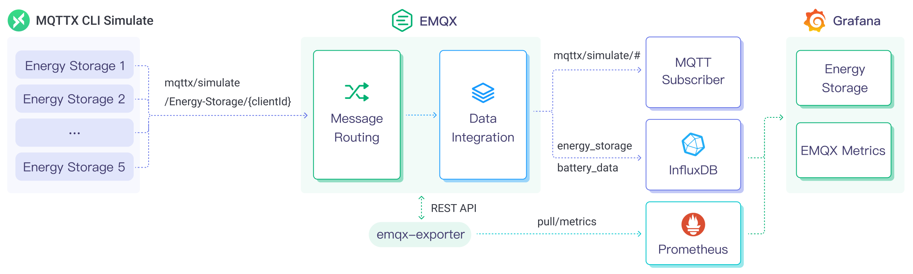

# Ingest MQTT Data into InfluxDB

[InfluxDB](https://www.influxdata.com/) is a database for storing and analyzing time series data. Its powerful data throughput capability and stable performance make it very suitable to be applied in the field of Internet of Things (IoT). EMQX Platform now supports connection to mainstream versions of InfluxDB Cloud, InfluxDB OSS, or InfluxDB Enterprise.

This page provides a comprehensive introduction to the data integration between EMQX Platform and InfluxDB with practical instructions on creating and validating the data integration.

## How It Works

InfluxDB data integration is an out-of-the-box feature in EMQX Platform that combines EMQX Platform's real-time data capturing and transmission capabilities with InfluxDB's data storage and analysis functionality. With a built-in [rule engine](./rules.md) component, the integration simplifies the process of ingesting data from EMQX Platform to InfluxDB for storage and analysis, eliminating the need for complex coding. EMQX Platform forwards device data to InfluxDB for storage and analysis through the rule engine and Sink. After analyzing the data, InfluxDB generates reports, charts, and other data analysis results, and then presents them to users through InfluxDB's visualization tools.

The diagram below illustrates the typical data integration architecture between EMQX and InfluxDB in an energy storage scenario.



EMQX Platform and InfluxDB provide an extensible IoT platform for efficiently collecting and analyzing energy consumption data in real-time. In this architecture, EMQX Platform serves as the IoT platform, handling device access, message transmission, and data routing, while InfluxDB serves as the data storage and analysis platform, responsible for data storage and analysis functions. The workflow is as follows:

1. **Message publication and reception**: Energy storage devices and Industrial IoT devices establish successful connections to EMQX Platform through the MQTT protocol and regularly publish energy consumption data using the MQTT protocol, including information such as power consumption, input/output power, etc. When EMQX Platform receives these messages, it initiates the matching process within its rules engine.
2. **Message data processing**: Using the built-in rule engine, messages from specific sources can be processed based on topic matching. When a message arrives, it passes through the rule engine, which matches it with the corresponding rule and processes the message data, such as transforming data formats, filtering specific information, or enriching messages with contextual information.
3. **Data ingestion into InfluxDB**: Rules defined in the rule engine trigger the operation of writing messages to InfluxDB. The InfluxDB Sink provides Line Protocol templates that allow flexible definitions of the data format to be written, mapping specific fields from the message to the corresponding measurement and field in InfluxDB.

After energy consumption data is written to InfluxDB, you can use Line Protocol flexibly to analyze the data, for example:

- Connect to visualization tools like Grafana to generate charts based on the data, displaying energy storage data.
- Connect to business systems for monitoring and alerting on the status of energy storage devices.

## Features and Benefits

The InfluxDB data integration offers the following features and advantages:

- **Efficient Data Processing**: EMQX Platform can handle a massive number of IoT device connections and message throughput, while InfluxDB excels in data writing, storage, and querying, providing outstanding performance to meet the data processing needs of IoT scenarios without overburdening the system.
- **Message Transformation**: Messages can undergo extensive processing and transformation through EMQX Platform rules before being written into InfluxDB.
- **Scalability**: Both EMQX Platform and InfluxDB are capable of cluster scaling, allowing flexible horizontal expansion of clusters as business needs grow.
- **Rich Query Capabilities**: InfluxDB offers optimized functions, operators, and indexing techniques, enabling efficient querying and analysis of timestamped data, and accurately extracting valuable insights from IoT time-series data.
- **Efficient Storage**: InfluxDB uses encoding methods with high compression ratios, significantly reducing storage costs. It also allows customization of storage durations for different data types to avoid unnecessary data occupying storage space.

## Before You Start

This section introduces the preparatory work needed to create InfluxDB Data Integration in EMQX Platform.

### Prerequisites

- Knowledge about [InfluxDB line protocol](https://docs.influxdata.com/influxdb/v2.5/reference/syntax/line-protocol/).

- Understand [rules](./rules.md).

- Understand [data integration](./introduction.md).

### Set up Network

<!--@include: ./network-setting.md-->

### Install and Set up InfluxDB

#### Install InfluxDB via Docker

1. [Install InfluxDB](https://docs.influxdata.com/influxdb/v2.5/install/) via Docker, and then run the docker image.

```bash
# TO start the InfluxDB docker image
docker run --name influxdb -p 8086:8086 influxdb:2.5.1
```

2. With InfluxDB running, visit the server address on port 8086. Set the **Username**, **Password**, **Organization Name**, and **Bucket Name**.

3. In the InfluxDB UI, click **Load Data** -> **API Token** and then follow the instructions to [create all-access tokens](https://docs.influxdata.com/influxdb/v2.5/install/#create-all-access-tokens).

#### Create InfluxDB Service using InfluxDB Cloud

1. Login to the [InfluxDB Cloud](https://cloud2.influxdata.com).

2. In the InfluxDB UI, Set the **Username**, **Password**, **Organization Name**, and **Bucket Name**.

3. In the InfluxDB UI, click **Load Data** -> **API Token** and then follow the instructions to [create all-access tokens](https://docs.influxdata.com/influxdb/v2.5/install/#create-all-access-tokens).

## Create an InfluxDB Connector

Before creating data integration rules, you need to first create a InfluxDB connector to access the InfluxDB server.

1. Go to your deployment. Click **Data Integration** from the left-navigation menu.

2. If it is the first time for you to create a connector, select **InfluxDB** under the **Data Forward** category. If you have already created connectors, select **New Connector** and then select **InfluxDB** under the **Data Forward** category.

3. **Connector Name**: The system will automatically generate a connector name.

4. Enter the connection information:

   - Select the **Version of InfluxDB** as needed, with the default being `V2`.
   - **Server Host**: IP address and port of the server. If using InfluxDB Cloud, specify port 443, i.e., enter `{url}:443` and click **Enable TLS** to activate TSL connection.
   - Complete the **Token**, **Organization**, and **Bucket** settings according to the setup in [Install and Set Up InfluxDB](#install-and-set-up-influxdb). Note: If choosing InfluxDB v1, please complete the settings for **Database**, **Username**, and **Password**.

5. Click the **Test** button. If the InfluxDB service is accessible, a success prompt will be returned.

6. Click the **New** button to complete the creation.

## Create Rules

Next, you need to create a rule to specify the data to be written and add corresponding actions in the rule to forward the processed data to InfluxDB.

1. Click **New Rule** in Rules area or click the New Rule icon in the **Actions** column of the connector you just created.

2. Set the rules in the **SQL Editor** based on the feature to use, Our goal is to trigger the engine when the client sends a temperature and humidity message to the temp_hum/emqx topic. Here you need a certain process of SQL:

   ```sql
     SELECT
       timestamp,
       payload.location as location,
       payload.temp as temp,
       payload.hum as hum
     FROM "temp_hum/emqx"
   ```

   ::: tip

   If you are a beginner user, click **SQL Examples** and **Enable Test** to learn and test the SQL rule.

   :::

3. Click **Next** to add an action.

4. Select the connector you just created from the **Connector** dropdown box.

5. Specify the **Time Precision**: Select `millisecond` by default.

6. Conf of InfluxDB line protocol to write data points. It is a text-based format that provides the measurement, tag set, field set, and timestamp of a data point, and placeholder supported. See also [InfluxDB 2.3 Line Protocol](https://docs.influxdata.com/influxdb/v2/reference/syntax/line-protocol/) and [InfluxDB 1.8 Line Protocol](https://docs.influxdata.com/influxdb/v1/write_protocols/line_protocol_tutorial/)

   ```bash
    temp_hum,location=${location} temp=${temp},hum=${hum} ${timestamp}
   ```

   ::: tip

   - To write a signed integer type value to InfluxDB 1.x or 2.x, add `i` as the type identifier after the placeholder, for example, `${payload.int}i`. See [InfluxDB 1.8 write integer value](https://docs.influxdata.com/influxdb/v1.8/write_protocols/line_protocol_reference/#write-the-field-value-1-as-an-integer-to-influxdb).
   - To write an unsigned integer type value to InfluxDB 1.x or 2.x, add `u` as the type identifier after the placeholder, for example, `${payload.int}u`. See [InfluxDB 1.8 write integer value](https://docs.influxdata.com/influxdb/v1.8/write_protocols/line_protocol_reference/#write-the-field-value-1-as-an-integer-to-influxdb).

   :::

7. Advanced Settings (Optional): Refer to [Advanced Configuration](https://docs.emqx.com/en/enterprise/latest/data-integration/data-bridge-influxdb.html#advanced-configurations).

8. Click the **Confirm** button to complete the rule creation.

9. In the **Successful new rule** pop-up, click **Back to Rules**, thus completing the entire data integration configuration chain.

## Test the Rule

You are recommended to use [MQTTX](https://mqttx.app/) to simulate temperature and humidity data reporting, but you can also use any other client.

1. Use MQTTX to connect to the deployment and send messages to the following Topic.

   - topic: `temp_hum/emqx`

   - payload:

     ```json
     {
       "temp": 27.5,
       "hum": 41.8,
       "location": "Prague"
     }
     ```

2. In the InfluxDB UI, you can confirm whether the message is written into the InfluxDB via the **Data Explorer** window.

3. If using InfluxDB V1, enter the InfluxDB container and view the data in InfluxDB.

   ```bash
     $ docker exec -it influxdb influx
     $ use db
   ```

   ```bash
     > select * from "temp_hum"
     name: temp_hum
     time                hum  location temp
     ----                ---  -------- ----
     1711093437420000000 41.8 Prague   27.5
     >
   ```

4. View operational data in the console. Click the rule ID in the rule list, and you can see the statistics of the rule and the statistics of all actions under this rule.
