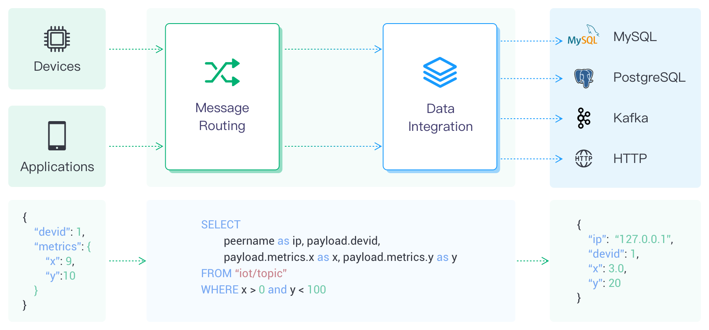

# Data Integration Overview

As a fully managed MQTT message cloud service, EMQX Platform connects Internet of Things (IoT) devices via the MQTT protocol and delivers messages in real time. Building on this foundation, Data Integration enhances EMQX Platform's capability of connecting with other cloud resources, enabling seamless integration of devices with other business systems. EMQX Platform Data Integration not only provides a clear and flexible "configurable" architecture solution but also simplifies the development process. It improves user availability, reduces the coupling between business systems and the EMQX Platform, and provides a better infrastructure for data forwarding.

## How It Works

As devices or applications establish connections, the MQTT broker routes the messages. Upon arrival, these messages are processed by the Rule Engine, a powerful component that utilizes SQL statements for data manipulation. This processed data is then forwarded to the target service by an "Action". Actions are categorized into two types: "Sink", for sending data to a service, and "Source", for receiving data from a service. Presently, the Data Integration operates only in "Sink" mode, facilitating the seamless integration of data into various cloud services.

### [Connectors](./connectors.md)

A connector serves as the underlying connection channel for Sink/Source, used to connect to the cloud service products you purchase from the cloud platform. The cloud service products can be message queue services like Kafka or storage services like RDS. 

### [Rules](./rules.md)

Rules describe "where data comes from" and "how to filter and process data." Rules use SQL-like statements to write custom data and can use SQL testing to simulate exported data. To learn and understand how to write rule SQL, refer to [Rule SQL Writing](https://docs.emqx.com/en/enterprise/v4.2/rule/rule-engine.html#sql-%E8%AF%AD%E5%8F%A5).

### [Actions](./rules.md#add-actions)

Actions determine "where the processed data goes." A rule can correspond to one or more actions, and actions need to be set with defined connectors, which means where the data is sent.

#### Sink

A Sink is a data output component added to the actions of a rule. When a device triggers an event or a message arrives at EMQX deployment, the system matches and executes the corresponding rule, filtering and processing the data. The data processed by the Rule Engine is forwarded to the specified Sink. In the Sink, you can configure how the data is handled, for example, by using `${var}` or `${.var}` syntax to extract variables from the data, dynamically generating SQL statements or data templates. Then, the data is sent to external data systems through a corresponding [connector](./connectors.md), enabling operations such as message storage, data updates, and event notifications.

The variable extraction syntax supported in Sink is as follows:

- `${var}`: This syntax is used to extract variables from the output results of a rule, for example, `${topic}`. If you wish to extract nested variables, you can use a period `.` for this, such as `${payload.temp}`. Note that if the variable you want to extract is not included in the output result, you will get the string `undefined`.
- `${.var}`: This syntax first tries to extract a variable from the rule's output results. If the variable does not exist in the output, it attempts to extract it from the corresponding event data, for example, `${.topic}`. This also supports the use of `.` for extracting nested variables, such as `${.payload.temp}`. If the variable you want to extract is not present in either the rule output results or event data, you will receive the string `undefined`. You can also use `${.}` to extract all variables merged from the rule output results and event data.

#### Source

A Source is a data input component, serving as a [data source](https://docs.emqx.com/en/enterprise/latest/data-integration/rule-sql-events-and-fields.html) for rules, and is selected through rule SQL.

Source subscribes or consumes messages from external data systems such as MQTT or Kafka. When new messages arrive through the connector, the rule engine matches and executes the corresponding rules, filtering and processing the data. Once processed, the data can be published to a specified EMQX topic, enabling operations like cloud command distribution.

## Work Flow

Below is the basic process for creating data integrations:

1. Create a connector. You can select the service you need to connect to from the Data Integration initial page in your deployment and configure the connector.
2. Create a rule to process the data collected from the device. The rule can collect and process data the way you want using SQL statements.
3. Attach actions to the rule. The processed data will be forwarded to the cloud service through the configured connector when the rule triggers an action.
4. Test whether the created data integration can run correctly.

## Network Setting Required by Deployments

The data integration function in different deployments requires different levels of data source access and networking.

**Serverless Deployment**

- Data sources only support public network access. Therefore, before creating a data source, you need to ensure the data source has the capability of public network access and open the security group.

- Only supports Kafka and HTTP Server connectors.

- The data integration for Serverless deployments employs a pay-as-you-go mode, explained as follows:

  EMQX Serverless provides users with a free quota for data integration: up to 1 million rule action executions per month. Should your usage exceed this allocation, a nominal fee of $0.25 is applied for each additional million rule action executions. 

  To maintain optimal performance and manageability, the EMQX Platform imposes the following constraints on the creation of connectors, rules, and actions within each deployment:

  | Category                    | Maximum Allowed |
  | --------------------------- | --------------- |
  | Total Connectors            | 2               |
  | Total Rules                 | 4               |
  | Actions Associated Per Rule | 1               |

**Dedicated and Premium Deployments**

- It is recommended to access data sources through an internal network. Therefore, before creating, you need to configure [VPC peering](../deployments/vpc_peering.md) first and also open the security group.
- If you need to access it through the public network, you can enable a [NAT gateway](../vas/nat-gateway.md).

**BYOC Deployment**

:::tip Note

Data integration configuration cannot be performed on the BYOC deployment through the console. Please use the [EMQX Management Console](../deployments/byoc_management.md) for configuration. 

:::

- It is recommended to access data sources through an internal network to improve network security and performance. Before creating, you need to configure a peering connection between the VPC where the resources are located and the VPC where the BYOC deployment is located in the public cloud console, and also open the relevant security group. For related steps, please refer to the [Create VPC Peering Connections](../deployments/byoc_vpc_peering.md) section.
- If you need to access resources through the public network, please configure a NAT gateway for the VPC where the BYOC deployment is located in your public cloud console.
