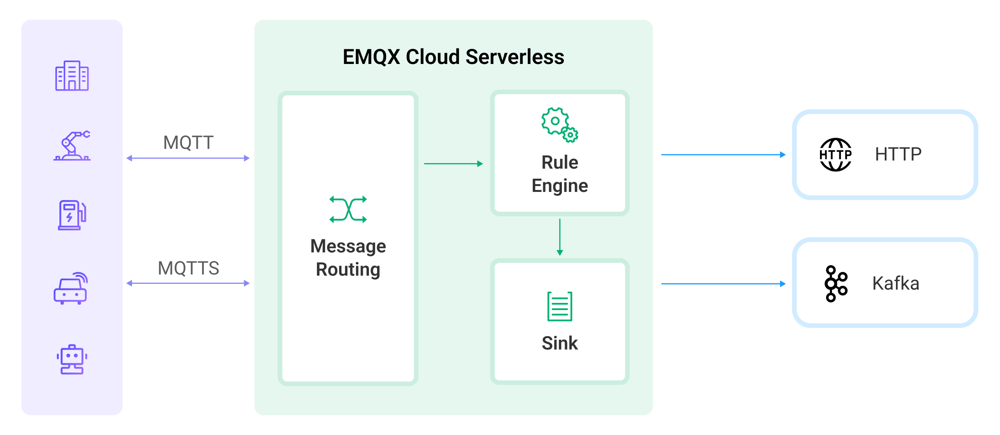

# Data Integration Overview

::: tip 

This section introduces the Data Integration feature for Serverless deployments. If your deployment is a Dedicated version, please refer to [Data Integration (Dedicated)](../rule_engine/introduction.md). 

:::

As a fully managed MQTT message cloud service, EMQX Cloud connects Internet of Things (IoT) devices via the MQTT protocol and delivers messages in real time. Building on this foundation, Data Integration enhances EMQX Cloud's capability of connecting with other cloud resources, enabling seamless integration of devices with other business systems. EMQX Cloud Data Integration not only provides a clear and flexible "configurable" architecture solution but also simplifies the development process. It improves user availability, reduces the coupling between business systems and EMQX Cloud, and provides a better infrastructure for data forwarding.

## How It Works

In Serverless deployments, as devices or applications establish connections, the MQTT broker routes the messages. Upon arrival, these messages are processed by the Rule Engine, a powerful component that utilizes SQL statements for data manipulation. This processed data is then forwarded to the target service by an "Action". Actions are categorized into two types: "Sink", for sending data to a service, and "Source", for receiving data from a service. Presently, the Data Integration feature of the Serverless deployment primarily operates in "Sink" mode, facilitating the seamless integration of data into various cloud services.

### [Connectors](./connectors.md)

Connectors help to connect to the cloud service products you purchase from the cloud platform, which can be message queue services like Kafka or storage services like RDS. A "connector" is equivalent to the "resource" of the data integration for the Dedicated version, providing a way to connect to a cloud service.

### [Rules](./rules.md)

Rules describe "where data comes from" and "how to filter and process data." Rules use SQL-like statements to write custom data and can use SQL testing to simulate exported data. To learn and understand how to write rule SQL, refer to [Rule SQL Writing](https://docs.emqx.com/en/enterprise/v4.2/rule/rule-engine.html#sql-%E8%AF%AD%E5%8F%A5).

### [Actions](./rules.md)

Actions determine "where the processed data goes." A rule can correspond to one or more actions, and actions need to be set with defined connectors, which means where the data is sent.

## Work Flow

The following is the basic process for creating data integrations:

1. Create a connector. You can select the service you need to connect to from the Data Integration initial page in your deployment and configure the connector.
2. Create a rule to process the data collected from the device. The rule can collect and process data the way you want using SQL statements.
3. Attach actions to the rule. The processed data will be forwarded to the cloud service through the configured connector when the rule triggers an action.
4. Test whether the created data integration can run correctly.

## Pricing and Usage Limits

EMQX Cloud provides users with a free quota for data integration: up to 1 million rule action executions per month. Should your usage exceed this allocation, a nominal fee of $0.25 is applied for each additional million rule action executions. 

To maintain optimal performance and manageability, EMQX Cloud imposes the following constraints on the creation of connectors, rules, and actions within each data integration:

| Category                         | Maximum Allowed |
| -------------------------------- | --------------- |
| Total Connectors per Integration | 2               |
| Total Rules per Integration      | 4               |
| Actions Associated Per Rule      | 1               |
