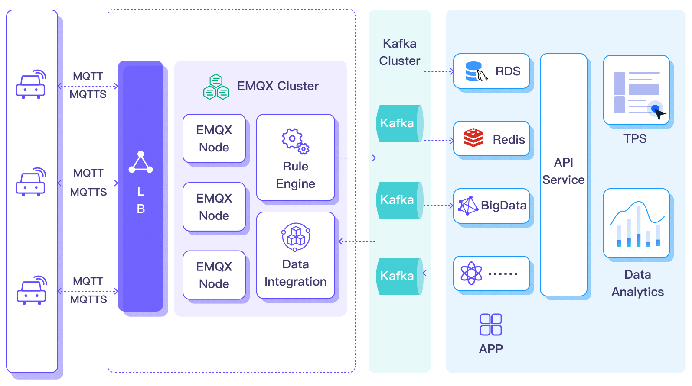

# Stream MQTT Data into Apache Kafka

[Apache Kafka](https://kafka.apache.org/) is a widely-used open-source distributed event streaming platform capable of handling real-time data flows between applications and systems. However, Kafka is not built for edge IoT communication, as Kafka clients require stable network connections and more hardware resources. In the IoT domain, data generated by devices and applications are transmitted using the lightweight MQTT protocol. The integration of EMQX Platform with Kafka/Confluent allows users to seamlessly stream MQTT data into Kafka. MQTT data streams are introduced into Kafka topics, ensuring real-time processing, storage, and analysis. Currently, EMQX Platform only supports forwarding data to Kafka.


This page provides a detailed introduction to the functional features of Kafka Data Integration and offers practical guidance for creating the data integration. 

## How It Works

Apache Kafka Data Integration is an out-of-the-box feature in EMQX Platform, bridging MQTT-based IoT data and Kafka's powerful data processing capabilities. Through its built-in rule engine component, the integration simplifies the data flow and processing between the two platforms without complex coding.



The basic workflow for forwarding message data to Kafka is as follows:

1. **Message Publishing**: Devices successfully connect to the EMQX Platform deployment via the MQTT protocol and periodically publish messages containing status data. When EMQX Platform receives these messages, it initiates the matching process in its rule engine.
2. **Message Data Processing**: These MQTT messages can be processed based on topic-matching rules through the built-in rule engine. When a message arrives and passes through the rule engine, the engine evaluates predefined processing rules for that message. If any rules specify payload transformations, these transformations are applied, such as data format conversion, filtering specific information, or enriching the payload with additional context.
3. **Sending to Kafka**: Rules defined in the rule engine trigger the action of forwarding messages to Kafka. Using Kafka Data Integration, MQTT topics are mapped to predefined Kafka topics, and all processed messages and data are written into Kafka topics.

The basic workflow for consuming messages from Kafka is as follows:

1. **Subscribe to Kafka Topic**: Define the Kafka consumer's action through the input sources in the rule engine, setting the Kafka topic name to be consumed. When the EMQX deployment receives these messages, it initiates the matching process within its rule engine.
2. **Message Data Processing**: Through the built-in rule engine, when messages arrive and pass through the rule engine, the rule engine evaluates the processing rules predefined for that message. If any rules specify message payload transformations, these transformations are applied, such as converting data formats, filtering specific information, or enriching the payload with additional context.
3. **Forwarding to MQTT Client**: The rules defined in the rule engine trigger actions to forward messages to MQTT topics. Using Kafka data integration, Kafka topics are mapped to predefined MQTT topics, and all processed messages and data can be consumed by MQTT clients.

## Features and Advantages

Data integration with Apache Kafka brings the following features and advantages to your business:

- **Payload Transformation**: During transmission, message payloads can be processed through defined SQL rules. For example, payloads containing real-time metrics like total message count, successful/failed delivery count, and message rate can undergo data extraction, filtering, enrichment, and transformation before being input into Kafka.
- **Effective Topic Mapping**: Through configured Kafka data integration, numerous IoT business topics can be mapped to Kafka topics. EMQX supports mapping MQTT user properties to Kafka headers and employs various flexible topic mapping methods, including one-to-one, one-to-many, many-to-many, and support for MQTT topic filters (wildcards).
- **Flexible Partition Selection Strategy**: Supports forwarding messages to the same Kafka partition based on MQTT topics or clients.
- **Processing Capability under High Throughput**: EMQX Kafka producers support synchronous and asynchronous write modes, allowing you to flexibly balance between real-time priority and performance priority data write strategies.
- **Runtime Metrics**: Supports viewing runtime metrics for each data bridge, such as total message count, success/failure count, current rate, etc.

These features enhance integration capabilities and flexibility, helping you build an effective and robust IoT platform architecture. Your growing IoT data can be transmitted under stable network connections and further effectively stored and managed.

## Before You Start

This section introduces the preparatory work needed to create Kafka Data Integration in EMQX Platform.

### Prerequisites

- Understand [rules](./rules.md).
- Understand [data integration](./introduction.md).

### Set up Network

<!--@include: ./network-setting.md-->

### Install Kafka and Create Topics

1. Install Kafka.

   ```bash
   # Install Zookeeper
   docker run -d --restart=always \
       --name zookeeper \
       -p 2181:2181 \
       zookeeper
   
   # Install Kafka, opening port 9092
   docker run -d  --restart=always --name mykafka \
       -p 9092:9092 \
       -e HOST_IP=localhost \
       -e KAFKA_ADVERTISED_PORT=9092 \
       -e KAFKA_ADVERTISED_HOST_NAME=<Server IP> \
       -e KAFKA_BROKER_ID=1 \
       -e KAFKA_LOG_RETENTION_HOURS=12 \
       -e KAFKA_LOG_FLUSH_INTERVAL_MESSAGES=100000 \
       -e KAFKA_ZOOKEEPER_CONNECT=<Server IP>:2181 \
       -e ZK=<Server IP> \
       wurstmeister/kafka
   ```
   
2. Create a topic.

   ```bash
   # Enter the Kafka instance and create the emqx topic
   $ docker exec -it mykafka /opt/kafka/bin/kafka-topics.sh --zookeeper <broker IP>:2181 --replication-factor 1 --partitions 1 --topic emqx --create
   ```
   

"Created topic emqx." indicates successful creation.

## Stream Message Data to Kafka

This section demonstrates how to report simulated temperature and humidity data to an EMQX deployment via the MQTT protocol and transfer the data to Kafka through configured data integration. The content includes creating a Kafka producer connector, creating rules, and testing rules.

### Create a Kafka Producer Connector

Before creating data integration rules, you need to first create a Kafka producer connector to access the Kafka server.

1. Go to your deployment. Click **Data Integration** from the left-navigation menu. 
2. If it is the first time for you to create a connector, select **Kafka Producer** under the **Data Forward** category. If you have already created connectors, select **New Connector** and then select **Kafka Producer** under the **Data Forward** category.
3. On the **New Connector** page, configure the following options:
   - **Connector Name**: The system will automatically generate a connector name, or you can name it yourself. In this example, you can use `my_kafkaserver`.
   - **Bootstrap Hosts**: Fill in the host list, ensuring your Kafka service can be normally accessed through the network. 
   - Use default values for other settings, or configure them according to your business needs.
4. Click the **Test** button. If the Kafka service is accessible, a success prompt will be returned. 
5. Click the **New** button to complete the creation.

### Create a Rule

Next, you need to create a rule to specify the data to be written and add corresponding actions in the rule to forward the processed data to Kafka.

1. Click **New Rule** in Rules area or click the New Rule icon in the **Actions** column of the connector you just created.

2. Enter the rule matching SQL statement in the **SQL editor**. The following SQL example reads the message reporting time `up_timestamp`, client ID, and message body (Payload) from messages sent to the `temp_hum/emqx` topic, extracting temperature and humidity.

   ```sql
   SELECT 
   timestamp,
   clientid, 
   payload.temp as temp, 
   payload.hum as hum
   
   FROM
   "temp_hum/emqx"
   ```

   You can use **Enable Test** to simulate data input and test the results.

3. Click **Next** to add an action. 

4. Select the connector you just created from the **Connector** dropdown box.

5. Configure the following information:

   - **Action Name**: The system will automatically generate an action name, or you can name it yourself.

   - **Kafka Topic Name**: Fill in the previously created topic `emqx`.

   - **Kafka Headers**: Define Kafka header according to your business needs.

   - In the message body settings, the **Message Key** defaults to the client ID obtained from the rule, but you can modify it as needed. In the **Message Value**, you can enter the temperature and humidity values to be forwarded.

     ```bash
     # Kafka message value
     {"temp": ${temp}, "hum": ${hum}}
     ```

   - Use default values for other settings, or configure them according to your business needs.

6. Click the **Confirm** button to complete the rule creation.

7. In the **Successful new rule** pop-up, click **Back to Rules**, thus completing the entire data integration configuration chain.

After successful creation, you will return to the New Rule page. In the **Rules** list, you can see the newly created rule. In the **Actions** list, the **Actions (Sink)** will show the list of data import actions. 

### Test the Rule

You are recommended to use [MQTTX](https://mqttx.app/) to simulate temperature and humidity data reporting, but you can also use any other client.

1. Use MQTTX to connect to the deployment and send messages to the following Topic.

   - topic: `temp_hum/emqx`

   - payload:

     ```json
     {
       "temp": "27.5",
       "hum": "41.8"
     }
     ```
   
2. Check if the message has been forwarded to Kafka.

   ```bash
   # Enter the Kafka instance and view the emqx topic
   $ docker exec -it mykafka /opt/kafka/bin/kafka-console-consumer.sh --bootstrap-server <broker IP>:9092  --topic emqx --from-beginning
   ```
   
3. View operational data in the console. Click the rule ID in the rule list, and you can see the statistics of the rule and the statistics of all actions under this rule.

## Consume Messages from Kafka

This section demonstrates how an EMQX deployment can consume messages from Kafka and republish the message data to an MQTT topic through configured data integration. The content includes creating a Kafka consumer connector, creating rules, and testing rules.

### Create a Kafka Consumer Connector

Before adding a Kafka consumer, you need to create a **Kafka Consumer Connector** to establish a connection between EMQX deployment and Kafka.

1. In the deployment menu, select **Data Integration,** and under the **Data Import** service category, select **Kafka Consumer**. If you have already created other connectors, click **Create New Connector**, then select **Kafka Consumer** under **Data Import**.
2. On the Create Connector page, configure the following information:
   - **Connector Name**: The system will automatically generate a name for the connector, starting with `connector-`.
   - **Host List**: Fill in the host list, ensuring your Kafka service can be accessed normally over the network.
   - Authentication: Fill in the authentication method as required, here we use Basic Authentication.
     - **Authentication Method**: Choose from `plain`, `SHA256`, `SHA512`, based on Kafka service authentication requirements.
     - **Username**: The username for Kafka service, usually the API Key.
     - **Password**: The authentication password for Kafka service, usually the API Secret.
   - Use other default values, or configure according to your business needs.
3. Click the **Test Connection** button, if the Kafka service can be accessed normally, a success message will be returned.
4. Click the **Create** button to complete the setup.

### Create a Rule

Next, you need to create a rule to specify the input data and the rules for rule engine processing, and add an output action in the rule to forward the data processed by the rule to the corresponding topic.

1. Click the New Rule icon in the **Actions** column of the connector list, or click **New Rule** above the **Rules** list to enter the **New Rule** step page.

2. For consumer rules, you first need to configure the input action. The rule editing page will automatically pop up the input action configuration, or select **Actions (Source)** -> **New Action (Source)**, then select **Kafka Consumer** on the panel and click **Next**.

   - Select the Kafka Consumer Connector.
   - **Kafka Topic**: Enter the topic to be consumed from Kafka, such as `temp_hum/emqx`.
   - **Group ID**: Specify the consumer group identifier for this source. If left blank, a group ID will be automatically generated based on the source name. It can only contain letters, numbers, underscores, dots, and hyphens.
   - **Key Encoding Mode** and **Value Encoding Mode**: Select the encoding mode for Kafka message key and message value.
   - **Offset Reset Policy**: Select the offset reset strategy for Kafka consumers to start reading from Kafka topic partitions when there is no consumer offset or when the offset becomes invalid.
     - If you want the consumer to start reading messages from the latest offset, skipping messages produced before the consumer starts, select `latest`.
     - If you want the consumer to read messages from the beginning of the partition, including messages produced before the consumer starts, i.e., reading all historical data in the topic, select `earliest`.

   Click the **Confirm** button to complete the configuration.

3. The SQL editor will update the data source field, and you can select fields in `SELECT` for data forwarding.

   ```sql
   SELECT
     key as key, value as value, topic as topic
   FROM
     "$bridges/kafka_consumer:source-812985f2"
   ```

4. Click **Next**, and create the output action.

5. In the new output action, select **Republish**.

6. Configure the output action information:

   - **Topic**: The MQTT topic to forward to, supports `${var}` format placeholders. Here enter `sub/${topic}`, meaning to add a `sub/` prefix to the original topic for forwarding. For example, when the original message topic is `t/1`, the forwarded topic would be `sub/t/1`.
   - **QoS**: Message publish QoS, choose from `0`, `1`, `2` or `${qos}`, or enter placeholders to set QoS from other fields. Here choose `${qos}` to follow the QoS of the original message.
   - **Retain**: Choose `true`, `false`, or `${flags.retain}`, to confirm whether to publish messages as retain messages, also can enter placeholders to set retain message flags from other fields. Here choose `${flags.retain}` to follow the retain message flag of the original message.
   - **Message Template**: Template for generating the forwarded message Payload, leave blank by default to forward the rule output results. Here, enter `${.}` to forward all fields in the rule engine.

7. Use default settings for other configurations, and click the **Confirm** button to complete the creation of the output action.

After successful creation, you will return to the New Rule page. In the **Rules** list, you can see the newly created rule. Republish actions are currently not displayed in the **Actions (Source)**. If needed, click the rule edit button, and you can see the republish output action at the bottom of the rule settings.

### Test the Rule

You can use tools to send messages to the Kafka topic `temp_hum/emqx` and subscribe to the forwarding topic in the deployment to test the rules. When messages are published to the topic `temp_hum/emqx`, they will be forwarded to the topic `sub/temp_hum/emqx` in the deployment.

The following steps demonstrate how to use [MQTTX](https://mqttx.app/zh/) to subscribe to the forwarded MQTT topic to receive messages.

1. Use MQTTX to subscribe to the current deployment's topic `sub/#`.

2. Use a Kafka producer or other tools to publish messages to the topic `temp_hum/emqx`:

   ```json
   {
      "temp": 55,
      "hum": 32
   }
   ```

3. MQTTX receives messages within the topic `sub/temp_hum/emqx` in the current deployment:

   ```json
   {
       "key": "",
       "value": {
           "temp": 55,
           "hum": 32
       }
   }
   ```
