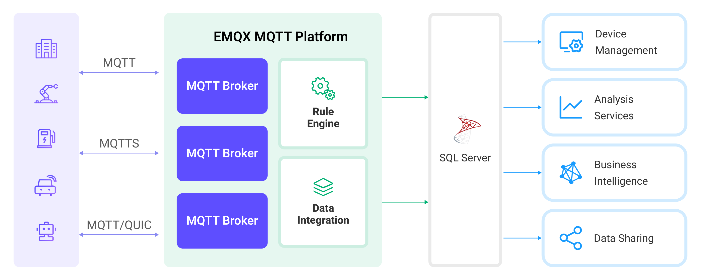

# Ingest MQTT Data into Microsoft SQL Server

[SQL Server](https://www.microsoft.com/en-us/sql-server/) is one of the leading relational commercial database solutions, widely used in enterprises and organizations of various sizes and types. EMQX Cloud supports integration with SQL Server, enabling you to save MQTT messages and client events to SQL Server. This facilitates the construction of complex data pipelines and analytical processes for data management and analysis, or for managing device connections and integrating with other enterprise systems such as ERP, CRM, and BI.

This page provides a detailed overview of the data integration between EMQX Cloud and Microsoft SQL Server with practical instructions on creating and validating the data integration.

## How It Works

Microsoft SQL Server data integration is an out-of-the-box feature in EMQX Cloud, combining EMQX Cloud's device connectivity and message transmission capabilities with the powerful data storage capabilities of Microsoft SQL Server. Through the built-in [rule engine](./rules.md) component, you can store MQTT messages and client events in Microsoft SQL Server. Additionally, events can trigger updates or deletions of data within Microsoft SQL Server, enabling the recording of information such as device online status and connection history. This integration simplifies the process of ingesting data from EMQX Cloud to SQL Server for storage and management, eliminating the need for complex coding.

The diagram below illustrates a typical architecture of data integration between EMQX and SQL Server:



Ingesting MQTT data into Microsoft SQL Server works as follows:

1. **Message publication and reception**: Industrial IoT devices establish successful connections to EMQX Cloud through the MQTT protocol and publish real-time MQTT data from machines, sensors, and product lines based on their operational states, readings, or triggered events to EMQX Cloud. When EMQX Cloud receives these messages, it initiates the matching process within its rules engine.
2. **Message data processing:** When a message arrives, it passes through the rule engine and is then processed by the rule defined in EMQX Cloud. The rules, based on predefined criteria, determine which messages need to be routed to Microsoft SQL Server. If any rules specify payload transformations, those transformations are applied, such as converting data formats, filtering out specific information, or enriching the payload with additional context.
3. **Data ingestion into SQL Server**: The rule triggers the writing of messages to Microsoft SQL Server. With the help of SQL templates, users can extract data from the rule processing results to construct SQL and send it to SQL Server for execution, so that specific fields of the message can be written or updated into the corresponding tables and columns of the database.
4. **Data Storage and Utilization**: With the data now stored in Microsoft SQL Server, businesses can harness its querying power for various use cases.

## Features and Benefits

The data integration with Microsoft SQL Server offers a range of features and benefits tailored to ensure efficient data transmission, storage, and utilization:

- **Real-time Data Streaming**: EMQX Cloud is built for handling real-time data streams, ensuring efficient and reliable data transmission from source systems to Microsoft SQL Server. It enables organizations to capture and analyze data in real-time, making it ideal for use cases requiring immediate insights and actions.
- **High Performance and Scalability**: Both EMQX Cloud and Microsoft SQL Server feature expandability and reliability, suitable for handling large-scale IoT data. They can undergo uninterrupted horizontal and vertical expansion as demands grow, ensuring the continuity and reliability of IoT applications.
- **Flexibility in Data Transformation:** EMQX Cloud provides a powerful SQL-based Rule Engine, allowing organizations to pre-process data before storing it in Microsoft SQL Server. It supports various data transformation mechanisms, such as filtering, routing, aggregation, and enrichment, enabling organizations to shape the data according to their needs.
- **Advanced Analytics:** Microsoft SQL Server offers powerful analytical capabilities, such as building multi-dimensional data models through Analysis Services to support complex data analysis and data mining. It also enables the creation and publication of reports through Reporting Services, presenting insights and analysis results of IoT data to stakeholders.

## Before You Start

This section describes the preparations you need to complete before you start to create the Microsoft SQL Server data integration, including how to install and connect to the Microsoft SQL Server, create database and data tables, and install and configure the ODBC driver.

### Prerequisites

- Understand [rules](./rules.md).
- Understand [data integration](./introduction.md).

### Install and Connect to Microsoft SQL Server

This section describes how to start Microsoft SQL Server 2019 on Linux/MacOS using Docker images and use `sqlcmd` to connect to Microsoft SQL Server. For other installation methods of Microsoft SQL Server, please refer to [Microsoft SQL Server Installation Guide](https://learn.microsoft.com/en-us/sql/database-engine/install-windows/install-sql-server?view=sql-server-ver16).

1. Install Microsoft SQL Server via Docker, and then start the docker image with the command below. Use `mqtt_public1` as the password. For the password policy of Microsoft SQL Server, see [Password Complexity](https://learn.microsoft.com/en-us/sql/relational-databases/security/password-policy?view=sql-server-ver16#password-complexity).

   Note: By starting a Docker container with the environment variable `ACCEPT_EULA=Y` you agree to the terms of Microsoft EULA, see also [MICROSOFT SOFTWARE LICENSE TERMS MICROSOFT SQL SERVER 2019 STANDARD(EN_US)](https://www.microsoft.com/en-us/Useterms/Retail/SQLServerStandard/2019/Useterms_Retail_SQLServerStandard_2019_English.htm).

   ```bash
   # To start the Microsoft SQL Server docker image and set the password as `mqtt_public1`
   $ docker run --name sqlserver -p 1433:1433 -e ACCEPT_EULA=Y -e MSSQL_SA_PASSWORD=mqtt_public1 -d mcr.microsoft.com/mssql/server:2019-CU19-ubuntu-20.04
   ```

2. Access the container.

   ```bash
   docker exec -it sqlserver bash
   ```

3. Enter the preset password to connect to the server in the container. The characters are not echoed when entering the password. Click `Enter` directly after entering the password.

   ```bash
   $ /opt/mssql-tools/bin/sqlcmd -S 127.0.0.1 -U sa
   $ Password:
   1>
   ```

   ::: tip

   The `mssql-tools` have been installed in the Microsoft SQL Server container provided by Microsoft, but the executable file is not in `$PATH`. Therefore, you need to specify the executable file path for `mssql-tools` before proceeding. As for the Docker deployment in this example, the file path should be `opt`.

   For more information on how to use `mssql-tools`, see [sqlcmd-utility](https://learn.microsoft.com/en-us/sql/tools/sqlcmd/sqlcmd-utility?view=sql-server-ver16).

   :::

So far, the Microsoft SQL Server 2019 instance has been deployed and can be connected.

### Create Database and Data Tables

This section describes how to create a database and data table in Microsoft SQL Server.

1. Create a database `emqx` in Microsoft SQL Server using the connection created from the previous section.

   ```bash
    ...
    Password:
    1> USE master
    2> GO
    Changed database context to 'master'.
    1> CREATE DATABASE emqx;
    2> GO
   ```

2. Use the following SQL statements to create a data table.

   - Use the following SQL command to create temp_hum table, and this table will be used for storing the temperature and humidity data reported by devices.

     ```sql
      CREATE TABLE temp_hum(
        client_id VARCHAR(64) NULL,
        temp NVARCHAR(100) NULL,
        hum NVARCHAR(100) NULL,
        up_timestamp DATETIME NOT NULL DEFAULT CURRENT_TIMESTAMP
      );
      GO;
     ```

### Configure ODBC Driver

Provide your SQL Server version through the EMQX Cloud [tickets](https://docs.emqx.com/en/cloud/latest/feature/tickets.html) service, and the ODBC driver will be installed for your deployment in the background.

## Create a Microsoft SQL server Connector

Before creating data integration rules, you need to first create a Microsoft SQL server connector to access the Microsoft SQL server server.

1. Go to your deployment. Click **Data Integration** from the left-navigation menu.

2. If it is the first time for you to create a connector, select **Microsoft SQL server** under the **Data Persistence** category. If you have already created connectors, select **New Connector** and then select **Microsoft SQL server** under the **Data Persistence** category.

3. **Connector name**: The system will automatically generate a connector name.

4. Enter the connection information:

   - **Server Host**: IP address and port of the server.
   - **Database Name**: Enter `emqx`.
   - **Username**: Enter `sa`.
   - **Password**: Enter the preset password `mqtt_public1`, or use the actual password.
   - **SQL Server Driver Name**: The name specified for the ODBC driver during the installation of the ODBC driver in the [Configure ODBC Driver](#configure-odbc-driver) step."

5. Click the **Test** button. If the Microsoft SQL server service is accessible, a success prompt will be returned.

6. Click the **New** button to complete the creation.

## Create Rules

Next, you need to create a rule to specify the data to be written and add corresponding actions in the rule to forward the processed data to Microsoft SQL server.

1. Click **New Rule** in Rules area or click the New Rule icon in the **Actions** column of the connector you just created.

2. Enter the rule matching SQL statement in the **SQL editor**. In the following rule, we read the time when the message was reported `up_timestamp`, client ID, payload via `temp_hum/emqx` topic. Also, we can read temperature and humidity from this topic.

   ```sql
    SELECT
      timestamp as up_timestamp,
      clientid as client_id,
      payload.temp as temp,
      payload.hum as hum
    FROM
      "temp_hum/emqx"
   ```

   ::: tip

   If you are a beginner user, click **SQL Examples** and **Enable Test** to learn and test the SQL rule.

   :::

3. Click **Next** to add an action.

4. Select the connector you just created from the **Connector** dropdown box.

5. Configure the **SQL Template** based on the feature to use. Note: This is a preprocessed SQL, so the fields should not be enclosed in quotation marks, and do not write a semicolon at the end of the statements:

   ```sql
    INSERT INTO temp_hum(client_id, temp, hum)
    VALUES (
      ${client_id},
      ${temp},
      ${hum}
    )
   ```

6. Advanced Settings (Optional).

7. Click the **Confirm** button to complete the rule creation.

8. In the **Successful new rule** pop-up, click **Back to Rules**, thus completing the entire data integration configuration chain.

## Test the Rule

You are recommended to use [MQTTX](https://mqttx.app/) to simulate temperature and humidity data reporting, but you can also use any other client.

1. Use MQTTX to connect to the deployment and send messages to the following Topic.

   - topic: `temp_hum/emqx`

   - payload:

     ```json
     {
       "temp": "27.5",
       "hum": "41.8"
     }
     ```

2. Check if the message has been forwarded to Microsoft SQL Server.

   ```bash
    1> SELECT * FROM temp_hum ORDER BY up_timestamp;
    2> GO
    client_id                                                        temp         hum          up_timestamp
    ---------------------------------------------------------------- ------------ ------------ -----------------------
    test_client                                                             27.50        41.80 2024-03-25 05:49:21.237
   ```

3. View operational data in the console. Click the rule ID in the rule list, and you can see the statistics of the rule and the statistics of all actions under this rule.
