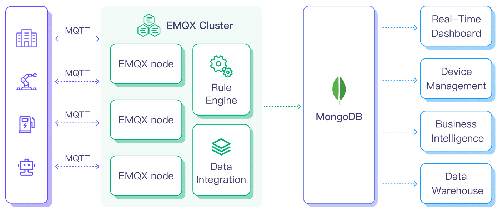

# Ingest MQTT Data into MongoDB

[MongoDB](https://www.mongodb.com/), a leading NoSQL database, is renowned for its flexibility in schema design, scalability, and capacity to store large volumes of structured and semi-structured data. By integrating EMQX Platform with MongoDB, users can efficiently ingest MQTT messages and client events directly into MongoDB. This facilitates long-term series data storage and advanced querying capabilities within MongoDB. The integration ensures a single-directional flow, where MQTT messages from EMQX Platform are written into the MongoDB database. This powerful combination is a solid foundation for businesses looking to manage their IoT data effectively.

This page provides a comprehensive introduction to the data integration between EMQX Platform and MongoDB with practical instructions on creating and validating the data integration.

## How It Works

MongoDB data integration is an out-of-the-box feature in EMQX Platform designed to bridge the gap between MQTT-based IoT data and MongoDB's powerful data storage capabilities. With a built-in [rule engine](./rules.md) component, the integration simplifies the process of ingesting data from EMQX Platform to MongoDB for storage and management, eliminating the need for complex coding.

The diagram below illustrates a typical architecture of data integration between EMQX and MongoDB.



Ingesting MQTT data into MongoDB works as follows:

1. **Message publication and reception**: IoT devices, whether they are part of connected vehicles, IIoT systems, or energy management platforms, establish successful connections to EMQX Platform through the MQTT protocol and publish MQTT messages to specific topics. When EMQX Platform receives these messages, it initiates the matching process within its rules engine.
2. **Message data processing:** When a message arrives, it passes through the rule engine and is then processed by the rule defined in EMQX Platform. The rules, based on predefined criteria, determine which messages need to be routed to MongoDB. If any rules specify payload transformations, those transformations are applied, such as converting data formats, filtering out specific information, or enriching the payload with additional context.
3. **Data ingestion into MongoDB**: Once the rule engine identifies a message for MongoDB storage, it triggers an action of forwarding the messages to MongoDB. Processed data will be seamlessly written into the collection of the MongoDB database.
4. **Data storage and utilization**: With the data now stored in MongoDB, businesses can harness its querying power for various use cases. For instance, in the realm of connected vehicles, this stored data can inform fleet management systems about vehicle health, optimize route planning based on real-time metrics, or track assets. Similarly, in IIoT settings, the data might be used to monitor machinery health, forecast maintenance, or optimize production schedules.

By using this integrated system, businesses in sectors like power and energy can continuously monitor grid health, forecast demand, or identify potential outages before they happen. The value derived from the real-time and historical data not only ensures operational efficiency but can also lead to significant cost savings and enhanced customer experiences.

## Features and Benefits

The data integration with MongoDB offers a range of features and benefits tailored to ensure effective data handling and storage:

- **Streamlined IoT Data Management**

  You can ingest, store, process, and analyze your IoT data all in one place, eliminating the need for complicated integrations and tedious data migrations. Say goodbye to data silos and hello to a unified view of your IoT data.

- **Real-time Data Processing**

  EMQX Platform is built for handling real-time data streams, ensuring efficient and reliable data transmission from source systems to MongoDB. It enables organizations to capture and analyze data in real-time, making it ideal for use cases requiring immediate insights and actions.

- **Flexible MongoDB Connection Options**

  Whether you operate with a single MongoDB instance or leverage the robustness of a replica set, the data integration offers native support to connect with both configurations, providing businesses with the flexibility to adapt as per their infrastructure needs.

- **High Performance and Scalability**

  EMQX's distributed architecture and MongoDB's columnar storage format enable seamless scalability as data volumes increase. This ensures consistent performance and responsiveness, even with large datasets. As your IoT deployments grow, your data storage capabilities can scale with ease.

- **Flexible Data Transformation**

  EMQX Platform provides a powerful SQL-based Rule Engine, allowing organizations to pre-process data before storing it in MongoDB. It supports various data transformation mechanisms, such as filtering, routing, aggregation, and enrichment, enabling organizations to shape the data according to their needs.

- **NoSQL**

  MongoDB's schema-less architecture ensures that diverse MQTT message structures can be easily stored without the need for rigid schemas, accommodating the dynamic nature of IoT data.

- **Reliable Data Storage**

  Once the EMQX Platform rule engine processes and routes the message, it is stored in MongoDB with the platform's proven reliability, ensuring data integrity and consistent availability.

- **Operational Metrics and Advanced Analytics**

  Glean insights from metrics such as the total message count, egress traffic rate, and more. These metrics, combined with MongoDB's powerful querying, can be utilized to monitor, analyze, and optimize the data flow, empowering users to gain valuable insights from IoT data, enabling predictive analytics, anomaly detection, and more.

- **Latest MongoDB Version Support**

  The data integration is compatible with and supports the latest versions of MongoDB, ensuring users benefit from the newest features, optimizations, and security updates offered by the database platform.

This MongoDB data integration fortifies your IoT infrastructure, ensuring that vast amounts of data generated by your devices are not just stored but are also ready for future querying and analysis. The ease of setup and operational excellence it brings can greatly enhance the efficiency and reliability of your IoT systems.

## Before You Start

This section introduces the preparatory work needed to create MongoDB Data Integration in EMQX Platform.

### Prerequisites

- Understand [rules](./rules.md)
- Understand [data integration](./introduction.md)
- Knowledge about [MongoDB](https://www.mongodb.com/)

### Set Up MongoDB Server

#### Install MongoDB via Docker

You can use the following commands to install MongoDB via Docker, run the docker image, and create a user.

```bash
#  To start the MongoDB docker image and set the password as public
docker run -d --name mongodb -p 27017:27017 mongo

# Access the container
docker exec -it mongodb bash

# Locate the MongoDB server in the container
mongosh

# Create a user
use admin
db.createUser({ user: "admin", pwd: "public", roles: [ { role: "root", db: "admin" } ] })

# Create database emqx_data
use emqx_data

# create collection emqx_messages
db.createCollection('emqx_messages')
```

<!-- TODO: Create MongoDB Service using MongoDB Atlas -->

## Create a MongoDB Connector

Before creating data integration rules, you need to first create a MongoDB connector to access the MongoDB server.

1. Go to your deployment. Click **Data Integration** from the left-navigation menu.
2. If it is the first time for you to create a connector, select **MongoDB** under the **Data Persistence** category. If you have already created connectors, select **New Connector** and then select **MongoDB** under the **Data Persistence** category.
3. **Connector name**: The system will automatically generate a connector name.
4. Enter the connection information:

   - **MongoDB Mode**: Select the type of MongoDB deployment you are connecting to based on your actual deployment mode. In this demonstration, you can select `single` for example.
     - `single`: a single standalone MongoDB instance.
     - `rs`: Replica Set, a group of `mongod` processes that maintain the same data set.
     - `sharded`: a sharded cluster in MongoDB.
   - **Server Host**: IP address and port of the server.
   - **Database Name**: Enter `emqx_data`.
   - **Write Mode**: Keep the default value `unsafe`.
   - **Username**: Enter `admin`.
   - **Password**: Enter `public`.
   - **Auth Source**: Enter the aatabase name associated with the user's credentials.
   - **Use Legacy Protocol**: Determine if MongoDB's legacy communication protocol should be used (MongoDB introduced a new wire protocol in version 3.6, with the legacy protocol retained for backward compatibility.). This setting can be set to `true`, `false`, or `auto`. In `auto` mode (default option), EMQX will automatically determine which protocol to use based on the detected MongoDB version.
   - **Srv Record**: Disabled by default. Once enabled, it allows EMQX Platform to use DNS SRV records to discover the MongoDB hosts it should connect to, which makes it easier to connect to replica sets or sharded clusters without having to specify each host in the connection string.
   - If you want to establish an encrypted connection, click the **Enable TLS** toggle switch.

5. Advanced Settings (Optional): Refer to [Advanced Configuration](https://docs.emqx.com/en/enterprise/latest/data-integration/data-bridge-mongodb.html#advanced-configurations).
6. Click the **Test** button. If the MongoDB service is accessible, a success prompt will be returned.
7. Click the **New** button to complete the creation.

## Create a Rule

Next, you need to create a rule to specify the data to be written and add corresponding actions in the rule to forward the processed data to MongoDB.

1. Click **New Rule** in Rules area or click the New Rule icon in the **Actions** column of the connector you just created.

2. Enter the rule matching SQL statement in the **SQL editor**. In the following rule, we read the time when the message was reported `up_timestamp`, client ID, payload via `temp_hum/emqx` topic. Also, we can read temperature and humidity from this topic.

   ```sql
     SELECT
       timestamp as up_timestamp,
       clientid as client_id,
       payload.temp as temp,
       payload.hum as hum
       FROM
     "temp_hum/emqx"
   ```

   ::: tip

   If you are a beginner user, click **SQL Examples** and **Enable Test** to learn and test the SQL rule.

   :::

3. Click **Next** to add an action.

4. Select the connector you just created from the **Connector** dropdown box.

5. Configure the **Payload template** to save `client_id`, `up_timestamp`, `temp`, and `hum` to MongoDB. This template will be executed via the MongoDB insert command, and the sample code is as follows:

   ```json
   {
     "client_id": "${client_id}",
     "timestamp": ${up_timestamp},
     "temp": ${temp},
     "hum": ${hum}
   }
   ```

   When configuring the payload template, pay attention to the following:

   - All `keys` need to be wrapped in double quotes `"`;
   - Auto-derivation of the data type of "value" is not supported:

     - Characters need to be wrapped with `"`, otherwise, an error will be reported;
     - Values do not need to be wrapped, otherwise, they will be recognized as characters;
     - For timestamp, date, and time types, if no special treatment is performed, they will be recognized as numeric or character types. To store them as date or time, use the `mongo_date` function in the rule SQL to process the fields.

   - Nested objects are allowed when the value is a JSON object:

     - It is not allowed to use `"` to nest the value in the template, otherwise, it will cause an execution error;
     - Objects will be nested and stored according to their own structure;

   - To store objects as JSON characters, use the `json_encode` function in rule SQL for the conversion, and the corresponding **value** in the template is still not allowed to be wrapped with `"`.

6. Advanced Settings (Optional): Refer to [Advanced Configuration](https://docs.emqx.com/en/enterprise/latest/data-integration/data-bridge-mongodb.html#advanced-configurations).

7. Click the **Confirm** button to complete the rule creation.

8. In the **Successful new rule** pop-up, click **Back to Rules**, thus completing the entire data integration configuration chain.

## Test the Rule

You are recommended to use [MQTTX](https://mqttx.app/) to simulate temperature and humidity data reporting, but you can also use any other client.

1. Use MQTTX to connect to the deployment and send messages to the following Topic.

   - topic: `temp_hum/emqx`

   - payload:

     ```json
     {
       "temp": "27.5",
       "hum": "41.8"
     }
     ```

2. View data dump results.

```bash
emqx_data> db.temp_hum.find()
[
  {
    _id: ObjectId('65fba3d0ac7ad8048e000001'),
    client_id: 'test_client',
    hum: 41.8,
    temp: 27.5,
    timestamp: 1710990288
  }
]
```

3. View operational data in the console. Click the rule ID in the rule list, and you can see the statistics of the rule and the statistics of all actions under this rule.
