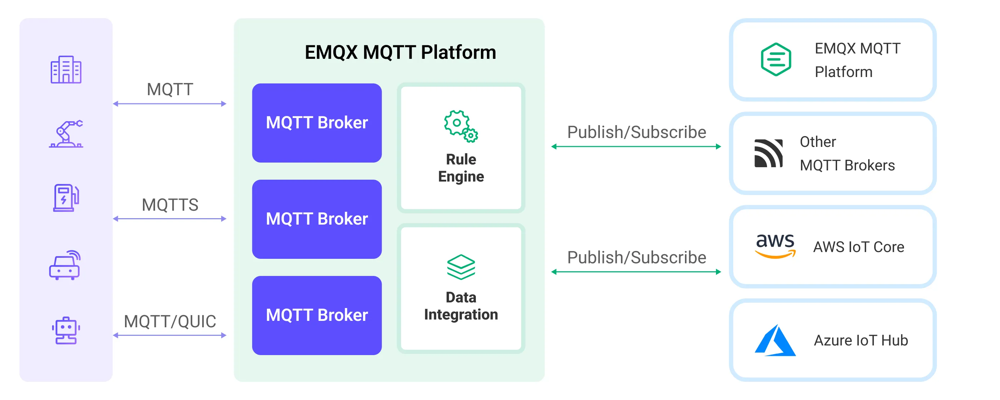

# Bridge with Other MQTT Services

MQTT Broker data integration provides EMQX with functionality to connect to another EMQX cluster or another MQTT service for message bridge, enabling cross-network, cross-service data interaction and communication. This page introduces the working principle of the MQTT message bridge in EMQX Platform and offers practical guidance on creating and verifying message bridges.

## How It Works

During bridging, EMQX Platform establishes an MQTT connection with the target service as a client, achieving bidirectional message transmission through the publish-subscribe model:

- Outgoing Messages: Publishes messages from local topics to specified topics on the remote MQTT service.

EMQX Platform supports configuring multiple bridging rules on the same connection, each with different topic mappings and message transformation rules, implementing a function similar to message routing. During bridging, you can also process messages through the Rule Engine to filter, enrich, and transform messages before forwarding.

The diagram below shows a typical architecture of data integration between EMQX Platform and other MQTT services:



## Features and Benefits

The MQTT Broker data integration has the following features and benefits:

- **Extensive Compatibility**: It uses the standard MQTT protocol, allowing it to bridge to various IoT platforms, including AWS IoT Core, Azure IoT Hubs, and also supports open-source or other industry MQTT brokers and IoT platforms. This enables seamless integration and communication with a variety of devices and platforms.
- **Flexible Topic Mapping**: Based on the MQTT publish-subscribe model, the MQTT broker data integration implements flexible topic mapping. It supports adding prefixes to topics and dynamically constructing topics using the client's contextual information (such as client ID, username, etc.). This flexibility allows for customized processing and routing of messages according to specific needs.
- **High Performance**: It offers performance optimization options like connection pooling and shared subscriptions to reduce the load on individual bridging clients, achieving lower bridging latency and higher message throughput. These optimization measures enhance the overall system performance and scalability.
- **Payload Transformation**: It allows for the processing of message payloads by defining SQL rules. This means that during message transmission, operations such as data extraction, filtering, enrichment, and transformation can be performed on the payload. For example, real-time metrics can be extracted from the payload and transformed and processed before the message is delivered to the remote MQTT Broker.
- **Metrics Monitoring**: The runtime metrics monitoring is provided for each MQTT Broker data integration. It allows viewing of total message count, success/failure counts, current rates, etc., helping users to monitor and assess the performance and health of the MQTT Broker data integration in real-time.

## Before You Start

### Prerequisites

- Knowledge about [data integration](./introduction.md)
- Knowledge about data integration [rules](./rules.md)

### Prepare MQTT Connection Information

Before creating an MQTT Broker data integration, you need to obtain the connection information for the remote MQTT service, including:

- **MQTT Service Address**: The address and port of the target MQTT service, for example, broker.emqx.io:1883.
- **Username**: The username required for the connection. If the target service does not require authentication, this can be left blank.
- **Password**: The password required for the connection. If the target service does not require authentication, this can also be left blank.
- **Protocol Type**: It is important to determine whether the target service has enabled TLS and whether it is using MQTT over TCP/TLS protocol. Note that the EMQX Platform MQTT bridge currently does not support protocols like MQTT over WebSocket and MQTT over QUIC.
- **Protocol Version**: The protocol version used by the target MQTT service. EMQX Platform supports MQTT 3.1, 3.1.1, and MQTT 5.0.

The data integration provides good compatibility and support for EMQX Platform or other standard MQTT servers. If you need to connect to other types of MQTT services, you can refer to their relevant documentation to obtain the connection information. Generally, most IoT platforms provide standard MQTT access methods, and you can convert device information into the aforementioned MQTT connection information based on their guidance.

### Notice for Cluster Mode

When EMQX Platform is running in cluster mode or when a connection pool is enabled, using the same client ID to connect multiple nodes to the same MQTT service usually leads to device conflicts. Therefore, the MQTT message bridge currently does not support setting a fixed client ID.

## Create a Connector

This section guides you on how to configure a connection with a remote MQTT server, using EMQX's [online MQTT server](https://www.emqx.com/en/mqtt/public-mqtt5-broker) as an example.

Before creating rules for data integration, you need to create an MQTT Broker connector to access the MQTT service.

1. Select **Data Integration** from the deployment menu, then choose MQTT Broker under the **Data Forward** category.If you have already created connectors, select **New Connector** and then select **MQTT Broker** under the **Data Forward** category.

2. **Connector Name**: The system will automatically generate a connector name.

3. Configure the connection information:

   - **MQTT Broker**: Only supports MQTT over TCP/TLS. Set this to `broker.emqx.io:1883`.
   - **ClientID Prefix**: This can be left blank. In actual use, specifying a client ID prefix can facilitate client management. EMQX Platform will automatically generate client IDs based on the client ID prefix and the size of the connection pool.
   - **Username** and **Password**: These can be left blank, as authentication is not required for this server.

4. Leave other configurations as default.

5. Click the **Test** button. If the MQTT Broker is accessible, a prompt indicating **connector available** will be returned.

6. Click the **New** button to complete the creation.

Next, you can create data bridge rules based on this Connector.

### Connection Pool and Client ID Generation Rules

EMQX Platform enables multiple clients to simultaneously connect to the bridged MQTT service. When creating a Connector, you can set up an MQTT client connection pool and configure its size to indicate the number of client connections in the pool. The connection pool maximizes server resources for greater message throughput and better concurrent performance, which is crucial for handling high-load, high-concurrency scenarios.

As the MQTT protocol requires clients connected to an MQTT server to have a unique client ID, and since EMQX Platform can be deployed in a cluster, each client in MQTT bridging is assigned a unique client ID. EMQX Platform automatically generates client IDs according to the following pattern:

```bash
[Client ID Prefix]:{Connector Name}{8-digit Random String}:{Connection Sequence Number in the Pool}
```

For example, if the client ID prefix is myprefix and the Connector name is foo, an actual client ID might be:

```bash
myprefix:foo2bd61c44:1
```

## Create a Rule with MQTT Broker

This section demonstrates how to create a rule for specifying data to be forwarded to a remote MQTT service.

1. Click **New Rule** in the Rules area or click the New Rule icon in the **Actions** column of the connector you just created.

2. Set the rules in the **SQL Editor** based on the feature to use, Our goal is to trigger the engine when the client sends a temperature and humidity message to the `temp_hum/emqx` topic. Here you need a certain process of SQL:

   ```sql
    SELECT
      topic,
      payload
    FROM
      "temp_hum/emqx"
   ```

   ::: tip

   If you are a beginner user, click **SQL Examples** and **Enable Test** to learn and test the SQL rule.

   :::

3. Click **Next** to add an action.

4. Select the connector you just created from the **Connector** dropdown box.

5. Configure the information for publishing messages from EMQX Platform to the external MQTT service:

   - **Topic**: The topic to publish to the external MQTT service, supporting `${var}` placeholders. Enter `pub/${topic}` here, meaning the original topic will be prefixed with `pub/` for forwarding. For example, if the original message topic is `t/1`, the topic forwarded to the external MQTT service will be `pub/t/1`.
   - **QoS**: The QoS for message publishing. Select from the dropdown options: `0`, `1`, `2`, or `${qos}`, or enter a placeholder to set QoS from another field. Here, select `${qos}` to follow the QoS of the original message.
   - **Retain**: Select `true`, `false`, or `${falgs.retain}` to decide whether to publish the message as retained, or enter a placeholder to set the retain flag from other fields. Here, select `${falgs.retain}` to follow the retain flag of the original message.
   - **Payload**: The template used to generate the payload for the forwarded message. Leave blank by default, which means forwarding the rule output result. Here, you can enter `${payload}` to forward only the payload.

6. Use default values for other configurations and click the **Confirm** button to complete the rule creation.

7. In the **Successful new rule** pop-up, click **Back to Rules**, thus completing the entire data integration configuration chain.

## Test the Rule

You are recommended to use [MQTTX](https://mqttx.app/) to simulate temperature and humidity data reporting, but you can also use any other client.

1. Subscribe to the pub/# topic in the external MQTT Service:

   ```bash
   mqttx sub -t pub/# -q 1 -h broker.emqx.io -v
   ```

1. Use MQTTX to connect to the deployment and send messages to the following Topic.

   - topic: `temp_hum/emqx`

   - client id: `test_client`

   - payload:

     ```json
     {
       "temp": "27.5",
       "hum": "41.8"
     }
     ```

1. You can subscribe to the `pub/temp_hum/emqx` topic in MQTTX to receive the message, indicating that the message has been successfully forwarded from EMQX Platform to the external MQTT service:

   ```bash
   [2024-3-21] [10:43:13] › topic: pub/temp_hum/emqx
   payload:
   { "temp": "27.5", "hum": "41.8"}
   ```
