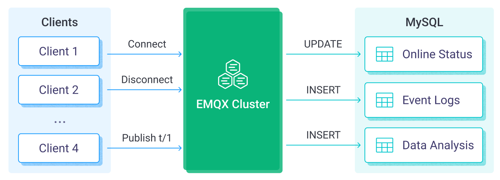

# Ingest MQTT Data into MySQL

[MySQL](https://www.mysql.com/) is a widely used relational database with high reliability and stability, and can be quickly installed, configured and used. MySQL data integration can efficiently store MQTT messages in the MySQL database, and also supports real-time updating or deletion of data in MySQL through event triggering. With the help of MySQL data integration, you can easily implement functions such as message storage, device online/offline status update, and device behavior recording to achieve flexible IoT data storage and device management functions.

This page introduces the data integration between EMQX Cloud and MySQL with practical instructions on creating and validating the data integration.

## How It Works

MySQL data integration is an out-of-the-box feature in EMQX Cloud, which enables complex business development through simple configuration. In a typical IoT application, EMQX Cloud, as the IoT platform, is responsible for device connection and transmitting messages. MySQL, as the data storage platform, is responsible for storing device status and metadata, as well as message data storage and data analysis.



EMQX Cloud forwards device events and data to MySQL through the rule engine. Applications can read the data in MySQL to sense the device status, obtain device online and offline records, and analyze device data. The specific workflow is as follows:

- **IoT devices connect to EMQX Cloud**: After IoT devices are successfully connected through the MQTT protocol, online events will be triggered. The events include information such as device ID, source IP address, and other attributes.
- **Message publication and reception**: The devices publish telemetry and status data to specific topics. When EMQX Cloud receives these messages, it initiates the matching process within its rules engine.
- **Rule Engine Processing Messages**: With the built-in rules engine, messages and events from specific sources can be processed based on topic matching. The rules engine matches the corresponding rules and processes messages and events, such as converting data formats, filtering out specific information, or enriching messages with contextual information.
- **Write to MySQL**: The rule triggers the writing of messages to MySQL. With the help of SQL templates, users can extract data from the rule processing results to construct SQL and send it to MySQL for execution, so that specific fields of the message can be written or updated into the corresponding tables and columns of the database.

After the event and message data are written to MySQL, you can connect to MySQL to read the data for flexible application development, such as:

- Connect to visualization tools, such as Grafana, to generate charts based on data and show data changes.
- Connect to the device management system, view the device list and status, detect abnormal device behavior, and eliminate potential problems in a timely manner.

## Features and Benefits

The data integration with MySQL can bring the following features and advantages to your business:

- **Flexible Event Handling**: Through the EMQX Cloud rules engine, MySQL can handle device lifecycle events, greatly facilitating the development of various management and monitoring tasks required for implementing IoT applications. By analyzing event data, you can promptly detect device failures, abnormal behavior, or trend changes to take appropriate measures.
- **Message Transformation**: Messages can undergo extensive processing and transformation through EMQX Cloud rules before being written to MySQL, making storage and usage more convenient.
- **Flexible Data Operations**: With SQL templates provided by EMQX Cloud, it's easy to write or update data from specific fields to the corresponding tables and columns in the MySQL database, enabling flexible data storage and management.
- **Integration of Business Processes**: The data integration allows you to integrate device data with MySQL's rich ecosystem applications, facilitating integration with systems like ERP, CRM, or other custom business systems to achieve advanced business processes and automation.
- **Runtime Metrics**: Support for viewing runtime metrics of each rule, such as total message count, success/failure counts, current rates, and more.

Through flexible event handling, extensive message transformation, flexible data operations, and real-time monitoring and analysis capabilities, you can build efficient, reliable, and scalable IoT applications, benefiting your business decisions and optimizations.

## Before You Start

This section describes the preparations you need to complete before you start to create the MySQL data integration in EMQX Cloud, including installing the MySQL server and creating data tables.

### Prerequisites

- Knowledge about [Data Integration](./introduction.md)
- Knowledge about EMQX Cloud data integration [rules](./rules.md)

### Install MySQL Server

1. Install MySQL server via Docker, and then run the docker image.

```bash
# To start the MySQL docker image and set the password as public
docker run --name mysql -p 3306:3306 -e MYSQL_ROOT_PASSWORD=public -d mysql

# Access the container
docker exec -it mysql bash

# Locate the MySQL server in the container and input the preset password
mysql -u root -p

# Create and then select the database
CREATE DATABASE emqx_data CHARACTER SET utf8mb4;
use emqx_data;
```

2. Create table. Use the following SQL command to create temp_hum table, and this table will be used for storing the temperature and humidity data reported by devices:

```sql
CREATE TABLE `temp_hum` (
  `id` int(11) unsigned NOT NULL AUTO_INCREMENT,
  `up_timestamp` timestamp NULL DEFAULT NULL,
  `client_id` varchar(32) DEFAULT NULL,
  `temp` float unsigned DEFAULT NULL,
  `hum` float unsigned DEFAULT NULL,
  PRIMARY KEY (`id`),
  KEY `up_timestamp_client_id` (`up_timestamp`,`client_id`)
) ENGINE=InnoDB AUTO_INCREMENT=26 DEFAULT CHARSET=utf8mb4;
```

## Create a MySQL Connector

Before creating data integration rules, you need to first create a MySQL connector to access the MySQL server.

1. Go to your deployment. Click **Data Integration** from the left-navigation menu.
2. If it is the first time for you to create a connector, select **MySQL** under the **Data Persistence** category. If you have already created connectors, select **New Connector** and then select **MySQL** under the **Data Persistence** category.
3. **Connector name**: The system will automatically generate a connector name.
4. Enter the connection information:

   - **Server Host**: IP address and port of the server.
   - **Database Name**: Enter `emqx_data`.
   - **Username**: Enter `root`.
   - **Password**: Enter `public`.
   - If you want to establish an encrypted connection, click the **Enable TLS** toggle switch.

5. Advanced Settings (Optional): Refer to [Advanced Configuration](https://docs.emqx.com/en/enterprise/latest/data-integration/data-bridge-mysql.html#advanced-configurations).
6. Click the **Test** button. If the MySQL service is accessible, a success prompt will be returned.
7. Click the **New** button to complete the creation.

## Create Rules

Next, you need to create a rule to specify the data to be written and add corresponding actions in the rule to forward the processed data to MySQL.

1. Click **New Rule** in Rules area or click the New Rule icon in the **Actions** column of the connector you just created.

2. Enter the rule matching SQL statement in the **SQL editor**. In the following rule, we read the time when the message was reported `up_timestamp`, client ID, payload via `temp_hum/emqx` topic. Also, we can read temperature and humidity from this topic.

   ```sql
    SELECT
      timestamp as up_timestamp,
      clientid as client_id,
      payload.temp as temp,
      payload.hum as hum
    FROM
      "temp_hum/emqx"
   ```

   ::: tip

   If you are a beginner user, click **SQL Examples** and **Enable Test** to learn and test the SQL rule.

   :::

3. Click **Next** to add an action.

4. Select the connector you just created from the **Connector** dropdown box.

5. Configure the **SQL Template** based on the feature to use:

   Note: This is a preprocessed SQL, so the fields should not be enclosed in quotation marks, and do not write a semicolon at the end of the statements.

   ```sql
    INSERT INTO temp_hum (up_timestamp, client_id, temp, hum)
    VALUES (
      FROM_UNIXTIME(${up_timestamp}/1000),
      ${client_id},
      ${temp},
      ${hum}
    )
   ```

6. Advanced Settings (Optional): Refer to [Advanced Configuration](https://docs.emqx.com/en/enterprise/latest/data-integration/data-bridge-mysql.html#advanced-configurations).

7. Click the **Confirm** button to complete the rule creation.

8. In the **Successful new rule** pop-up, click **Back to Rules**, thus completing the entire data integration configuration chain.

## Test the Rule

You are recommended to use [MQTTX](https://mqttx.app/) to simulate temperature and humidity data reporting, but you can also use any other client.

1. Use MQTTX to connect to the deployment and send messages to the following Topic.

   - topic: `temp_hum/emqx`

   - payload:

     ```json
     {
       "temp": "27.5",
       "hum": "41.8"
     }
     ```

2. View data dump results.

```bash
mysql> SELECT * FROM temp_hum ORDER BY up_timestamp DESC LIMIT 10;
+----+---------------------+-------------+------+------+
| id | up_timestamp        | client_id   | temp | hum  |
+----+---------------------+-------------+------+------+
| 26 | 2024-03-20 08:44:55 | test_client | 27.5 | 41.8 |
+----+---------------------+-------------+------+------+
1 row in set (0.00 sec)
```

3. View operational data in the console. Click the rule ID in the rule list, and you can see the statistics of the rule and the statistics of all actions under this rule.
