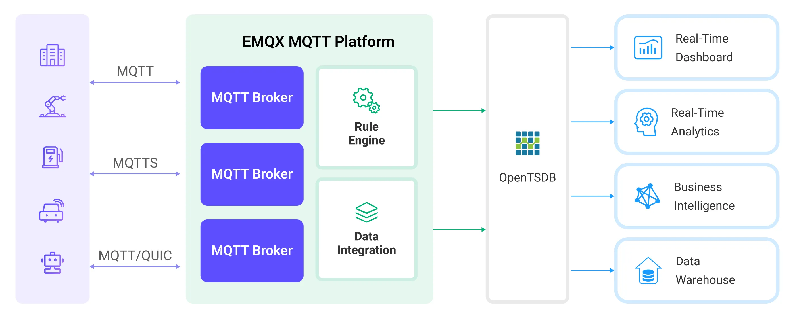

# Ingest MQTT Data into OpenTSDB

[OpenTSDB](http://opentsdb.net/) is a scalable, distributed time series database. EMQX Platform supports integration with OpenTSDB. You can save MQTT messages to OpenTSDB for subsequent analysis and retrieval.

This page provides a comprehensive introduction to the data integration between EMQX Platform and OpenTSDB with practical instructions on creating and validating the data integration.

## How It Works

OpenTSDB data integration is an out-of-the-box feature in EMQX Platform that combines EMQX Platform's real-time data capturing and transmission capabilities with OpenTSDB's data storage and analysis functionality. With a built-in [rule engine](./rules.md) component, the integration simplifies the process of ingesting data from EMQX Platform to OpenTSDB for storage and analysis, eliminating the need for complex coding.

The diagram below illustrates a typical architecture of data integration between EMQX Platform and OpenTSDB:



EMQX Platform inserts device data to OpenTSDB through the rule engine and action. OpenTSDB provides extensive query capabilities, supporting the generation of reports, charts, and other data analysis results. Taking industrial energy management scenarios as an example, the workflow is as follows:

1. **Message publication and reception**: Industrial devices establish successful connections to EMQX Platform through the MQTT protocol and regularly publish energy consumption data using the MQTT protocol. This data includes production line identifiers and energy consumption values. When EMQX Platform receives these messages, it initiates the matching process within its rules engine.
2. **Rule Engine Processes Messages**: The built-in rule engine processes messages from specific sources based on topic matching. When a message arrives, it passes through the rule engine, which matches it with corresponding rules and processes the message data. This can include transforming data formats, filtering specific information, or enriching messages with context information.
3. **Data ingestion into OpenTSDB**: Rules defined in the rule engine trigger operations to write messages to OpenTSDB.

After data is written to OpenTSDB, you can flexibly use the data, for example:

- Connect to visualization tools like Grafana to generate charts based on the data, displaying energy storage data.
- Connect to business systems for monitoring and alerting on the status of energy storage devices.

## Features and Benefits

The OpenTSDB data integration offers the following features and advantages:

- **Efficient Data Processing**: EMQX Platform can handle a massive number of IoT device connections and message throughput, while OpenTSDB excels in data writing, storage, and querying, providing outstanding performance to meet the data processing needs of IoT scenarios without overburdening the system.
- **Message Transformation**: Messages can undergo extensive processing and transformation through EMQX Platform rules before being written into OpenTSDB.
- **Large-Scale Data Storage**: By integrating EMQX Platform with OpenTSDB, a vast amount of device data can be directly stored in OpenTSDB. OpenTSDB is a database designed for storing and querying large-scale time-series data, capable of efficiently handling the massive volume of time-series data generated by IoT devices.
- **Rich Query Capabilities**: OpenTSDB's optimized storage structure and indexing enable rapid writing and querying of billions of data points, which is extremely beneficial for applications requiring real-time monitoring, analysis, and visualization of IoT device data.
- **Scalability**: Both EMQX Platform and OpenTSDB are capable of cluster scaling, allowing flexible horizontal expansion of clusters as business needs grow.

## Before You Start

This section describes the preparations you need to complete before you start to create the OpenTSDB data integration, including how to set up the OpenTSDB server.

### Prerequisites

- Knowledge about [data integration](./introduction.md)
- Knowledge about data integration [rules](./rules.md)

### Install OpenTSDB

Install OpenTSDB via Docker, and then run the docker image (Only x86 platform is supported now).

```bash
docker pull petergrace/opentsdb-docker

docker run -d --name opentsdb -p 4242:4242 petergrace/opentsdb-docker

```

## Create a Connector

Before creating data integration rules, you need to first create an OpenTSDB connector to access the OpenTSDB server.

1.  Go to your deployment. Click **Data Integration** from the left-navigation menu. If it is the first time for you to create a connector, select **OpenTSDB** under the **Data Persistence** category. If you have already created connectors, select **New Connector** and then select **OpenTSDB** under the **Data Persistence** category.

2.  **Connector Name**: The system will automatically generate a connector name.

3.  Enter the connection information:

    - Enter `http://127.0.0.1:4242` as the **Server Host**, or the actual URL if the OpenTSDB server runs remotely.
    - Leave other options as default.
    - Configure advanced settings according to your business needs (optional).

4.  Click the **Test** button. If the OpenTSDB service is accessible, a prompt indicating **connector available** will be returned.

5.  Click the **New** button to complete the creation.

Next, you can create data bridge rules based on this Connector.

## Create a Rule

This section demonstrates how to create an OpenTSDB Rule and add action to the rule via the EMQX Platform Console.

1. Click **New Rule** in the Rules area or click the New Rule icon in the **Actions** column of the connector you just created.

2. Set the rules in the **SQL Editor** using the following statement, which means the MQTT messages under topic `t/#` will be saved to OpenTSDB.

   Note: If you want to specify your own SQL syntax, make sure that you have included all fields required by the rule in the `SELECT` part.

   ```sql
   	SELECT
     		payload.metric as metric, payload.tags as tags, payload.value as value
   	FROM
     		"t/#"
   ```

   ::: tip

   If you are a beginner user, click **SQL Examples** and **Enable Test** to learn and test the SQL rule.

   :::

3. Click **Next** to add an action.

4. Select the connector you just created from the **Connector** dropdown box.

5. Specify how data is written into OpenTSDB in the **Write Data** field to correctly convert MQTT messages into the format required by OpenTSDB. For example, the client reports the following data:

   - Topic: `t/opents`
   - Payload:

   ```json
   {
     "metric": "cpu",
     "tags": {
       "host": "serverA"
     },
     "value": 12
   }
   ```

   Based on the provided Payload data format, configure the following format information:

   - **Timestamp**: OpenTSDB requires a timestamp to record the time of the data point. If the MQTT message does not provide a timestamp, you can use the current time as the timestamp when configuring the action in EMQX Platform, or you may need to modify the client's reported data format to include a timestamp field.
   - **Metric**: In this example, `"metric": "cpu"` indicates that the metric name is `cpu`.
   - **Tags**: Tags are used to describe additional information about the metric. Here, the tag is `"tags": {"host": "serverA"}`, indicating that this metric data comes from host `serverA`.
   - **Value**: This is the actual metric value. In this example, it is `"value": 12`, indicating the metric value is 12.

6. Advanced settings (optional): Choose whether to use **sync** or **async** query mode as needed.

7. Click the **Confirm** button to complete the rule creation.
8. In the **Successful new rule** pop-up, click **Back to Rules**, thus completing the entire data integration configuration chain.

## Test the Rule

Use MQTTX to publish a message on topic `t/opents`.

```bash
mqttx pub -i emqx_c -t t/opents -m '{"metric":"cpu","tags":{"host":"serverA"},"value":12}'
```

Check the running status of the rule, there should be one new incoming and one new outgoing message.

Check whether the data is written into the OpenTSDB:

```bash
curl -X POST -H "Accept: Application/json" -H "Content-Type: application/json" http://localhost:4242/api/query -d '{
    "start": "1h-ago",
    "queries": [
        {
            "aggregator": "last",
            "metric": "cpu",
            "tags": {
                "host": "*"
            }
        }
    ],
    "showTSUIDs": "true",
    "showQuery": "true",
    "delete": "false"
}'
```

The formatted output of the query result is as follows:

```json
[
  {
    "metric": "cpu",
    "tags": {
      "host": "serverA"
    },
    "aggregateTags": [],
    "query": {
      "aggregator": "last",
      "metric": "cpu",
      "tsuids": null,
      "downsample": null,
      "rate": false,
      "filters": [
        {
          "tagk": "host",
          "filter": "*",
          "group_by": true,
          "type": "wildcard"
        }
      ],
      "percentiles": null,
      "index": 0,
      "rateOptions": null,
      "filterTagKs": [
        "AAAB"
      ],
      "explicitTags": false,
      "useFuzzyFilter": true,
      "preAggregate": false,
      "rollupUsage": null,
      "rollupTable": "raw",
      "showHistogramBuckets": false,
      "useMultiGets": true,
      "tags": {
        "host": "wildcard(*)"
      },
      "histogramQuery": false
    },
    "tsuids": [
      "000001000001000001"
    ],
    "dps": {
      "1711678449": 12
    }
  }
]%
```
