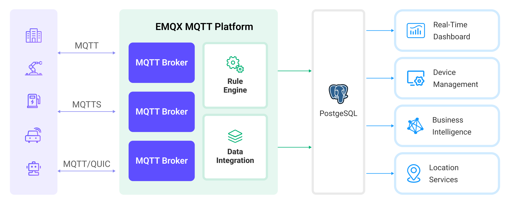

# Ingest MQTT Data into PostgreSQL

[PostgreSQL](https://www.postgresql.org/) is the world's most advanced open-source relational database, possessing robust data processing capabilities suitable for everything from simple applications to complex data tasks. EMQX Platform supports integration with PostgreSQL, enabling efficient handling of real-time data streams from IoT devices. This integration supports large-scale data storage, precise querying, and complex data association analysis while ensuring data integrity. Leveraging EMQX's efficient message routing and PostgreSQL's flexible data model, it's easy to monitor device statuses, track events, and audit operations, providing businesses with deep data insights and robust business intelligence support.

This page introduces the data integration between EMQX Platform and PostgreSQL with practical instructions on creating and validating the data integration.

::: tip
This page is also applicable to MatrixDB.
:::

## How It Works

PostgreSQL data integration is an out-of-the-box feature in EMQX Platform designed to bridge the gap between MQTT-based IoT data and PostgreSQL's powerful data storage capabilities. With a built-in [rule engine](./rules.md) component, the integration simplifies the process of ingesting data from EMQX Platform to PostgreSQL for storage and management, eliminating the need for complex coding.

The diagram below illustrates a typical architecture of data integration between EMQX Platform and PostgreSQL:



Ingesting MQTT data into PostgreSQL works as follows:

- **IoT devices connect to EMQX Platform**: After IoT devices are successfully connected through the MQTT protocol, online events will be triggered. The events include information such as device ID, source IP address, and other attributes.
- **Message publication and reception**: The devices publish telemetry and status data to specific topics. When EMQX Platform receives these messages, it initiates the matching process within its rules engine.
- **Rule Engine Processing Messages**: With the built-in rules engine, messages and events from specific sources can be processed based on topic matching. The rules engine matches the corresponding rules and processes messages and events, such as converting data formats, filtering out specific information, or enriching messages with contextual information.
- **Write to PostgreSQL**: The rule triggers the writing of messages to PostgreSQL. With the help of SQL templates, users can extract data from the rule processing results to construct SQL and send it to PostgreSQL for execution, so that specific fields of the message can be written or updated into the corresponding tables and columns of the database.

After the event and message data are written to PostgreSQL, you can connect to PostgreSQL to read the data for flexible application development, such as:

- Connect to visualization tools, such as Grafana, to generate charts based on data and show data changes.
- Connect to the device management system, view the device list and status, detect abnormal device behavior, and eliminate potential problems in a timely manner.

## Features and Benefits

PostgreSQL is a popular open-source relational database with a rich set of features. The data integration with PostgreSQL can bring the following features and advantages to your business:

- **Flexible Event Handling**: Through the EMQX rules engine, PostgreSQL can handle device lifecycle events, greatly facilitating the development of various management and monitoring tasks required for implementing IoT applications. By analyzing event data, you can promptly detect device failures, abnormal behavior, or trend changes to take appropriate measures.
- **Message Transformation**: Messages can undergo extensive processing and transformation through EMQX Platform rules before being written to PostgreSQL, making storage and usage more convenient.
- **Flexible Data Operations**: With SQL templates provided by PostgreSQL data bridging, it's easy to write or update data from specific fields to the corresponding tables and columns in the PostgreSQL database, enabling flexible data storage and management.
- **Integration of Business Processes**: PostgreSQL data bridging allows you to integrate device data with PostgreSQL's rich ecosystem applications, facilitating integration with systems like ERP, CRM, or other custom business systems to achieve advanced business processes and automation.
- **Combining IoT with GIS Technology**: PostgreSQL offers GIS data storage and querying capabilities, supporting geospatial indexing, geofencing and alerts, real-time location tracking, and geographical data processing, among others. Combined with EMQX's reliable message transmission capability, it can efficiently process and analyze geographical location information from mobile devices such as vehicles, enabling real-time monitoring, intelligent decision-making, and business optimization.
- **Runtime Metrics**: Support for viewing runtime metrics of each rule, such as total message count, success/failure counts, current rates, and more.

Through flexible event handling, extensive message transformation, flexible data operations, and real-time monitoring and analysis capabilities, you can build efficient, reliable, and scalable IoT applications, benefiting your business decisions and optimizations.

## Before You Start

This section introduces the preparatory work needed to create PostgreSQL Data Integration in EMQX Platform.

### Prerequisites

- Knowledge about [Data Integration](./introduction.md)
- Knowledge about EMQX data integration [rules](./rules.md)

### Set up Network

<!--@include: ./network-setting.md-->

### Install PostgreSQL

1. Install PostgreSQL via Docker, and then run the docker image.

```bash
# To start the PostgreSQL docker image and set the password as public
docker run --name PostgreSQL -p 5432:5432 -e POSTGRES_PASSWORD=public -d postgres

# Access the container
docker exec -it PostgreSQL bash

# Locate the PostgreSQL server in the container and input the preset password
psql -U postgres -W

# Create and then select the database

CREATE DATABASE emqx_data;

\c emqx_data;
```

2. Create table. Use the following SQL command to create temp_hum table, and this table will be used for storing the temperature and humidity data reported by devices:

```sql
CREATE TABLE temp_hum (
  up_timestamp   TIMESTAMPTZ       NOT NULL,
  client_id      TEXT              NOT NULL,
  temp           DOUBLE PRECISION  NULL,
  hum            DOUBLE PRECISION  NULL
);
```

3. Insert test data and view it

```sql
INSERT INTO temp_hum(up_timestamp, client_id, temp, hum)
VALUES (to_timestamp(1603963414), 'temp_hum-001', 19.1, 55);
```

```bash
emqx_data=# SELECT * FROM temp_hum;
      up_timestamp      |  client_id   | temp | hum
------------------------+--------------+------+-----
 2020-10-29 09:23:34+00 | temp_hum-001 | 19.1 |  55
(1 row)
```

## Create a Connector

Before creating data integration rules, you need to first create a PostgreSQL connector to access the PostgreSQL server.

1. Go to your deployment. Click **Data Integration** from the left-navigation menu.

2. If it is the first time for you to create a connector, select **PostgreSQL** under the **Data Persistence** category. If you have already created connectors, select **New Connector** and then select **PostgreSQL** under the **Data Persistence** category.

3. **Connector name**: The system will automatically generate a connector name.

4. Enter the connection information:

   - **Server Host**: IP address and port of the server.
   - **Database Name**: Enter `emqx_data`.
   - **Username**: Enter `postgres`.
   - **Password**: Enter `public`.

5. If you want to establish an encrypted connection, click the **Enable TLS** toggle switch.

6. Advanced settings (optional).

7. Click the **Test** button. If the PostgreSQL service is accessible, a success prompt will be returned.

8. Click the **New** button to complete the creation.

## Create a Rule

Next, you need to create a rule to specify the data to be written and add corresponding actions in the rule to forward the processed data to PostgreSQL.

1. Click **New Rule** in Rules area or click the New Rule icon in the **Actions** column of the connector you just created.

2. Enter the rule matching SQL statement in the **SQL editor**. In the following rule we read the time `up_timestamp` when the message is reported, the client ID, the message body (Payload) from the `temp_hum/emqx` topic and the temperature and humidity from the message body respectively.

   ```sql
    SELECT
      timestamp div 1000 as up_timestamp,
      clientid as client_id,
      payload.temp as temp,
      payload.hum as hum
    FROM
      "temp_hum/emqx"
   ```

   ::: tip

   If you are a beginner user, click **SQL Examples** and **Enable Test** to learn and test the SQL rule.

   :::

3. Click **Next** to add an action.

4. Select the connector you just created from the **Connector** dropdown box.

5. Configure the **SQL Template** based on the feature to use. Note: This is a preprocessed SQL, so the fields should not be enclosed in quotation marks, and do not write a semicolon at the end of the statements:

   ```sql
    INSERT INTO temp_hum(up_timestamp, client_id, temp, hum)
    VALUES (
      to_timestamp(${up_timestamp}),
      ${client_id},
      ${temp},
      ${hum}
    )
   ```

6. Advanced settings (optional).

7. lick the **Confirm** button to complete the rule creation.

8. In the **Successful new rule** pop-up, click **Back to Rules**, thus completing the entire data integration configuration chain.

## Test the Rule

You are recommended to use [MQTTX](https://mqttx.app/) to simulate temperature and humidity data reporting, but you can also use any other client.

1. Use MQTTX to connect to the deployment and send messages to the following Topic.

   - topic: `temp_hum/emqx`

   - payload:

     ```json
     {
       "temp": "27.5",
       "hum": "41.8"
     }
     ```

2. View data dump results

```bash
emqx_data=# SELECT * from temp_hum ORDER BY up_timestamp DESC LIMIT 10;
      up_timestamp      |  client_id   | temp | hum
------------------------+--------------+------+------
 2024-03-20 09:39:17+00 | test_client  | 27.5 | 41.8
 2020-10-29 09:23:34+00 | temp_hum-001 | 19.1 |   55
(2 rows)
```

3. View operational data in the console. Click the rule ID in the rule list, and you can see the statistics of the rule and the statistics of all actions under this rule.
