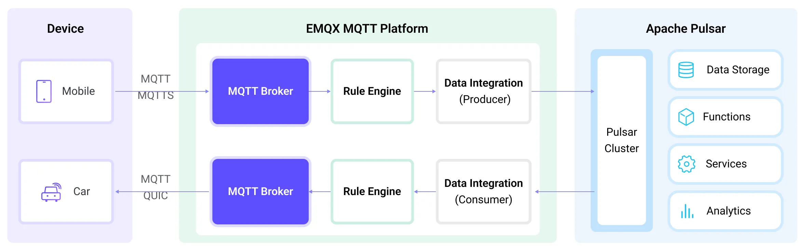

# Stream MQTT Data into Apache Pulsar

[Apache Pulsar](https://pulsar.apache.org/) is a popular open-source distributed event streaming platform designed for the efficient transmission of real-time data streams between applications and systems. Apache Pulsar offers greater scalability, faster throughput, and lower latency. In IoT applications, data generated by devices is typically transmitted using a lightweight MQTT protocol. With data integration between Apache Pulsar and EMQX, users can effortlessly stream MQTT data into Apache Pulsar and connect it with other data systems for real-time processing, storage, and analysis of data generated by IoT devices.

This page provides a detailed overview of the data integration between EMQX Platform and Pulsar with practical instructions on creating and validating the data integration.

## How It Works

Apache Pulsar data integration is an out-of-the-box feature of EMQX Platform that combines EMQX Platform's device connectivity and message transmission capabilities with Pulsar's robust data processing capabilities. With the built-in rule engine component, the data streaming and processing process is simplified between the two platforms. This means that you can easily transmit MQTT data to Pulsar and leverage Pulsar's powerful features for data processing without the need for complex coding, making the management and utilization of IoT data more efficient and convenient.



EMQX Platform forwards MQTT data to Apache Pulsar through the rule engine and configured action, and the complete process is as follows:

1. **Message publication and reception**: IoT devices establish successful connections through the MQTT protocol and subsequently publish telemetry and status data to specific topics. When EMQX Platform receives these messages, it initiates the matching process within its rules engine.
2. **Rule engine processes messages**: Using the built-in rule engine, MQTT messages from specific sources can be processed based on topic matching. The rule engine matches corresponding rules and processes messages, such as data format conversion, filtering specific information, or enriching messages with context information.
3. **Data streaming into Apache Pulsar**: Rule triggers the action of forwarding messages to Pulsar where data can be easily configured to Pulsar message key and value. MQTT topics can also be mapped to Pulsar topics for better data organization and identification, facilitating subsequent data processing and analysis.

After MQTT message data is written to Apache Pulsar, you can engage in flexible application development, such as:

- Write Pulsar consumer applications to subscribe and process these messages. Depending on business needs, you can associate, aggregate, or transform MQTT data with other data sources, achieving real-time data synchronization and integration.
- Upon receiving specific MQTT messages, you can use Pulsar's rule engine component to trigger corresponding actions or events, enabling cross-system and application event-driven functionality.
- Analyze MQTT data streams in real-time within Pulsar, detect anomalies or specific event patterns, and trigger alert notifications or perform corresponding actions based on these conditions.
- Centralize data from multiple MQTT topics into a unified data stream and utilize Pulsar's computational capabilities for real-time aggregation, calculation, and analysis to gain more comprehensive data insights.

## Features and Benefits

The data integration with Pulsar brings the following features and advantages to your business:

- **Reliable IoT Data Message Delivery**: EMQX can reliably batch and send MQTT messages to Pulsar, enabling the integration of IoT devices with Pulsar and application systems.
- **MQTT Message Transformation**: Using the rule engine, EMQX can filter and transform MQTT messages. Messages can undergo data extraction, filtering, enrichment, and transformation before being sent to Pulsar.
- **Flexible Topic Mapping**: The Pulsar action supports flexible mapping of MQTT topics to Pulsar topics, allowing easy configuration of keys (Key) and values (Value) for data in Pulsar messages.
- **Flexible Partition Selection**: The Pulsar action can select Pulsar partitions based on MQTT topics or clients using different strategies, providing flexibility in organizing and identifying data.
- **Processing Capabilities in High-Throughput Scenarios**: The Pulsar action supports both synchronous and asynchronous write modes, allowing for a flexible balance between latency and throughput according to different scenarios.

## Before You Start

This section describes the preparations you need to complete before you start to create the Pulsar data integration in EMQX Platform.

### Prerequisites

- Knowledge about [data integration](./introduction.md)
- Knowledge about data integration [rules](./rules.md)

### Install Pulsar

Run Pulsar in Docker.

```bash
docker run --rm -it -p 6650:6650 --name pulsar apachepulsar/pulsar:2.11.0 bin/pulsar standalone -nfw -nss
```

Refer to the [Quick Start section in Pulsar Documentation](https://pulsar.apache.org/docs/2.11.x/getting-started-home/) for detailed operation steps.

### Create Pulsar Topic

Relevant Pulsar topics should be created before creating the data integration in EMQX. Use the commands below to create a topic called `my-topic` in Pulsar under the `public` tenant, `default` namespace, with 1 partition.

```bash
docker exec -it pulsar bin/pulsar-admin topics create-partitioned-topic persistent://public/default/my-topic -p 1
```

## Create a Connector

Before creating data integration rules, you need to first create a Pulsar connector to access the Pulsar server.

1.  Go to your deployment. Click **Data Integration** from the left-navigation menu. If it is the first time for you to create a connector, select **Pulsar** under the **Data Forward** category. If you have already created connectors, select **New Connector** and then select **Pulsar** under the **Data Forward** category.

2.  **Connector Name**: The system will automatically generate a connector name.

3.  Enter the connection information:

    - **Servers**: Enter `pulsar://xxx:6650` for the **Servers**. If you have Pulsar and EMQX running remotely, adjust the **xxx** settings accordingly.
    - **Authentication**: Select the authentication method based on your actual situation: `none`, `Basic auth`, or `token`.
    - **Enable TLS**: If you want to establish an encrypted connection, click the toggle switch.
    - Configure advanced settings according to your business needs (optional).

4.  Click the **Test** button. If the Pulsar service is accessible, a prompt indicating **connector available** will be returned.

5.  Click the **New** button to complete the creation.

Next, you can create data bridge rules based on this Connector.

## Create Rule

This section demonstrates how to create a Pulsar Producer Rule and add action to the rule via the EMQX Platform Console.

1. Click **New Rule** in the Rules area or click the New Rule icon in the **Actions** column of the connector you just created.

2. Set the rules in the **SQL Editor** based on the feature to use, Our goal is to trigger the engine when the client sends a temperature and humidity message to the temp_hum/emqx topic. Here you need a certain process of SQL:

   ```sql
    SELECT
     timestamp as up_timestamp, clientid as client_id, payload.temp as temp, payload.hum as hum
    FROM
      "temp_hum/emqx"
   ```

   ::: tip

   If you are a beginner user, click **SQL Examples** and **Enable Test** to learn and test the SQL rule.

   :::

3. Click **Next** to add an action.

4. Select the connector you just created from the **Connector** dropdown box.

5. Configure the information for publishing messages from the EMQX Platform to the Pulsar service:

   - **Pulsar Topic Name**: Enter `persistent://public/default/my-topic`, the pulsar topic you created before. Note: Variables are not supported here.
   - **Partition Strategy**: Select the way for the producer to dispatch messages to Pulsar partitions: `random`, `roundrobin`, or `key_dispatch`.
   - **Compression**: Specify whether or not to use compression algorithms and which algorithms are used to compress/decompress the records in a Pulsar message. The optional values are: `no_compression`, `snappy`, or `zlib`.
   - **Message Key**: Pulsar message key. Insert a string here, either a plain string or a string containing placeholders (${var}).
   - **Message Value**: Pulsar message value. Insert a string here, either a plain string or a string containing placeholders (${var}).

6. Advanced settings (optional): See [Advanced Configurations](#advanced-configurations).

7. Click the **Confirm** button to complete the rule creation.
8. In the **Successful new rule** pop-up, click **Back to Rules**, thus completing the entire data integration configuration chain.

## Test the Rule

You are recommended to use [MQTTX](https://mqttx.app/) to simulate temperature and humidity data reporting, but you can also use any other client.

1. Use MQTTX to connect to the deployment and send messages to the following Topic.

   - topic: `temp_hum/emqx`

   - client id: `test_client`

   - payload:

     ```json
     {
       "temp": "27.5",
       "hum": "41.8"
     }
     ```

2. Check whether messages are written into the topic `persistent://public/default/my-topic` with the following Pulsar command:

   ```bash
   docker exec -it pulsar bin/pulsar-client consume -n 0 -s mysubscriptionid -p Earliest persistent://public/default/my-topic
   ```

## Advanced Configurations

This section describes some advanced configuration options that can optimize the performance of your Pulsar action and customize the operation based on your specific scenarios. When creating the action, you can unfold the **Advanced Settings** and configure the following settings according to your business needs.

| Fields                     | Descriptions                                                                                                                                                                                                                                                                                                                                                                                                                                                                                                                                                                                          | Recommended Values |
| -------------------------- | ----------------------------------------------------------------------------------------------------------------------------------------------------------------------------------------------------------------------------------------------------------------------------------------------------------------------------------------------------------------------------------------------------------------------------------------------------------------------------------------------------------------------------------------------------------------------------------------------------- | ------------------ |
| Sync Publish Timeout       | The maximum amount of time the publisher will wait for a response or confirmation that the message has been successfully delivered in a synchronous publish operation.<br />This timeout setting can be essential for ensuring data reliability, as it prevents the publisher from blocking indefinitely in case of delivery issues or network problems.                                                                                                                                                                                                                                              | `3` second         |
| Socket Send Buffer Size    | Manages the size of socket buffers to optimize network transmission performance.                                                                                                                                                                                                                                                                                                                                                                                                                                                                                                                      | `1` MB             |
| Batch Size                 | Specify the maximum number of individual requests to be batched within a Pulsar message.                                                                                                                                                                                                                                                                                                                                                                                                                                                                                                              | `100`              |
| Max Batch Bytes            | The maximum size, in bytes, for collecting messages within a Pulsar batch. Typically, Pulsar brokers have a default batch size limit of 1 MB. However, EMQX's default value is intentionally set slightly lower than 1 MB to account for Pulsar message encoding overheads, particularly when individual messages are very small. A single message will still be sent as a separate batch if it exceeds this limit.                                                                                                                                                                                   | `900` KB           |
| Connect Timeout            | The maximum time to wait for TCP connection establishment includes the authentication time if enabled.                                                                                                                                                                                                                                                                                                                                                                                                                                                                                                | `5` second         |
| Buffer Mode                | Defines whether messages are stored in a buffer before being sent. Memory buffering can increase transmission speeds.<br />`memory`: Messages are buffered in memory. They will be lost in the event of an EMQX node restart.<br />`disk`: Messages are buffered on disk, ensuring they can survive an EMQX node restart.<br />`hybrid`: Messages are initially buffered in memory. When they reach a certain limit (refer to the `segment_bytes` configuration for more details), they are gradually offloaded to disk. Similar to the memory mode, messages will be lost if the EMQX node restarts. | `Memory`           |
| Per-partition Buffer Limit | Maximum allowed buffer size, in bytes, for each Pulsar partition. When this limit is reached, older messages will be discarded to make room for new ones by reclaiming buffer space. <br />This option helps to balance memory usage and performance.                                                                                                                                                                                                                                                                                                                                                 | `2` GB             |
| Segment File Bytes         | This setting is applicable when the buffer mode is configured as `disk` or `hybrid`. It controls the size of segmented files used to store messages, influencing the optimization level of disk storage.                                                                                                                                                                                                                                                                                                                                                                                              | `100` MB           |
| Memory Overload Protection | This setting applies when the buffer mode is configured as `memory`. EMQX will automatically discard older buffered messages when it encounters high memory pressure. It helps prevent system instability due to excessive memory usage, ensuring system reliability. <br />**Note**: The threshold for high memory usage is defined in the configuration parameter `sysmon.os.sysmem_high_watermark`. This configuration is effective only on Linux systems.                                                                                                                                         | `disabled`         |
| Start Timeout              | Determines the maximum time interval, in seconds, that the Connector will wait for an auto-started resource to reach a healthy state before responding to resource creation requests. This setting helps ensure that the Connector does not proceed with operations until it verifies that the connected resource, such as an instance in Polar, is fully operational and ready to handle data transactions.                                                                                                                                                                                          | `5` second         |
| Health Check Interval      | The time interval for checking the running status of the action.                                                                                                                                                                                                                                                                                                                                                                                                                                                                                                                                      | `15` second        |
