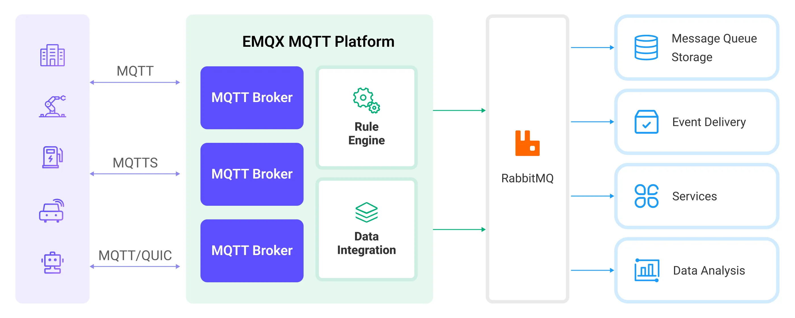

# Ingest MQTT Data into RabbitMQ

[RabbitMQ](https://www.rabbitmq.com/) is a widely used open-source message broker that implements the Advanced Message Queuing Protocol (AMQP). It provides a robust and scalable platform for messaging between distributed systems. EMQX Cloud supports integration with RabbitMQ, allowing you to forward MQTT messages and events to RabbitMQ. It also enables consuming data from the RabbitMQ Server and publishing it to specific topics in EMQX Cloud, achieving message delivery from RabbitMQ to MQTT.

This page provides a detailed overview of the data integration between EMQX Cloud and RabbitMQ with practical instructions on creating and validating the data integration.

## How It Works

The RabbitMQ data integration is an out-of-the-box feature in EMQX Cloud designed to bridge the gap between MQTT-based IoT data and RabbitMQ's powerful message queue processing capabilities. With a built-in [rule engine](./rules.md) component, the integration simplifies the process of ingesting data from EMQX Cloud to RabbitMQ for storage and management, eliminating the need for complex coding.

Take the RabbitMQ for an example, the diagram below illustrates a typical architecture of data integration between EMQX Cloud and RabbitMQ:



Ingesting MQTT data into RabbitMQ works as follows:

1. **Message publication and reception**: Industrial IoT devices establish successful connections to EMQX Cloud through the MQTT protocol and publish real-time MQTT data to EMQX Cloud. When EMQX Cloud receives these messages, it initiates the matching process within its rules engine.
2. **Message data processing:** When a message arrives, it passes through the rule engine and is then processed by the rule defined in EMQX Cloud. The rules, based on predefined criteria, determine which messages need to be routed to RabbitMQ. If any rules specify payload transformations, those transformations are applied, such as converting data formats, filtering out specific information, or enriching the payload with additional context.
3. **Message ingestion into RabbitMQ**: When the rule has finished processing the message, it triggers an action of forwarding the messages to RabbitMQ. Processed messages will be seamlessly written into RabbitMQ.
4. **Data persistence and Utilization**: RabbitMQ stores the messages in queues and delivers them to the appropriate consumers. The messages can be consumed by other applications or services for further processing, such as data analysis, visualization, and storage.

## Features and Benefits

The data integration with RabbitMQ brings the following features and advantages to your business:

- **Reliable IoT Data Message Delivery**: EMQX Cloud ensures reliable connections and message delivery from devices to the cloud, while RabbitMQ handles message persistence and reliable delivery across different services, ensuring data reliability throughout various processes.
- **MQTT Message Transformation**: Using the rule engine, EMQX Cloud can filter and transform MQTT messages. Messages can undergo data extraction, filtering, enrichment, and transformation before being sent to RabbitMQ.
- **Flexible Message Mapping**: RabbitMQ data integration supports flexible mapping of MQTT topics to RabbitMQ Routing Key and Exchange, allowing seamless integration between MQTT and RabbitMQ.
- **High Availability and Cluster Support**: EMQX Cloud and RabbitMQ both support the construction of highly available message broker clusters, ensuring that the system can continue to provide services even in the event of node failures. Leveraging the cluster capabilities also provides excellent scalability.
- **Processing Capabilities in High-Throughput Scenarios**: RabbitMQ data integration supports both synchronous and asynchronous write modes, allowing for a flexible balance between latency and throughput according to different scenarios.

## Before You Start

This section describes the preparations you need to complete before you start to create the RabbitMQ data integration, including how to create a RabbitMQ server and create RabbitMQ test exchange and queue.

### Prerequisites

- Knowledge about [data integration](./introduction.md)
- Knowledge about EMQX Cloud data integration [rules](./rules.md)
- Basic knowledge of UNIX terminal and commands

### Start a RabbitMQ Server

This section introduces how to start a RabbitMQ server using [Docker](https://www.docker.com/).

Run the following command to start a RabbitMQ server with the management plugin enabled. The management plugin allows you to inspect RabbitMQ with a web interface.

```bash
docker run -it --rm --name rabbitmq -p 5672:5672 -p 15672:15672 rabbitmq:3.11-management
```

You can find more information about running [RabbitMQ in Docker on Docker Hub](https://hub.docker.com/_/rabbitmq).

### Create an Exchange and Queue for Message Receiving

After the RabbitMQ server is started, you can use the RabbitMQ Management Web Interface to create a test exchange and a queue for receiving messages forwarded from EMQX Cloud. You can skip this section if you already have an exchange and queue to test with.

1. Open your web browser and navigate to http://{ip address}:15672/ to access the RabbitMQ Management Web Interface. On the login page, enter the default credentials and click **Login**.
   - **Username**: `guest`
   - **Password**: `guest`
2. Click the **Exchanges** tab in the top menu. Unfold **Add a new exchange**, and input the following information:

   - **Name**: Type `test_exchange`
   - **Type**: Select `direct` from the drop-down list
   - **Durability**: Select `Durable` to make the exchange persistent, that is the queue exists after the RabbitMQ server is restarted.
   - **Auto delete**: `No`
   - **Internal**: `No`
   - **Arguments**: Leave empty

3. Click the **Add exchange** button to create the test exchange.
4. Click the **Queues** tab in the top menu. Unfold **Add a new queue**, and input the following information:
   - **Type**: `Default for virtual host`
   - **Name**: Type `test_queue`
   - **Durability**: Select `Durable` to make the queue persistent,
   - **Arguments**: Leave empty
5. Click the **Add queue** button to create the test queue. The new `test_queue` should appear in **All queues** section.
6. Click the queue name **test_queue** to open its details page. Unfold **Bindings**. In the **Add binding to this queue** section, input the following information:
   - **From exchange**: Type `test_exchange`
   - **Routing key**: Type `test_routing_key`
   - **Arguments**: Leave empty
7. Click the **Bind** button to bind the `test_queue` to the `test_exchange` with the specified routing key.

## Create a Connector

Before creating data integration rules, you need to first create a RabbitMQ connector to access the RabbitMQ server.

1.  Go to your deployment. Click **Data Integration** from the left-navigation menu.If it is the first time for you to create a connector, select **RabbitMQ** under the **Data Forward** category. If you have already created connectors, select **New Connector** and then select **RabbitMQ** under the **Data Forward** category.

2.  **Connector Name**: The system will automatically generate a connector name.

3.  Enter the connection information:

    - **Server**: Enter `localhost` or the actual hostname/IP if the RabbitMQ server is running remotely.
    - **Port**: Enter `5672` or the actual port if different.
    - **Username**: Enter `guest`.
    - **Password**: Enter `guest`.
    - **Virtual Host**: Enter RabbitMQ virtual host; `/` by default.
    - **Enable TLS**: If you want to establish an encrypted connection, click the toggle switch.
    - Configure advanced settings according to your business needs (optional).

4.  Click the **Test** button. If the Pulsar service is accessible, a prompt indicating **connector available** will be returned.

5.  Click the **New** button to complete the creation.

Next, you can create data bridge rules based on this Connector.

## 创建规则

This section demonstrates how to create a RabbitMQ Rule and add action to the rule via the EMQX Cloud Console.

1. Click **New Rule** in Rules area or click the New Rule icon in the **Actions** column of the connector you just created.

2. Set the rules in the **SQL Editor** based on the feature to use, Our goal is to trigger the engine when the client sends a temperature and humidity message to the temp_hum/emqx topic. Here you need a certain process of SQL:

   ```sql
    SELECT
     timestamp, clientid, payload
    FROM
      "temp_hum/emqx"
   ```

   ::: tip

   If you are a beginner user, click **SQL Examples** and **Enable Test** to learn and test the SQL rule.

   :::

3. Click **Next** to add an action.

4. Select the connector you just created from the **Connector** dropdown box.

5. Configure the information for publishing messages from EMQX Cloud to the RabbitMQ service:

   - **Exchange**: Enter `test_exchange` created before, which means messages will be published to this exchange.
   - **Routing Key**: Enter `test_routing_key` created before, which is the RabbitMQ routing key to be used when publishing messages.
   - In the **Message Delivery Mode** dropdown, select between `non_persistent` and `persistent`:

     - `non_persistent` (default): Messages are not persisted to disk and may be lost if RabbitMQ restarts or crashes.

     - `persistent`: Messages are persisted to disk, providing durability in case RabbitMQ restarts or crashes.

     ::: tip

     You may also need to set the queue and exchange as durable to prevent messages from being lost in case RabbitMQ is restarted. See the RabbitMQ [documentation](https://www.rabbitmq.com/documentation.html) for more information.

     :::

   - **Payload Template**: The default value is an empty string, meaning the message payload will be forwarded as JSON-formatted text to RabbitMQ without modification.

     You can also define a custom message payload format using placeholders within the template to dynamically include data from the incoming MQTT messages. For example, if you want to include the MQTT message payload and its timestamp in the RabbitMQ message, you can use the following template:

     ```json
     {"payload": "${payload}", "timestamp": ${timestamp}}
     ```

     This template will produce a JSON-formatted message containing the payload and timestamp of the incoming MQTT message. `${payload}` and `${timestamp}` are placeholders and will be replaced by the actual values from the message when it is forwarded to the RabbitMQ server.

   - **Wait for Publish Confirmations**: Enabled by default to ensure that messages are successfully published to RabbitMQ.

     ::: tip

     With this option enabled RabbitMQ broker acknowledges the receipt of a published message before considering it successfully published, which improves the reliability of your message delivery.

     :::

6. Expand **Advanced Settings** to configure Sync/Async mode, queue and batch, and other parameters as appropriate Advanced Settings Options (optional)

7. Click the **Confirm** button to complete the rule creation.
8. In the **Successful new rule** pop-up, click **Back to Rules**, thus completing the entire data integration configuration chain.

## Test the Rule

You are recommended to use [MQTTX](https://mqttx.app/) to simulate temperature and humidity data reporting, but you can also use any other client.

1. Use MQTTX to connect to the deployment and send messages to the following Topic.

   - topic: `temp_hum/emqx`

   - client id: `test_client`

   - payload:

     ```json
     {
       "temp": "27.5",
       "hum": "41.8"
     }
     ```

2. If the action and rule are created successfully, a message should have been published to the specified exchange in the RabbitMQ server with the specified routing key. Visit the RabbitMQ Management Console at http://{ip address}:15672 and navigate to the Queues section.

3. Verify that the message has been routed to the appropriate queue(s). Click the queue to see details and then click the **Get Message(s)** button to see the detailed message contents.

   - payload:

     ```json
     {"payload":
      "{
      "temp": "27.5",
      "hum": "41.8"
       }",
       "timestamp": 1711333401673
     }
     ```
