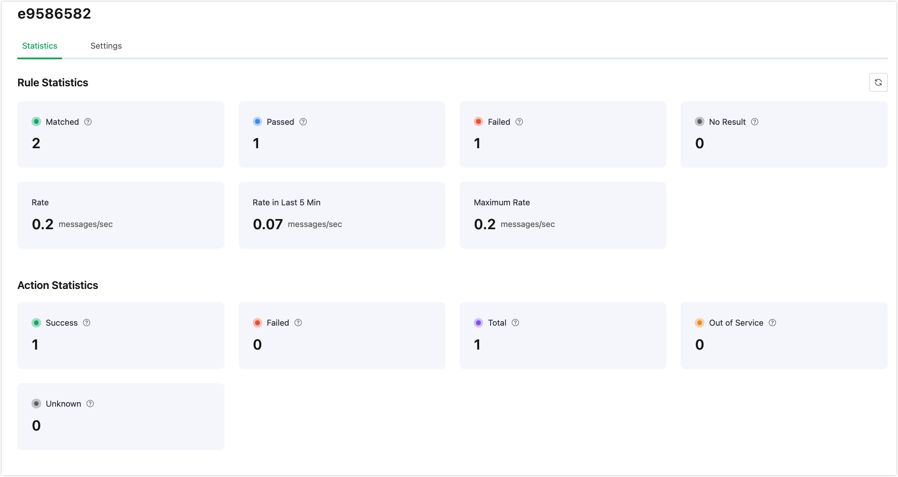
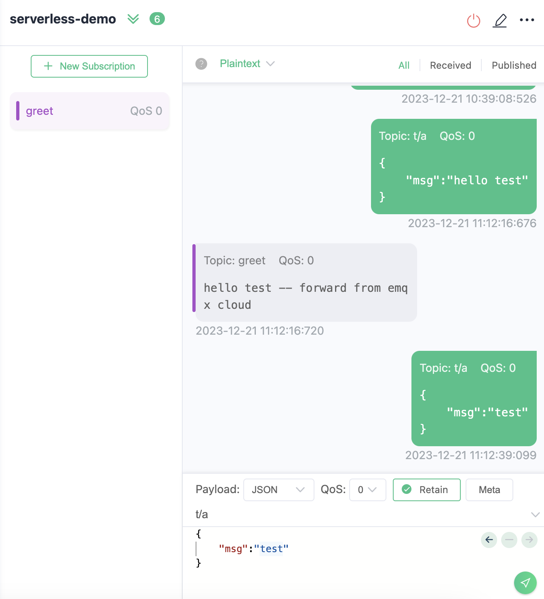

# Message Republish

Through EMQX Cloud Data Integration, it's possible to republish messages that meet certain conditions to other topics without writing any code. In EMQX Cloud, you can create rules, define rule SQL to filter and process data from source messages and add a "Message Republish" action to the rule to forward the processed results via message publishing.

This page demonstrates how to create data integration to republish a message to the `greet` topic whenever any message's `msg` contains the string `hello`. The main steps include:

1. Creating a rule to set filtering conditions.
2. Adding an action to the rule for message republishing.
3. Completing the creation of data integration and conducting tests.

Configuring the message republishing feature through data integration does not require adding any connectors. The following sections outline the specific configuration steps.

## Create a Rule

1. In the **Data Integration** page, under the **Data Forward** service category, click **Republish**. If you have already created other connectors, click **New Connector**, and then select **Republish** under the **Data Forward** service category.

2. Define the rule SQL in the **SQL Editor** to trigger the engine whenever `msg` in any message contains the string `hello`:

   - Specify the source of message data in the FROM clause. This demonstration targets messages from all topics, i.e., `#`.
   - Perform regex matching in the WHERE clause on `msg` in the message payload to execute data integration if it contains the string `hello`.

   An example SQL definition based on the above principles is as follows:

   ```sql
   SELECT
     payload.msg as msg
   FROM
     "#"
   WHERE  
     regex_match(msg, 'hello')
   ```

3. You can click the **Enable Test** below the SQL input box and fill in the data:

   - **Topic**: t/a
   - **Payload**:

   ```json
   {
     "msg": "hello test"
   }
   ```

   Click **Test** and check the **Output Result**. If set correctly, the Field and Value should display the complete JSON data, as follows:

   ```json
   {
     "msg": "hello test"
   }
   ```

   If the test output matches expectations, you can proceed to the next steps.

   > Note: If the test fails, please check if the SQL is compliant.

## Add an Action

1. On the **New Rule** step page, click **Next** to add an action.
2. On the **New Action** step page, configure the following information:
   - **Connector**: Keep the default value `Republish`.
   - **Topic**: Set the target topic as `greet`.
   - **Payload**: Fill in `${msg} -- forward from emqx cloud` as the message content template.
   - Leave QoS at its default value. 

3. Click **Confirm** to complete the action and rule creation.

4. In the **Successful new rule** pop-up, click **Back to Rules**, thus completing the entire data integration configuration chain.

## Test Message Republish

You are recommended to use [MQTTX](https://mqttx.app/) to simulate message reporting, but you can also use any other client.

1. Use MQTTX to connect to the deployment and send a message to the `test` topic.

   ```json
   {
     "msg": "hello"
   }
   ```

2. Find the message republishing rule in the rule list and click on the rule ID to enter the rule statistics page. You can see the related statistical indicators on the page.

    

3. Subscribe to the `greet` topic on the client. You will see that if `msg` contains `hello`, the message will be forwarded, and if not, it will not be forwarded.

    
