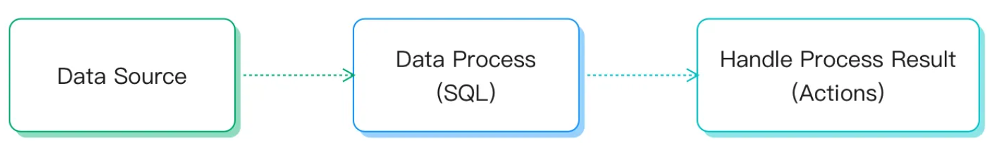
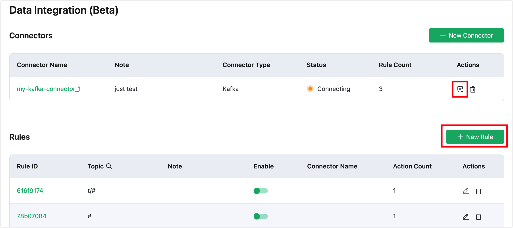
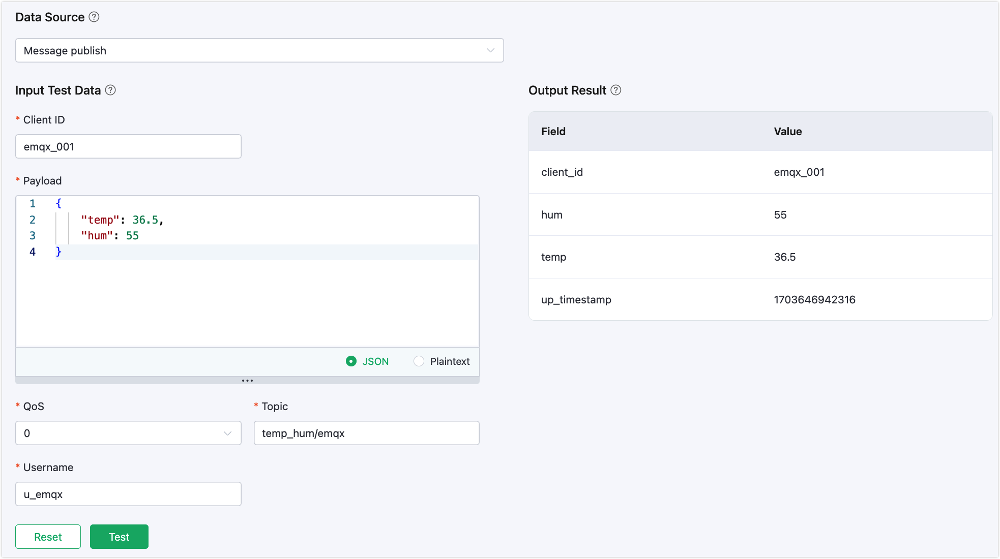
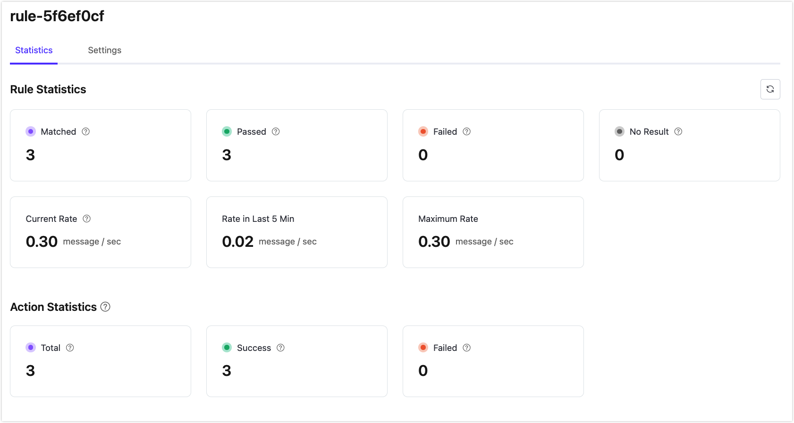
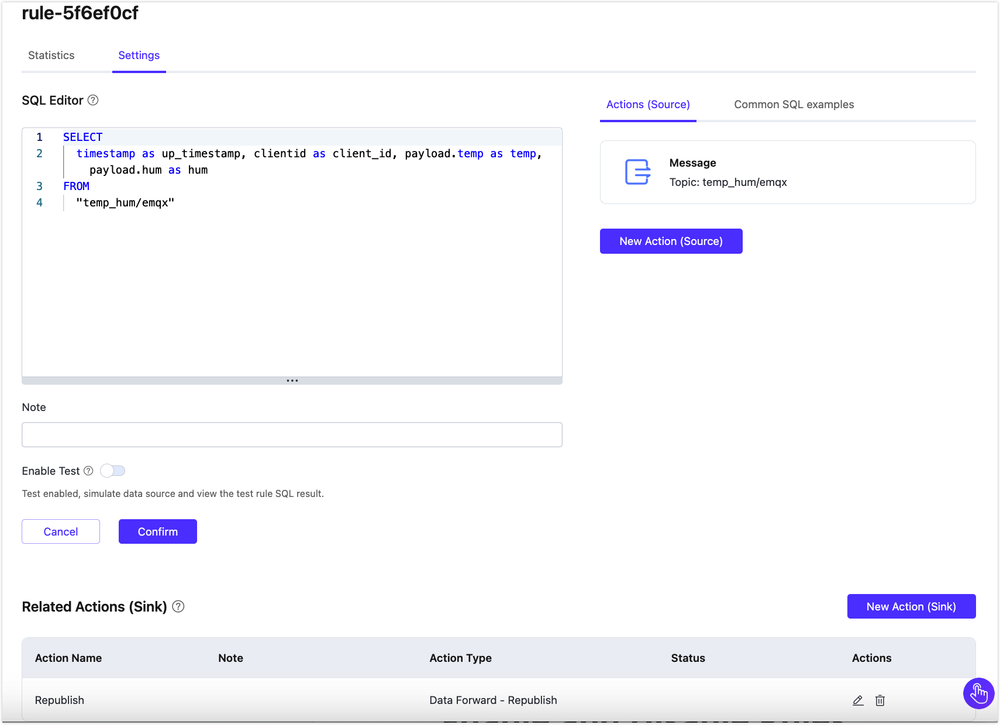

# Rules

Rules, also known as the rule engine, are an SQL-based data processing component built into EMQX. They are used in conjunction with [Connectors](./connectors.md) to enable code-free IoT data extraction, filtering, transformation, storage, and processing, accelerating application integration and business innovation.

## How Rules Work

Rules specify how to retrieve data from a **data source**, perform **data transformations**, and the **actions** that should be applied to the results.



- **Data Source**: The data source of a rule can be a message, event, or external data system. The `FROM` clause in the rule's SQL specifies the data source, while the `WHERE` clause adds additional constraints on which messages the rule processes.

  For more information on the various types of supported data sources and fields that can be referenced in the `WHERE` clause, see [SQL Data Sources and Fields](https://docs.emqx.com/en/enterprise/latest/data-integration/rule-sql-events-and-fields.html).

- **Data Transformation**: Data transformations describe the process of transforming an input message. The `SELECT` part of the SQL extracts and transforms data from the input message. Embedded SQL sample statements can be used to implement advanced transformations, such as adding a timestamp to the output message.

  For a detailed explanation of the syntax and built-in SQL functions, see [Rule SQL Reference](https://docs.emqx.com/en/enterprise/latest/data-integration/rule-sql-syntax.html) and [Built-in SQL Functions](https://docs.emqx.com/en/enterprise/latest/data-integration/rule-sql-builtin-functions.html). To learn more about SQL functions, you can also refer to [jq Functions](https://docs.emqx.com/zh/enterprise/latest/data-integration/rule-sql-jq.html).

- **Actions**: Actions solve the problem of "where to send the processed data". They tell EMQX Cloud how to handle the data produced by the rule. After the input is processed according to the specified rules, one or more actions can be defined to process the SQL execution results. The rule engine will sequentially perform corresponding actions. Currently, rules support the following two types of actions:

  - Built-in Actions: Currently, you can republish the processing results to another MQTT topic through [Message Republish](./republish.md).
  - Store the processing results in a database: Send data to various target services through predefined [Connectors](./connectors.md).

## Rule SQL Example

SQL statements are used to specify the data source of a rule and define data processing. Here's an example of an SQL statement:

```sql
SELECT
    payload.data as d
FROM
    "t/#"
WHERE
    clientid = "foo"
```

In the above SQL statement:

- Data Source: Messages from topics `t/#`;
- Data Processing: If the client ID of the message sender is `foo`, select the `data` field from the message content and assign it to the new variable `d`.

::: tip 

The "." syntax requires the data to be in JSON or Map format. If it is in another data type, SQL functions must be used for data type conversion. 

:::

For detailed information on the format and usage of Rule SQL statements, refer to the [SQL Manual](https://docs.emqx.com/en/enterprise/latest/data-integration/rule-sql-syntax.html).

## Create a Rule

This section demonstrates how to create a rule for data forward to Kafka. In that case, it is supposed that you have already created a Kafka Connector. 

1. Go to your deployment and click **Data Integration (Beta)** from the left-navigation menu.
2. On the Data Integration page, click **New Rule** in the upper left corner of the **Rule List** to create a new rule. You can also create a new rule by clicking the rule creation button in the Connector list.



3. In the **SQL Editor**, enter the SQL statement below. By specifying this statement, the rule reads the reported `timestamp`, `clientid`, and `temperature` and `humidity` contained in the payload of the message published to the `temp_hum/emqx` topic.

```sql
SELECT
  timestamp as up_timestamp, clientid as client_id, payload.temp as temp, payload.hum as hum
FROM
  "temp_hum/emqx"
```

4. Click the **Enable Test** toggle switch to create a new test SQL. Fill in the appropriate test parameters, and click the **Test** button. 

   In the Output Result, you can see the expected data processing results.



5.  Click the **Next** button to add an action.

## Add Actions

Next, you can add actions to the rule. EMQX will display different action configuration options based on the type of associated Connector. This demonstration takes the example of forwarding data to Kafka via a Kafka Connector.

The console will pre-set some default values. You can change them if necessary.

1. Select the associated Kafka Connector from the **Connector** dropdown box.

2. Configure the following information:

   - **Kafka Topic**: Specify the topic sent to Kafka, for example, `emqx`.

   - **Message Key** and **Message Value**: Enter parameters as follows, and you can also modify them according to your business.

     ```bash
     # Message Key
     ${client_id}
     
     # Message Value
     {"temp": ${temp}, "hum": ${hum}}
     ```

   - Leave other options as default.

3. Click the **Confirm** button to complete the action creation.

4. In the **Successful new rule** pop-up, click **Back to Rules** to complete the rule creation. 

   A rule can be associated with multiple actions. If you want to add another action, you can click **Continue** to proceed and select another Connector. For example, one action can forward data to Kafka while another action sends data to an HTTP service.

## View Rule Statistics

Send a message to the `temp_hum/emqx` topic for verification.

```json
{
  "temp": "27.5",
  "hum": "41.8"
}
```

Click the rule ID in the rule list to view the rule's statistics and the statistics of all actions under this rule on the run statistics page.



## Edit Rule

Click the edit icon in the rule list to edit the rule. On the editing page, you can edit the SQL template of the rule and edit or add actions.



## Enable and Disable Rules

You can enable and disable rules in the rule list. Click the toggle switch in the **Enable** column to activate or deactivate the rule.

## Delete Rules

You can delete rules in the rule list. Click the delete button and enter the rule ID to delete the rule.

## Edit and Delete Actions

In the **Actions** area, you can click the name in the **Action Name** column or the edit button in the **Actions** column to edit the action. Click the **Delete** button to delete the action.
