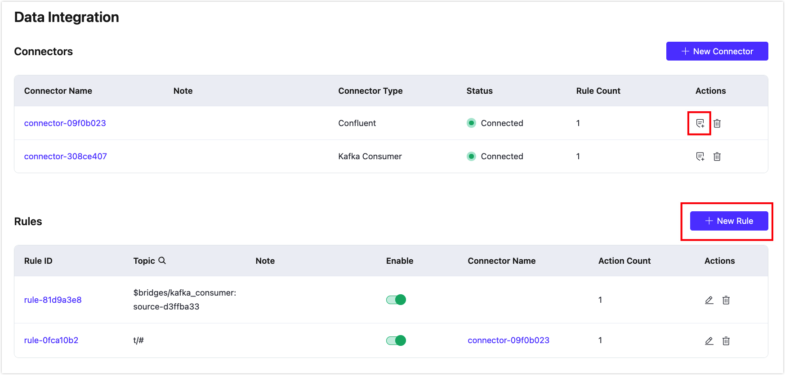
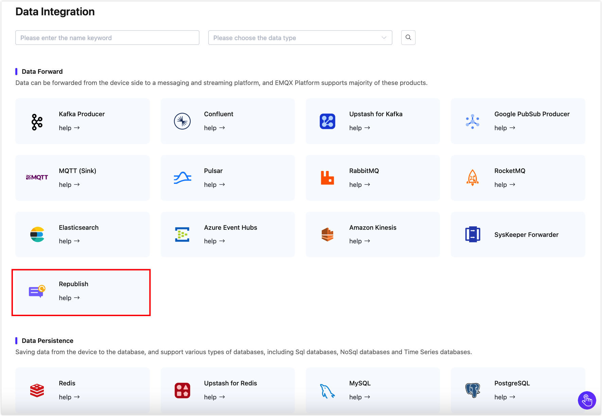

# Rules

Rules, also known as the rule engine, are an SQL-based data processing component built into EMQX. They are used in conjunction with [Connectors](./connectors.md) to enable code-free IoT data extraction, filtering, transformation, storage, and processing, accelerating application integration and business innovation.

## How Rules Work

Rules specify how to retrieve data from a **data source**, perform **data transformations**, and the **actions** that should be applied to the results.


- **Data Source**: The data source of a rule can be a message, event, or external data system. The `FROM` clause in the rule's SQL specifies the data source, while the `WHERE` clause adds additional constraints on which messages the rule processes.

  For more information on the various types of supported data sources and fields that can be referenced in the `WHERE` clause, see [SQL Data Sources and Fields](https://docs.emqx.com/en/enterprise/latest/data-integration/rule-sql-events-and-fields.html).

- **Data Transformation**: Data transformations describe the process of transforming an input message. The `SELECT` part of the SQL extracts and transforms data from the input message. Embedded SQL sample statements can be used to implement advanced transformations, such as adding a timestamp to the output message.

  For a detailed explanation of the syntax and built-in SQL functions, see [Rule SQL Reference](https://docs.emqx.com/en/enterprise/latest/data-integration/rule-sql-syntax.html) and [Built-in SQL Functions](https://docs.emqx.com/en/enterprise/latest/data-integration/rule-sql-builtin-functions.html). To learn more about SQL functions, you can also refer to [jq Functions](https://docs.emqx.com/zh/enterprise/latest/data-integration/rule-sql-jq.html).

- **Actions**: Actions solve the problem of "where to send the processed data". They tell EMQX Platform how to handle the data produced by the rule. After the input is processed according to the specified rules, one or more actions can be defined to process the SQL execution results. The rule engine will sequentially perform corresponding actions. Currently, rules support the following two types of actions:

  - Built-in Actions: Currently, you can republish the processing results to another MQTT topic through [Message Republish](./republish.md).
  - Store the processing results in a database: Send data to various target services through predefined [Connectors](./connectors.md).

## Rule SQL Example

SQL statements are used to specify the data source of a rule and define data processing. Here's an example of an SQL statement:

```sql
SELECT
    payload.data as d
FROM
    "t/#"
WHERE
    clientid = "foo"
```

In the above SQL statement:

- Data Source: Messages from topics `t/#`;
- Data Processing: If the client ID of the message sender is `foo`, select the `data` field from the message content and assign it to the new variable `d`.

::: tip 

The "." syntax requires the data to be in JSON or Map format. If it is in another data type, SQL functions must be used for data type conversion. 

:::

For detailed information on the format and usage of Rule SQL statements, refer to the [SQL Manual](https://docs.emqx.com/en/enterprise/latest/data-integration/rule-sql-syntax.html).

## Create Rules

Go to your deployment and click **Data Integration** from the left-navigation menu to enter the Data Integration page. When you first access the initial page of data integration, you can select the type of data integration as needed, and create a connector to connect to the target service by clicking the corresponding icon. For specific steps on creating a connector, refer to [Create a Connector](./connectors.md#create-a-connector) and specific data integration instructions in the Data Integration section.

::: tip

You can return to the data integration initial page by clicking **New Connector**.

:::

When you have created a Connector for connecting to the cloud resources, click **New Rule** in the upper left corner of the **Rule List** to enter the **New Rule** page. You can also create a new rule by clicking the rule creation button in the Connector list.



If you want to create a rule for [message republish](./republish.md), click **Republish** from the **Data Forward** category to start the rule creation process.



You can also click **Do Nothing (debug)** under the **Debug** category to enter the rule creation process. An empty action is configured only with rules and does not associate with any actions, which can be used specifically for debugging rules. For more details, refer to [Empty Action (Debug)](./empty_action_debug.md).

### Define a Data Source

On the **New Rule** page, enter a name for your rule and add a note to facilitate future management.

In the **SQL Editor**, you can customize the statements to add a data source that suits your business needs. For this demonstration, enter the SQL statement below:

```sql
SELECT
  timestamp as up_timestamp, clientid as client_id, payload.temp as temp, payload.hum as hum
FROM
  "temp_hum/emqx"
```

By specifying this SQL statement, the rule reads the reported `timestamp`, `clientid`, and `temperature` and `humidity` contained in the payload of the message published to the `temp_hum/emqx` topic.

### Test the SQL Statements

Click the **Enable Test** toggle switch to create a new test SQL. Fill in the appropriate test parameters, and click the **Test** button. 

In the Output Result, you can see the expected data processing results.


## Add Actions

After you have created the rule, click the **Next** button on the **New Rule** step page to proceed to the **New Action** step page. On the **New Actions** step page, select the associated Connector from the **Connector** dropdown box. The page will display different action configuration options based on the type of associated Connector selected. See the detailed action configuration examples in [Add Republish Action](#add-republish-action) and [Add Action for Forwarding Data to Target Services](#add-action-for-forwarding-data-to-target-services).

A rule can be associated with multiple actions. When you click **Confirm** to complete the action creation, a **Successful new rule** pop-up appears. If you want to add another action, you can click **Continue** to proceed and select another Connector. For example, one action can forward data to Kafka while another action sends data to an HTTP service.

### Add Republish Action

The following steps demonstrate how to add an action to republish the original messages received from the topic `temp_hum/emqx` to another topic `a/1`.

1. Select **Republish** from the **Connector** dropdown box. 
2. Configure the following settings:
   - **Topic**: Set the target topic, `a/1` in this example;
   - **QoS**: Set the QoS of the republished message, `0` in this example;
   - **Retain**: Set whether to forward this message as a retained message, for this tutorial, keep the default setting, `false`;
   - **Payload**: Enter `${payload}`, indicating the republished message will have the same payload as the original message, without any modifications.
   - **MQTT 5.0 Message Properties**: Click the toggle switch to configure the user properties and MQTT properties as necessary. The properties options allow you to add rich message metadata descriptions for the republished message.
     - **Payload Format Indicator**: Enter a value to indicate whether the payload of the message is in a specific format. When the value is set to `false`, the message is considered as undetermined bytes. When set to `true`, it indicates that the payload within the message body is UTF-8 encoded character data. This will help MQTT clients or MQTT servers parse message content more efficiently without the need for explicit formatting or type identification for the message body.
     - **Message Expiry Interval**: Enter a value (in seconds) to specify a time interval after which the message should expire and be considered invalid if it hasn't been delivered to the intended recipient.
     - **Content Type**: Enter a value to specify the type or format of the payload content within the republished message (MIME type), for example, `text/plain` represents a text file, `audio/aac` represents an audio file, and `application/json` signifies an application message in JSON format.
     - **Response Topic**: Enter the specific MQTT topic to which you want the response message to be published. For example, if you want responses to be sent to a topic named "response/my_device," you would enter: `response/my_device`.
     - **Correlation Data**: Enter a unique identifier or data to correlate a response message with the original request message. For example, you could enter a unique request identifier, a transaction ID, or any other information that is meaningful in your application context.

3. Click **Confirm** to complete the action creation.
4. In the **Successful new rule** pop-up, click **Back to Rules** to complete the rule creation. 


### Add Action for Forwarding Data to Target Services

You can also add actions to forward the processed results to target services using associated Connectors. On the **New Action** step page, select the target Connector from the Connector drop-down list. For details on the action configuration, see [Ingest MQTT Data into HTTP Server](./http_server.md) and [Stream MQTT Data into Apache Kafka](./kafka.md).

## Test Rules

::: tip Note

This feature is only available for Dedicated and Premium deployments.

:::

The rule engine provides a rule testing feature, which allows you to trigger rules using simulated data or real client data, execute rule SQL, and perform all actions added to the rule, obtaining the execution results for each step.

By testing rules, you can verify whether the rules work as expected, and quickly identify and solve any issues. This not only speeds up the development process but also ensures that the rules can run as expected in real environments, avoiding failures in production.

### Testing Steps

1. Toggle the **Try It Out** switch and select **Rule** as the test target. Note that before starting the test, you need to save the rule.
2. Click the **Start Test** button to begin the test. The browser will wait for the current rule to be triggered to generate the test results.
3. Trigger the rule for testing. The following 2 methods are supported:
   - **Use simulated data**: Click the **Input Simulated Data** button, select the **Data Source** that matches the SQL in the pop-up window, and ensure it matches the specified source in the rule (FROM clause). EMQX provides default values for all fields, such as **Client ID**, **Username**, **Topic**, **QoS**, **Payload**, etc. Modify them as needed, and click the **Submit Test** button to trigger the rule for testing once.
   - **Use real device data**: Keep the current page open, connect to EMQX using a real client or MQTT client tool, trigger the corresponding events, and perform testing.
4. View the test results: When the rule is triggered, the execution results will be output to the Console, displaying detailed execution results for each step.

### Testing Example

You can use [MQTTX](https://mqttx.app/) to test the rule with the republish action. Create one client, and use this client to subscribe to the `a/1` topic and send a `t/1` message. You will see in the dialog box that this message is republished to the topic `a/1`.

For details on how to build the connection between the MQTTX client tool and EMQX, see [MQTTX - Get Started](https://mqttx.app/docs/get-started).


Correspondingly, on the Console, the execution results of the entire rule will be displayed, with the following contents:

- On the left are the rule execution records. Each time the rule is triggered, a record is generated. Clicking on it can switch to the corresponding message or event details.
- On the right is the list of actions recorded by the selected rule. Clicking on it can expand to view the action execution results and logs.

When the execution of the rule SQL or any action fails, the entire rule record will be marked as failed. You can select the record to view the corresponding action's error information for troubleshooting.


From the above example, it can be seen that the rule was triggered 4 times, with 3 times the rule execution being completely successful. The 4th time failed due to the **HTTP Server** action execution failure, with the error reason being service unavailable.

## View Rule Statistics

Send a message to the `temp_hum/emqx` topic for verification.

```json
{
  "temp": "27.5",
  "hum": "41.8"
}
```

Click the rule ID in the rule list to view the rule's statistics and the statistics of all actions under this rule on the run statistics page.


## View Action Statistics

You can click the action ID in the action list. On the Action Statistics page, you can view the Metrics and Rate Indicators for this action.

::: tip

Currently, only the Dedicated version v5 deployment supports viewing the metrics of individual actions.

:::


## Edit Rule

You can directly click the edit icon on the **Rules** list to edit the rule, or you can click on the rule ID and then select the **Settings** tab to edit the rule. On the settings page, you can edit the SQL template of the rule, and also edit or add actions.


## Enable and Disable Rules

You can enable and disable rules in the rule list. Click the toggle switch in the **Enable** column to activate or deactivate the rule.

## Delete Rules

You can delete rules in the rule list. Click the delete button and enter the rule ID to delete the rule.

## Enable and Disable Actions

::: tip Note

This feature is only available for Dedicated and Premium deployments.

:::

Actions can be enabled or disabled on the actions list. Simply click the **Enable** toggle switch to turn an action on or off.

## Edit and Delete Actions

In the **Actions** area, you can click the name in the **Action Name** column or the edit button in the **Actions** column to edit the action. Click the **Delete** button to delete the action.
