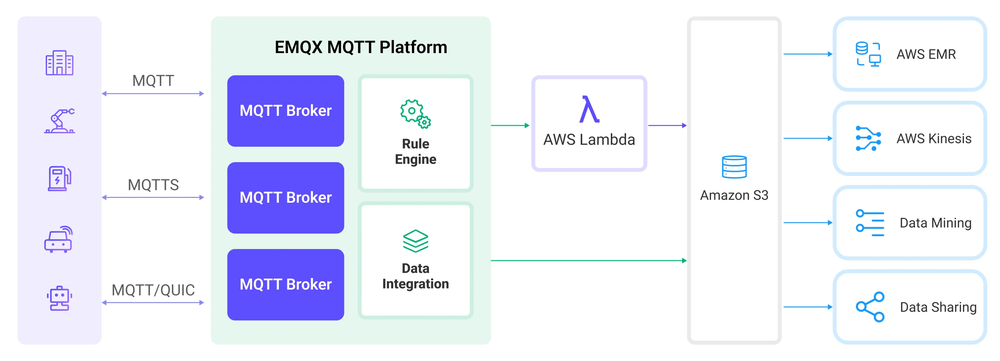

# Ingest MQTT Data into Amazon S3

[Amazon S3](https://aws.amazon.com/s3/) is an internet-based storage service known for its high reliability, stability, and security, allowing for rapid deployment and ease of use. EMQX Platform is capable of efficiently storing MQTT messages into Amazon S3 buckets, enabling flexible Internet of Things (IoT) data storage functionalities.

This page provides a detailed introduction to the data integration between EMQX Platform and Amazon S3 and offers practical guidance on the rule and Sink creation.

## How It Works

Amazon S3 data integration in EMQX Platform is a ready-to-use feature that can be easily configured for complex business development. In a typical IoT application, EMQX Platform acts as the IoT platform responsible for device connectivity and message transmission, while Amazon S3 serves as the data storage platform, handling message data storage.



EMQX Platform utilizes rules and Sinks to forward device events and data to Amazon S3. Applications can read data from Amazon S3 for further data applications. The specific workflow is as follows:

1. **Device Connection to EMQX Platform**: IoT devices trigger an online event upon successfully connecting via the MQTT protocol. The event includes device ID, source IP address, and other property information.
2. **Device Message Publishing and Receiving**: Devices publish telemetry and status data through specific topics. EMQX Platform receives the messages and compares them within the rules engine.
3. **Rules Engine Processing Messages**: The built-in rules engine processes messages and events from specific sources based on topic matching. It matches corresponding rules and processes messages and events, such as data format transformation, filtering specific information, or enriching messages with context information.
4. **Writing to Amazon S3**: The rule triggers an action to write the message to S3. Using the Amazon S3 Sink, users can extract data from processing results and send it to S3. Messages can be stored in text or binary format, or multiple lines of structured data can be aggregated into a single CSV file, depending on the message content and the Sink configuration.

After events and message data are written to Amazon S3, you can connect to Amazon S3 to read the data for flexible application development, such as:

- Data archiving: Store device messages as objects in Amazon S3 for long-term preservation to meet compliance requirements or business needs.
- Data analysis: Import data from S3 into analytics services like Snowflake for predictive maintenance, device efficiency evaluation, and other data analysis services.

## Features and Advantages

Using Amazon S3 data integration in EMQX Platform can bring the following features and advantages to your business:

- **Message Transformation**: Messages can undergo extensive processing and transformation in EMQX Platform rules before being written to Amazon S3, facilitating subsequent storage and use.
- **Flexible Data Operations**: With the S3 Sink, specific fields of data can be conveniently written into Amazon S3 buckets, supporting the dynamic setting of bucket and object keys for flexible data storage.
- **Integrated Business Processes**: The S3 Sink allows device data to be combined with the rich ecosystem applications of Amazon S3, enabling more business scenarios like data analysis and archiving.
- **Low-Cost Long-Term Storage**: Compared to databases, Amazon S3 offers a highly available, reliable, and cost-effective object storage service, suitable for long-term storage needs.

These features enable you to build efficient, reliable, and scalable IoT applications and benefit from business decisions and optimizations.

## Before You Start

This section introduces the preparations required before creating an Amazon S3 Sink in EMQX Platform.

### Prerequisites

- Understand [rules](./rules.md).
- Understand [data integration](./introduction.md).

### Network settings

Since EMQX accesses Amazon S3 through public network, you need to enable [NAT Gateway](../vas/nat-gateway.md) in your deployment. Click **VAS** from the top menu bar and select the NAT Gateway card, or you can select **Enable NAT Gateway service** in the bottom tab bar of the Deployment Overview page.

### Prepare an S3 Bucket

EMQX Platform supports Amazon S3 and other S3-compatible storage services. Here you can use AWS cloud services to create an S3 bucket.

1. In the [AWS S3 Console](https://console.amazonaws.cn/s3/home), click the **Create bucket** button. Follow the instructions to enter the relevant information, such as bucket name and region, to create an S3 bucket. For detailed operations, refer to the [AWS Documentation](https://docs.amazonaws.cn/AmazonS3/latest/userguide/creating-bucket.html).
2. Set bucket permissions. After the bucket is created successfully, select the bucket and click the **Permissions** tab. Based on your needs, you can set the bucket to public read/write, private, or other permissions.Setting bucket access can be referenced in the following JSON:

   ```json
   {
    "Version": "2012-10-17",
    "Statement": [
      {
        "Sid": "Stmt1ListBucket",
        "Effect": "Allow",
        "Action": ["s3:ListBucket"],
        "Resource": ["arn:aws:s3:::emqx-cloud-s3-connector-test"]
      },
      {
        "Sid": "Stmt2GetAndPutObject",
        "Effect": "Allow",
        "Action": ["s3:GetObject", "s3:PutObject"],
        "Resource": ["arn:aws:s3:::emqx-cloud-s3-connector-test/*"]
      },
      {
        "Effect": "Allow",
        "Action": "s3:ListAllMyBuckets",
        "Resource": "*"
      }
    ]
   }
   ```

3. Obtain access keys. In the AWS Console, search for and select the **IAM** service. Create a new user for S3 and obtain the Access Key and Secret Key.

With the Amazon S3 bucket created and configured, you are now ready to create an Amazon S3 Sink in EMQX Platform.

## Create a Connector

Before creating data integration rules, you need to create the corresponding connector.

1. If it is the first time for you to create a connector, select **Amazon S3** under the **Data Persistence** category. If you have already created connectors, select **New Connector** and then select **Amazon S3** under the **Data Persistence** category.
2. **Connector Name**: The system will automatically generate a connector name.
3. Enter the connection information:
   - **Host**: The host varies by region and is formatted as `s3.{region}.amazonaws.com`.
   - **Port**: Enter `443`.
   - **Access Key ID** and **Secret Access Key**: Enter the access keys created in AWS.
   - You need to click **Enable TLS** and turn off **TLS Verify**.
4. Click the **Test** button. If the Amazon S3 service is accessible, a success prompt will be returned.
5. Click the **New** button to complete the creation.

You have now completed the connector creation and will proceed to create a rule and Sink for specifying the data to be written into the S3 service.

## Create a Rule with Amazon S3 Sink

This section demonstrates how to create a rule in EMQX Platform to process messages from the source MQTT topic `t/#` and write the processed results to the `emqx-cloud-s3-connector-test` bucket in S3 through the configured Sink.

1. Click **New Rule** in Rules area or click the New Rule icon in the **Actions** column of the connector you just created.

2. Enter the rule matching SQL statement in the **SQL editor**.

   ```sql
   SELECT
     *
   FROM
       "t/#"
   ```

   ::: tip

   If you are new to SQL, you can click **SQL Examples** and **Enable Debug** to learn and test the rule SQL results.

   :::

3. Click **Next** to add an action that contains the Amazon S3 Sink.

4. Select the connector you just created from the **Connector** dropdown box.

5. Set the **Bucket** by entering `emqx-cloud-s3-connector-test`. This field also supports `${var}` format placeholders, but ensure the corresponding name bucket is created in S3 in advance.

6. Select **ACL** as needed, specifying the access permission for the uploaded object.

7. Select the **Upload Method**. The differences between the two methods are as follows:

   - **Direct Upload**: Each time the rule is triggered, data is uploaded directly to S3 according to the preset object key and content. This method is suitable for storing binary or large text data. However, it may generate a large number of files.
   - **Aggregated Upload**: This method packages the results of multiple rule triggers into a single file (such as a CSV file) and uploads it to S3, making it suitable for storing structured data. It can reduce the number of files and improve write efficiency.

   The configuration parameters differ for each method. Please configure according to the selected method:

   :::: tabs type

   ::: tab Direct Upload

   Direct Upload requires configuring the following fields:

   - **Object Key**: Defines the object's location to be uploaded to the bucket. It supports placeholders in the format of `${var}` and can use `/` to specify storage directories. It's also necessary to set the object's suffix for management and differentiation. Here, enter `msgs/${clientid}_${timestamp}.json`, where `${clientid}` is the client ID and `${timestamp}` is the timestamp of the message. This ensures that each device's messages are written to different objects.
   - **Object Content**: By default, this is in JSON text format containing all fields. It supports placeholders in the format of `${var}`. Here, enter `${payload}` to use the message body as the object content. The storage format of the object depends on the format of the message body, supporting compressed files, images, or other binary formats.

   :::

   ::: tab Aggregate Upload

   Aggregate Upload requires configuring the following parameters:

   - **Object Key**: Used to specify the storage path of the object. The following variables can be used:

     - **`${action}`**: Action name (required).
     - **`${node}`**: Name of the EMQX Platform node performing the upload (required).
     - **`${datetime.{format}}`**: Start date and time of the aggregation, with the format specified by the `{format}` string (required):
       - **`${datetime.rfc3339utc}`**: RFC3339 date and time in UTC format.
       - **`${datetime.rfc3339}`**: RFC3339 date and time in local time zone format.
       - **`${datetime.unix}`**: Unix timestamp.
     - **`${datetime_until.{format}}`**: End date and time of the aggregation, with format options as above.
     - **`${sequence}`**: Sequence number for aggregated uploads within the same time interval (required).

     Note that if all placeholders marked as required are not used in the template, these placeholders will be automatically added to the S3 object key as path suffixes to avoid duplication. All other placeholders are considered invalid.

   - **Aggregation Type**: Currently, only CSV is supported. Data will be written to S3 in comma-separated CSV format.

   - **Column Order**: Adjust the order of rule result columns through a dropdown selection. The generated CSV file will first be sorted by the selected columns, with unselected columns sorted alphabetically following the selected columns.

   - **Max Records**: When the maximum number of records is reached, the aggregation of a single file will be completed and uploaded, resetting the time interval.

   - **Time Interval**: When the time interval is reached, even if the maximum number of records has not been reached, the aggregation of a single file will be completed and uploaded, resetting the maximum number of records.
   - **Min Part Size**： The minimum chunk size for part uploads after aggregation is complete. The data to be uploaded will accumulate in memory until it reaches this size.
   - **Max Part Size**： The maximum chunk size for part uploads. The S3 Sink will not attempt to upload parts exceeding this size.

   :::

   ::::

8. Expand **Advanced Settings** and configure the advanced setting options as needed (optional). For more details, refer to [Advanced Settings](#advanced-settings).

9. Click the **Confirm** button to complete the rule creation.

10. In the **Successful new rule** pop-up, click **Back to Rules**, thus completing the entire data integration configuration chain.

## Test the Rule

This section shows how to test the rule configured with the direct upload method.

Use MQTTX to publish a message to the topic `t/1`:

```bash
mqttx pub -i EMQX Platform_c -t t/1 -m '{ "msg": "hello S3" }'
```

After sending a few messages, access the MinIO console or Amazon S3 console to see the result.

Log in to the AWS Management Console and open the Amazon S3 console: <https://console.aws.amazon.com/s3/>.

In the bucket list, select the bucket `emqx-cloud-s3-connector-test` to enter the bucket. You can see in the object list that the message just published has been successfully written into the `msg` object. Select the checkbox next to the object, then choose **Download** to download the object to your local machine for viewing.

## Advanced Settings

This section delves into the advanced configuration options available for the S3 Sink. In the Dashboard, when configuring the Sink, you can expand **Advanced Settings** to adjust the following parameters based on your specific needs.

| Field Name                | Description                                                  | Default Value  |
| ------------------------- | ------------------------------------------------------------ | -------------- |
| **Buffer Pool Size**      | Specifies the number of buffer worker processes, which are allocated to manage the data flow between EMQX Platform and S3. These workers temporarily store and process data before sending it to the target service, crucial for optimizing performance and ensuring smooth data transmission. | `16`           |
| **Request TTL**           | The "Request TTL" (Time To Live) configuration setting specifies the maximum duration, in seconds, that a request is considered valid once it enters the buffer. This timer starts ticking from the moment the request is buffered. If the request stays in the buffer for a period exceeding this TTL setting or if it is sent but does not receive a timely response or acknowledgment from S3, the request is deemed to have expired. |                |
| **Health Check Interval** | Specifies the time interval (in seconds) for the Sink to perform automatic health checks on its connection with S3. | `15`           |
| **Max Buffer Queue Size** | Specifies the maximum number of bytes that can be buffered by each buffer worker process in the S3 Sink. The buffer workers temporarily store data before sending it to S3, acting as intermediaries to handle the data stream more efficiently. Adjust this value based on system performance and data transmission requirements. | `256`          |
| **Query Mode**            | Allows you to choose between `synchronous` or `asynchronous` request modes to optimize message transmission according to different requirements. In asynchronous mode, writing to S3 does not block the MQTT message publishing process. However, this may lead to clients receiving messages before they arrive at S3. | `Asynchronous` |
| **In-flight  Window**     | "In-flight queue requests" refer to requests that have been initiated but have not yet received a response or acknowledgment. This setting controls the maximum number of in-flight queue requests that can exist simultaneously during Sink communication with S3. <br/>When **Request Mode** is set to `asynchronous`, the "Request In-flight Queue Window" parameter becomes particularly important. If strict sequential processing of messages from the same MQTT client is crucial, then this value should be set to `1`. | `100`          |
