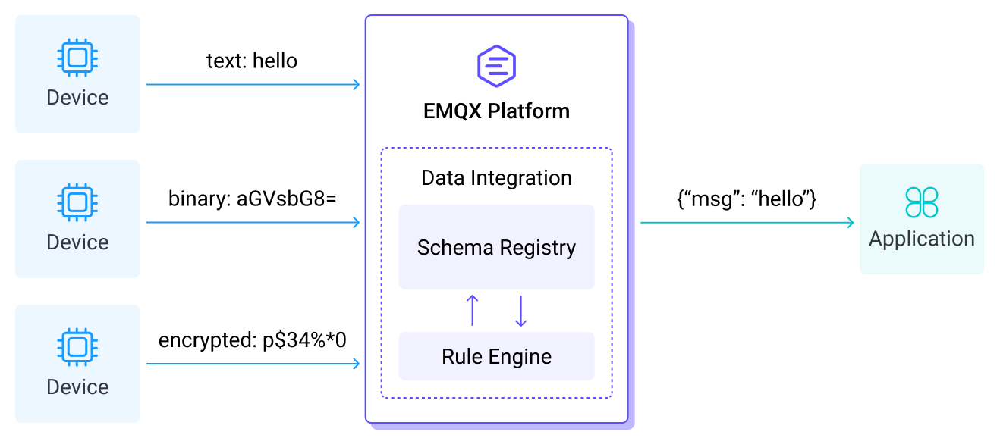
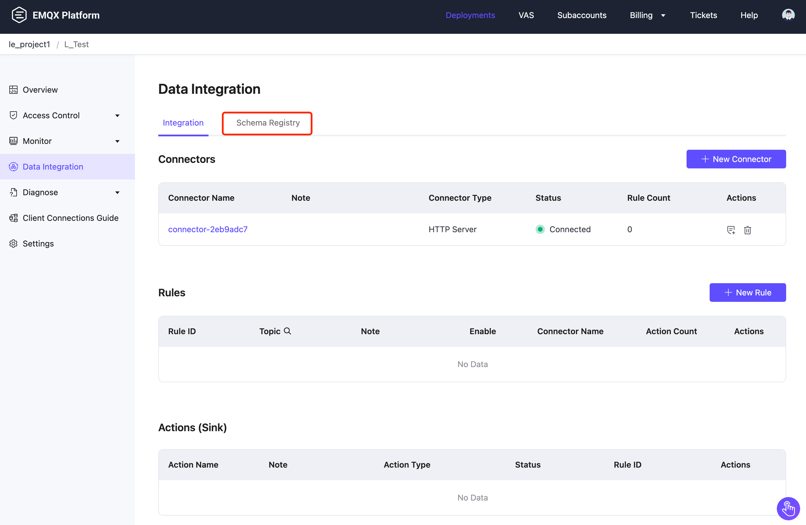
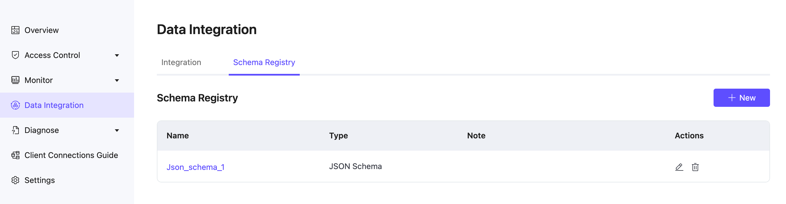

# Schema Registry

The chema Registry provides a centralized schema for managing and validating topic message data, as well as the ability to serialize and deserialize data over the network. publishers and subscribers of MQTT topics can use the Schema to ensure data consistency and compatibility. Codecs are a key component of the rules engine and can be adapted to multiple scenarios of device access and rule design, helping to ensure data quality, compliance, application development efficiency and system performance.

::: warning Note
Schema Registry is only available for **Dedicated** deployments.
:::

## Understand Schema Registry

The Schema defines the structure of the data. It defines the allowed data types, formats, and relationships. A schema is a blueprint for data that describes the structure of a data record, the data types of individual fields, the relationships between fields, and any constraints or rules that apply to the data.

Schemas can be used in a variety of data processing systems, including databases, messaging services, and distributed event and data processing frameworks. They help ensure that data is consistent and accurate, and can be efficiently processed and analyzed by different systems and applications. Data sharing and interoperability between different systems and organizations is facilitated.

Users can define Schema in codecs, users use the defined Schema in rules, in forwarding client data to different data services through data integration. At the same time, you can also send the data in the application or data service to the client through the Schema to realize two-way data flow.

Schema has multiple advantages, including data validation, compatibility checking, version control and iterative evolution. It also simplifies the development and maintenance of data pipelines and reduces the risk of data compatibility issues, data corruption and data loss.

## Create and Manage Schema

In Data Integration，create a [connector](./connectors.md) or a [rule](rules.md) first. Schema Register can be found beside integration tab.

Support to create **Avro**, **Protobuf**, **JSON Schema** format schema, please check the [Schema Documentation](https://docs.emqx.com/en/enterprise/latest/data-integration/schema-registry.html) for details on how to use it.