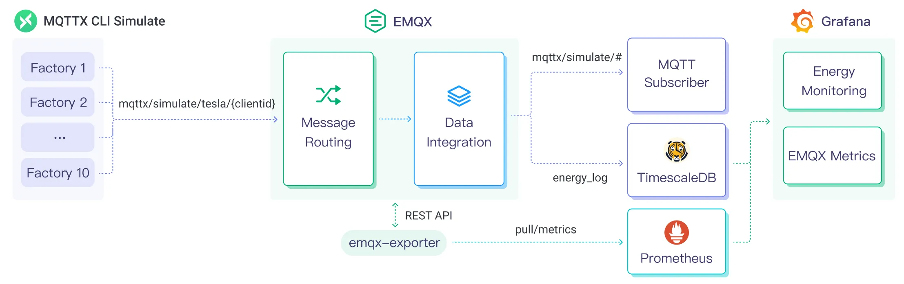
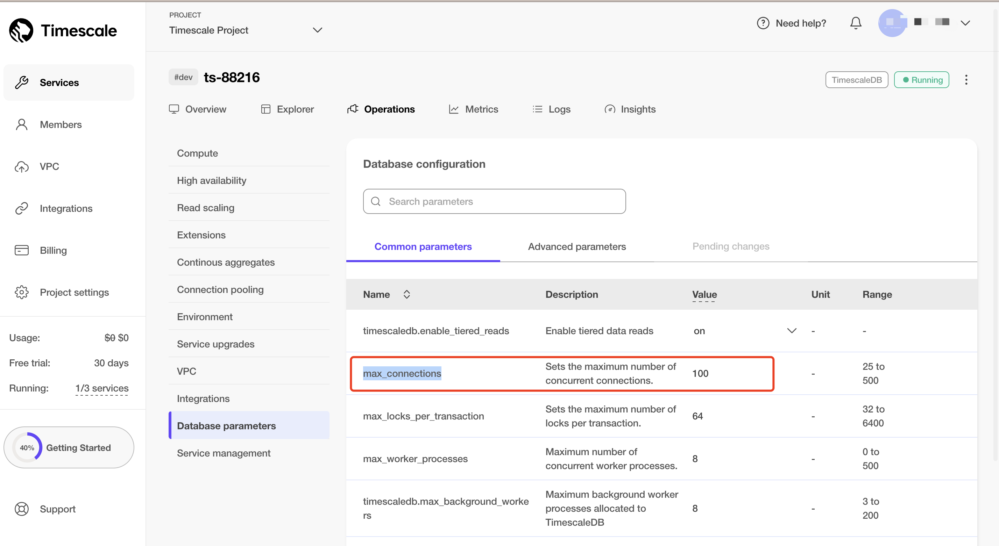

# Stream MQTT Data into TimescaleDB

[TimescaleDB](https://www.amazon.cn/en/TimescaleDB/) (Timescale) is a database specifically designed for storing and analyzing time-series data. Its exceptional data throughput and reliable performance make it an ideal choice for the Internet of Things (IoT) domain, providing efficient and scalable data storage and analysis solutions for IoT applications.

This page provides a detailed introduction to the functional features of TimescaleDB Data Integration and offers practical guidance for creating it. The content includes creating TimescaleDB connectors, creating rules, and testing rules. It demonstrates how to report simulated temperature and humidity data to EMQX Cloud via the MQTT protocol and store the data in TimescaleDB through configured data integration.

## How It Works

TimescaleDB data integration is a built-in feature in EMQX that combines the real-time data capturing and transmission capabilities of EMQX with the data storage and analysis capabilities of TimescaleDB. With a built-in rule engine component, the integration simplifies the process of ingesting data from EMQX to TimescaleDB for storage and analysis, eliminating the need for complex coding.

The diagram below illustrates the typical architecture of EMQX and TimescaleDB data integration in the industrial IoT.



EMQX and TimescaleDB provide a scalable IoT platform for efficiently collecting and analyzing energy consumption data in real-time. In this architecture, EMQX serves as the IoT platform, responsible for device access, message transmission, and data routing, while TimescaleDB acts as the data storage and analysis platform, handling data storage and analysis functions.

EMQX forwards device data to TimescaleDB through the rule engine and Sink. TimescaleDB analyzes the data using SQL statements, generates reports, charts, and other data analysis results, and displays them to users through TimescaleDB's visualization tools. The workflow is as follows:

1. **Message publication and reception**: Industrial devices establish successful connections to EMQX through the MQTT protocol and regularly publish energy consumption data using the MQTT protocol. This data includes production line identifiers and energy consumption values. When EMQX receives these messages, it initiates the matching process within its rules engine.
2. **Rule Engine Processes Messages**: The built-in rule engine processes messages from specific sources based on topic matching. When a message arrives, it passes through the rule engine, which matches it with corresponding rules and processes the message data. This can include transforming data formats, filtering specific information, or enriching messages with context information.
3. **Data ingestion into TimescaleDB**: Rules defined in the rule engine trigger operations to write messages to TimescaleDB. The TimescaleDB Sink provides SQL templates that allow flexible definitions of the data format to write specific message fields to the corresponding tables and columns in TimescaleDB.

After energy consumption data is written to TimescaleDB, you can flexibly use SQL statements to analyze the data. For example:

- Connect to visualization tools such as Grafana to generate charts and display energy consumption data.
- Connect to application systems such as ERP for production analysis and production plan adjustments.
- Connect to business systems to perform real-time energy usage analysis, facilitating data-driven energy management.

## Features and Advantages

The TimescaleDB data integration in EMQX brings the following features and advantages to your business:

- **Efficient Data Handling**: EMQX can handle a large number of IoT device connections and message throughput efficiently. TimescaleDB excels in data writing, storage, and querying, meeting the data processing needs of IoT scenarios without overwhelming the system.
- **Message Transformation**: Messages can undergo rich processing and transformation within EMQX rules before being written to TimescaleDB.
- **Efficient Storage and Scalability**: EMQX and TimescaleDB both have cluster scaling capabilities, allowing flexible horizontal scaling as your business grows to meet expanding demands.
- **Advanced Querying Capabilities**: TimescaleDB provides optimized functions, operators, and indexing techniques for efficient querying and analysis of timestamp data, enabling precise insights to be extracted from IoT time-series data.

## Before You Start

This section introduces the preparatory work needed to create TimescaleDB Data Integration in EMQX Cloud.

### Prerequisites

- Understand [rules](./rules.md).
- Understand [data integration](./introduction.md).

### Set Up Deployment

Before you start, you need to create a deployment (EMQX Cluster) on EMQX Cloud and configure the networking.

- For Professional Plan users: Please create [ VPC Peering Connections](../deployments/vpc_peering.md) first, all IPs mentioned below refer to the internal network IP of the resource (Professional Plan with a [NAT gateway](../vas/nat-gateway.md) can also use public IP to connect to resources).
- For BYOC Plan users: Please establish a peering connection between the VPC where BYOC is deployed and the VPC where the resources are located. All IPs mentioned below refer to the internal IP of the resources. If you need to access the resources via public IP addresses, please configure a NAT gateway in your public cloud console for the VPC where BYOC is deployed.

### Install Timescale and Create Data Table

EMQX Cloud supports integration with self-deployed TimescaleDB or Timescale Service on the cloud. You can use Timescale Service as a cloud service or deploy a TimescaleDB instance using Docker.

#### Create Timescale Service Instance and Table on the Cloud

If you are using TimescaleDB Cloud for the first time, you can refer to the [help document](https://docs.timescale.com/).

1. If you do not have a Timescale account, create an account by referring to [Create your Timescale account](https://docs.timescale.com/getting-started/latest/services/#create-your-timescale-account).
2. Log in to Timescale portal and [Create Timescale service](https://docs.timescale.com/getting-started/latest/services/#create-your-first-service). Save the password for your service.
3. Get the connection information from the service overview page. The fields required by EMQX include **Database name**, **Host**, **Port**, and **Username**.
4. Connect to service with psql client.

    ```bash
    # Connect to service by service URL
    psql "postgres://tsdbadmin@xxxxx.xxxxx.tsdb.cloud.timescale.com:xxxxx/tsdb?sslmode=require"
    ```

5. Create a table `temp_hum` to save the data in the message from the client.

    ```bash
    CREATE TABLE temp_hum (
    up_timestamp   TIMESTAMPTZ       NOT NULL,
    client_id      TEXT              NOT NULL,
    temp           DOUBLE PRECISION  NULL,
    hum            DOUBLE PRECISION  NULL
    );

    SELECT create_hypertable('temp_hum', 'up_timestamp');
    ```

    Insert test data and view it.

    ```bash
    INSERT INTO temp_hum(up_timestamp, client_id, temp, hum) values (to_timestamp(1603963414), 'temp_hum-001', 19.1, 55);

    SELECT * from temp_hum;
    ```

    After the table is successfully created, you can view the information of the table `temp_hum` under the **Explorer** tab in Services.

6. Optimize Timescale Instance Max_Connections

    Access the Timescale instance details page, navigate to `Operations` -> `Database Parameters` -> `Common Parameters`, and increase the maximum number of connections to 100 or higher.

    

#### Install TimescaleDB via Docker and Create a Table

1. If you do not Docker environment, refer to [Install Docker](https://docs.docker.com/get-docker/).

2. Create a TimescaleDB container with Docker, and set the password of the database by POSTGRES_PASSWORD environment variable.

    ```bash
    docker run -d --name timescaledb \
    -p 5432:5432 \
    -e POSTGRES_PASSWORD=public \
    timescale/timescaledb:latest-pg13
    ```

3. Create a database to save the client data.

    ```bash
    docker exec -it timescaledb psql -U postgres

    ## create tsdb database
    CREATE database tsdb;

    \c tsdb;
    ```

4. Create a table `temp_hum` to save the data in the message from the client. This table will be used to save the temperature and humidity data reported by devices.

    ```bash
    CREATE TABLE temp_hum (
    up_timestamp   TIMESTAMPTZ       NOT NULL,
    client_id      TEXT              NOT NULL,
    temp           DOUBLE PRECISION  NULL,
    hum            DOUBLE PRECISION  NULL
    );
    
    SELECT create_hypertable('temp_hum', 'up_timestamp');
    ```

    Insert test data and view it.

    ```bash
    INSERT INTO temp_hum(up_timestamp, client_id, temp, hum) values (to_timestamp(1603963414), 'temp_hum-001', 19.1, 55);
    
    SELECT * from temp_hum;
    ```

## Create a TimescaleDB Connector

Before creating data integration rules, you need to first create a TimescaleDB connector to access the server.

1. Go to your deployment. Click **Data Integration** from the left-navigation menu.
2. If it is the first time for you to create a connector, select **TimescaleDB** under the **Data Persistence** category. If you have already created connectors, select **New Connector** and then select **TimescaleDB** under the **Data Forward** category.
3. On the **New Connector** page, configure the following options:
   - **Server Host**: Enter the host and port for the TimescaleDB service. If you are using docker, use `http://<server-address>:5432`.
   - **Database Name**: Enter the TimescaleDB database name.
   - **Username and Password**: Enter the TimescaleDB username and password. If deployed using Docker, use the following credentials:
     - Database Name: `tsdb`
     - Username: `postgres`
     - Password: `public`
   - **Advanced Settings**: For Connection Pool Size, if you are using TimescaleDB Cloud, set the pool size to 1.
   - You can either use default values for other settings or configure them according to your business requirements.
4. Click the **Test** button. If the TimescaleDB service is accessible, a success prompt will be returned.
5. Click the **New** button to complete the creation.

## Create a Rule

Next, you need to create a rule to specify the data to be written and add corresponding actions in the rule to forward the processed data to TimescaleDB.

1. Click **New Rule** in the Rules area or click the New Rule icon in the **Actions** column of the connector you just created.

2. Enter the rule matching SQL statement in the **SQL editor**. The following SQL example reads the message reporting time `up_timestamp`, client ID, and message body (Payload) from messages sent to the `temp_hum/emqx` topic, extracting temperature and humidity.

   ```sql
    SELECT 
    timestamp div 1000 AS up_timestamp, 
    clientid AS client_id, 
    payload.temp AS temp, 
    payload.hum AS hum

    FROM
    "temp_hum/emqx"
   ````

3. You can use **Enable Test** to simulate data input and test the results.

4. Click **Next** to add an action.

5. Select the connector you just created from the **Connector** dropdown box.

6. In SQL Template, enter the following data to insert them into the SQL template.

   ```sql
    INSERT INTO temp_hum(up_timestamp, client_id, temp, hum) VALUES (to_timestamp(${up_timestamp}), ${client_id}, ${temp}, ${hum})
   ```

    For Advanced settings (optional), see [Advanced Configurations](https://docs.emqx.com/en/enterprise/latest/data-integration/data-bridge-timescale.html#advanced-configurations).

7. Click the **Confirm** button to complete the rule creation.

8. In the **Successful new rule** pop-up, click **Back to Rules**, thus completing the entire data integration configuration chain.

## Test the Rule

You are recommended to use [MQTTX](https://mqttx.app/) to simulate temperature and humidity data reporting, but you can also use any other client.

1. Use MQTTX to connect to the deployment and send messages to the following Topic.

   - topic: `temp_hum/emqx`

   - payload:

     ```json
     {
       "temp": 27.5,
       "hum": 41.8
     }
     ```

2. Check if the message has been forwarded to TimescaleDB.

    In the terminal, use the command below to view data ingested into the Timescale database.

    ```bash
    SELECT * from temp_hum order by up_timestamp desc limit 10;
    ```

    Verify the TimescaleDB table `temp_hum`. New records should be inserted.

3. View operational data in the console. Click the rule ID in the rule list, and you can see the statistics of the rule and the statistics of all actions under this rule.
