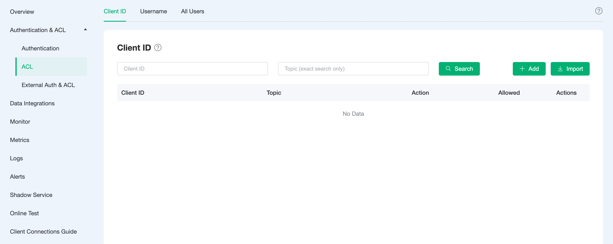
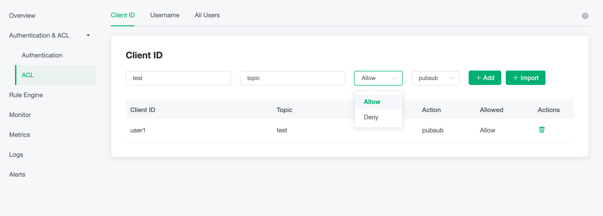
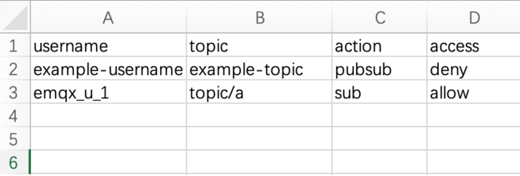
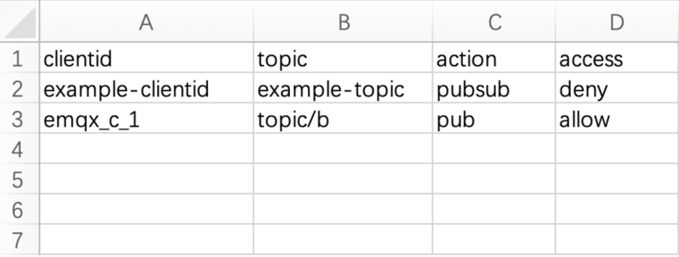
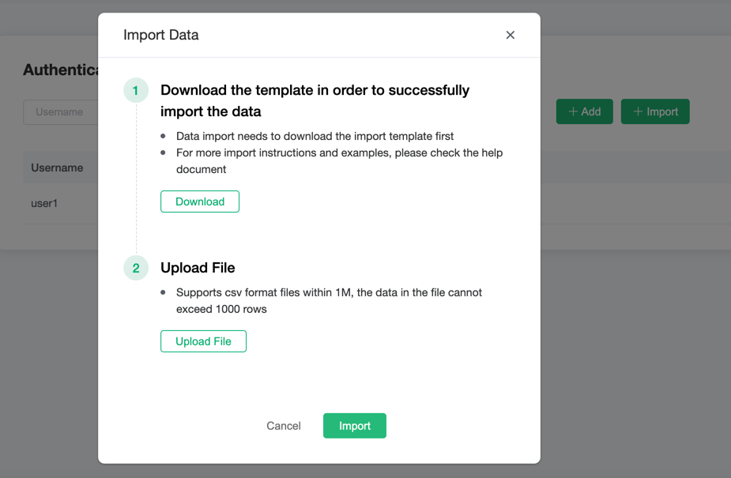

# Access Control

In the `ACL` page of `Authentication & ACL` menu on the left, access control information can be viewed, and the corresponding access control information can be viewed by switching the three granularity at the top.

## Add ACL Information

Fill in the client id, topic, allow/deny, pub/sub/pubsub, and then click `Add`.

You can use the following placeholders in your topic and EMQX Cloud will be automatically populated with client information when requested.

- %u：Username
- %c：Client ID
  

Same process for `Username` and `All Users`.

## Batch Add ACL Information

ACL information can be imported in bulk through CSV files.

> `All Users` are not supported

1. Download the template

2. Fill in the ACL information and submit the file

   The sample template file for `username` is shown below:

   

   The sample template file for `clientid` is shown below:

   

3. Click `import` button

   

## Delete ACL Information

Click the `delete` button to the right of the ACL information to delete the ACL information.
