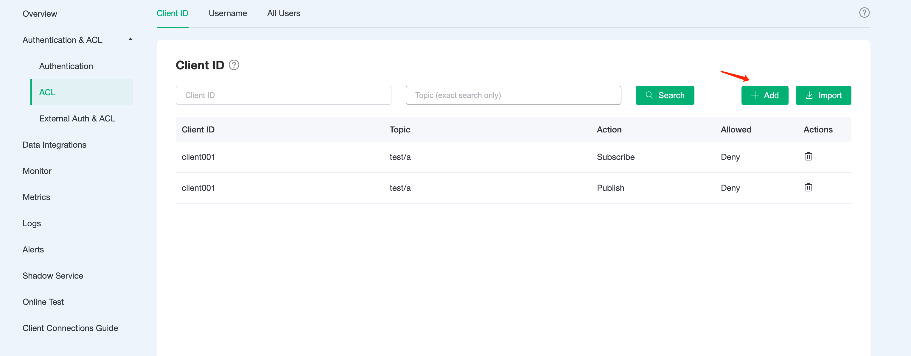

# Access Control

Access control pertains to controlling permissions for publish (PUBLISH) and subscribe (SUBSCRIBE) operations, which can be implemented at three levels:

1. Client ID
2. Username
3. All users: controls permissions for topics without distinguishing between client ID and username.

:::tip TIP

- Access control uses a blacklist mode by default, ACL matching order is: All Users -> User/Client. The mode can be switched to whilelist via [ticket](../feature/tickets.md).  
- The combination of clientid/username + topic is unique, which means that only the latest record for the same clientid/username + topic is considered valid.

:::

## Add ACL Information

Fill in the client id, topic, allow/deny, pub/sub/pubsub, and then click `Add`.

You can use the following placeholders in your topic and EMQX Cloud will be automatically populated with client information when requested.

- %u：Username
- %c：Client ID
  

Same process for `Username` and `All Users`.

## Batch Add ACL Information

ACL information can be imported in bulk through CSV files.

> `All Users` are not supported

1. Download the template

2. Fill in the ACL information and submit the file

   The sample template file for `username` is shown below:

   

   The sample template file for `clientid` is shown below:

   

3. Click `import` button

   

## Delete ACL Information

Click the `delete` button to the right of the ACL information to delete the ACL information.

## Access Control White List Mode

- Using Default Access Control: Click on **Authentication & ACL** -> **ACL** in the left deployment menu. Add an authorization entry for **All Users**, enter # in the topic, select Publish and Subscribe for topic action, and choose Deny to enable white list mode. 
- Using External Access Control：If you need to use external access control, please submit a ticket to contact us.
- After enabling white list mode, all users will be prohibited by default from subscribing and publishing. Authorization information must be set for clients to allow them to subscribe and publish.
