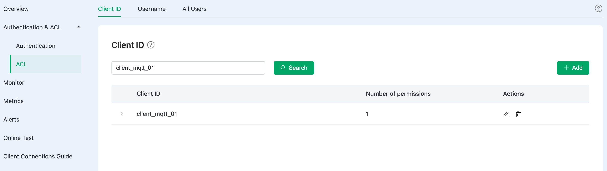
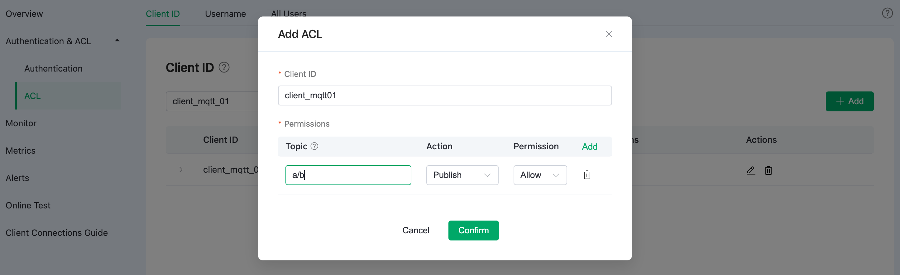

# Access Control

Access control pertains to controlling permissions for publish (PUBLISH) and subscribe (SUBSCRIBE) operations, which can be implemented at three levels:

1. Client ID
2. Username
3. All users: controls permissions for topics without distinguishing between client ID and username.

:::tip TIP

- Access control uses a blacklist mode by default, ACL matching order is: All Users -> User/Client.  
- The combination of clientid/username + topic is unique, which means that only the latest record for the same clientid/username + topic is considered valid.

:::

## View Access Control Policy

Click **Authentication & ACL** -> **ACL** on the left navigation menu. You can switch between the three levels to view corresponding access control policy.

## Add Access Control Policy

For example to add an access control policy for certain clients, you can follow the steps below:

On the **Client ID** tab, click **+ Add**, fill in the **Client ID**, **Topic**, select the action for this target user (**Publish**, **Subscribe**, or **Publish & Subscribe**), then add **Permission** (**Allow** or **Deny**), and then click **Confirm** to complete the addition. 

Placeholders can be used in topics to support dynamic themes. The supported placeholders are as follows:

- ${clientid}
- ${username}

Placeholders can be used as topic segments, like a/b/${username}/c/d.

The above steps also apply to the **Username** and **All Users** tab. 

## Delete Access Control Policy

To delete access control information, simply click the delete icon on the right-hand side of the access control policy.
