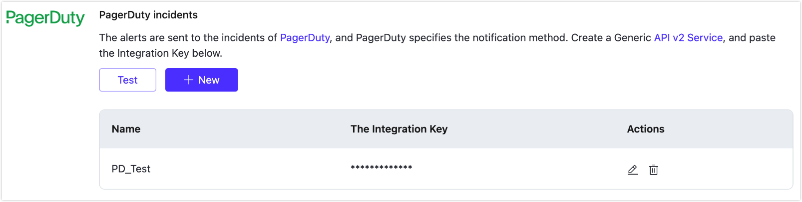

# Alerts

EMQX Platform provides complete alerts reminders and alerts integration, allowing users and operation and maintenance personnel to make corresponding treatment promptly based on these alerts. 

The EMQX Platform provides comprehensive alarm notifications and integrations, allowing users and operations staff to respond promptly to these alarms. Click on **Monitor** -> **Alerts** in the left menu of the deployment to enter the alerts page. In the **Alert List**, you can view the alerts generated by the deployment. In **Alert Integrations**, you can configure the alerts to be sent to an email, or notify via integrated PagerDuty or Webhook events.

## Alerts Event

You can view the alert information generated by deployment. EMQX Platform provides the following alerts events:

| Type                                            | Level   | Information                                                  | Solution                                                     |
| ----------------------------------------------- | ------- | ------------------------------------------------------------ | ------------------------------------------------------------ |
| Excessive connections                           | warning | The number of deployment connections is too high: {current number of connections} | Upgrade deployment specifications                            |
| Excessive Traffic usage                         | warning | The deployment traffic is too high in the past 24 hours: {Total traffic in the past 24 hours} | Check whether the device traffic is normal. If it is normal, you need to upgrade the deployment specifications |
| Certificate expiration warning                  | warning | The deployment certificate will expire in {num} days, please update in time! | Update the deployment certificate in time                    |
| Client authentication failure                   | warning | The deployment has many client connections with failed authentication | Check the client authentication configuration in the deployment |
| Client authorization failure                    | warning | The deployment has many client connections with failed authorization | Check the authorization configuration in the deployment      |
| Non-standard MQTT protocol connection           | warning | The deployment has many client connections with non-standard mqtt protocol | Check whether the MQTT protocol used by the client connection is a standard MQTT protocol |
| Deployment transaction (TPS) rate limit reached | warning | The deployment has exceeded 1000 msg/sec message publishing rate | Adjust the client transmission rate in time                  |
| Unusual VPC peering connection                  | error   | VPC peering connection status is abnormal: {status}          | Check the deployment of VPC peering connection               |
| Data Integrations xxx Resource Exception        | error   | The deployment rule engine xxx resource exception            | Check the MySQL resources in the deployment rule engine      |

## Alerts Integrations

EMQX Platform currently provides email, PagerDuty and Webhook event alerts integrations. If you need other alerts integrations methods, you can submit a ticket or email us.

### Send Alerts to Email

You can add a mailbox that accepts alert information in the page of alerts integrations, send to mailbox. When the deployment generates an alert, an alert reminder will be sent to the mailbox as soon as possible.

You can use the test feature to check if the alert email is configured correctly. Click the **Test** button, then select an email to send a test message.

### PagerDuty Incidents

The alert information is sent to the event of PagerDuty, and PagerDuty specifies the notification method.

1. Create alert service in PagerDuty.

    

2. Add api v2 integration and copy the integration key.
    

3. Fill in the Integration key on EMQX Platform. 
    

4. You can use the test feature to check if the alert event is configured correctly. Click the **Test** button, then select an event to send a test message.

### Webhook Integration

EMQX Platform supports sending alerts to communication software or web services by integrating Webhook.

For more information, see [Webhook Alerts](./alerts_webhook.md).
