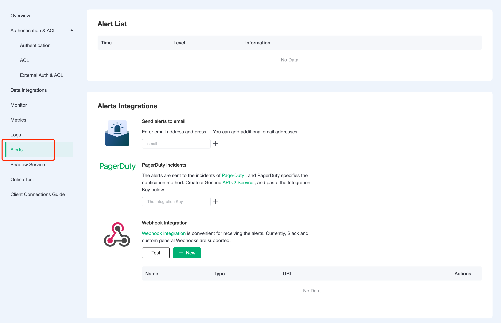
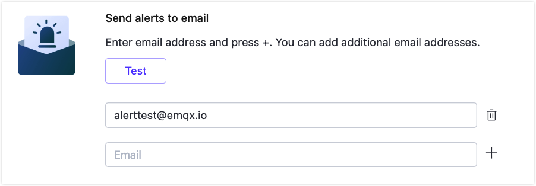

# Alerts

EMQ X Cloud provides complete alerts reminders and alerts integration, allowing users and operation and maintenance personnel to make corresponding treatment promptly based on these alerts. EMQ X Cloud provides the following alerts events:

## Alerts Event

You can view the alert information generated by deployment. EMQ x cloud provides the following alerts events:

| Type                            | Level   | Information                                                  | Solution                                                     |
| ------------------------------- | ------- | ------------------------------------------------------------ | ------------------------------------------------------------ |
| Too many connections            | warning | The number of deployment connections is too high: {current number of connections} | Upgrade deployment specifications                            |
| Excessive Traffic usage         | warning | The deployment traffic is too high in the past 24 hours: {Total traffic in the past 24 hours} | Check whether the device traffic is normal. If it is normal, you need to upgrade the deployment specifications |
| VPC peering connection abnormal | error   | VPC peering connection status is abnormal: {status}          | Check the deployment of VPC peering connection               |
| Certificate expiration warning  | warning | The deployment certificate will expire in {num} days, please update in time! | Update the deployment certificate in time                    |

## Alerts integrations

EMQ X Cloud currently provides email and PagerDuty event alerts integrations. If you need other alerts integrations methods, you can submit a ticket or email us.

### Send to Email

You can add a mailbox that accepts alert information in the page of alerts integrations, send to mailbox. When the deployment generates an alert, an alert reminder will be sent to the mailbox as soon as possible.

### PagerDuty integration
The alert information is sent to the event of PagerDuty, and PagerDuty specifies the notification method.

1. Create alert service in PagerDuty
    

2. Add api v2 integration and copy the integration key
    

3. Fill in the Integration key on EMQ X Cloud
    