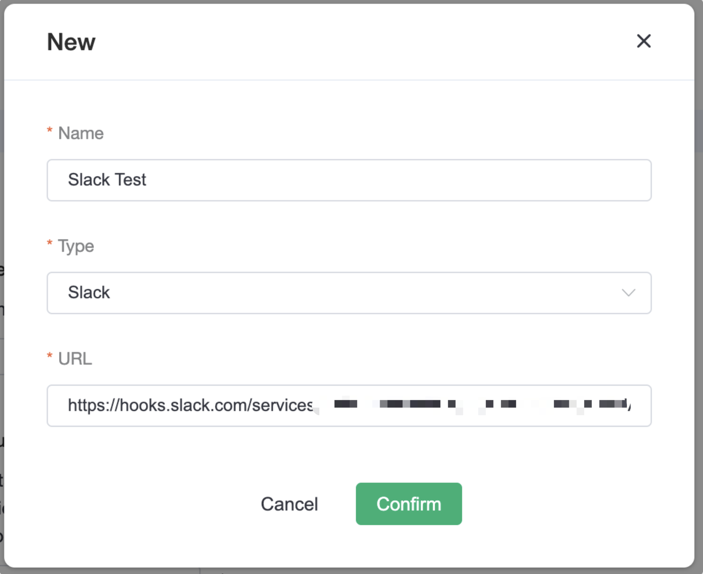

# Webhook Alerts

EMQX Cloud integrates with Webhook, enabling alerts to be sent to IM software or to your own service. Testing whether the Webhook is correctly configured by sending the message through test function.

Now we suppoert Slack and a common webhook from your service.

## Send an alert to Slack
1. Create a Webhook in Slack and get the Webhook URL address. For more information, see [Sending messages using Incoming Webhooks](https://api.slack.com/messaging/webhooks?spm=a2c4g.11186623.0.0.2fa63db5J0PRQp)；
2. Copy the Webhook API address, and in the alarm configuration, select Slack and fill in the name and Webhook address to complete the configuration.
 
3. To verify the configuration, you can use the test function to send a default message to check if the configuration is successful by selecting Slack item.

## Send an alert to a service
We also support sending messages to your own services via Webhook.

1. First you need to set up the service that is able to receive and process requests, select `General Webhook` in the New dialog box.
2. Fill in the New dialog box with the request address for the Webhook service. It is also possible to add additional keys and values for the request header.
 
3. To verify the configuration, you can use the test function to send a default message to check if the configuration is successful by selecting the configured Webhook alarms.