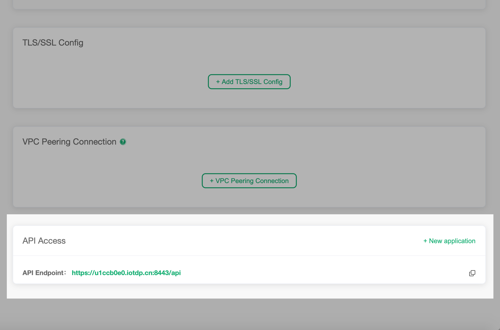
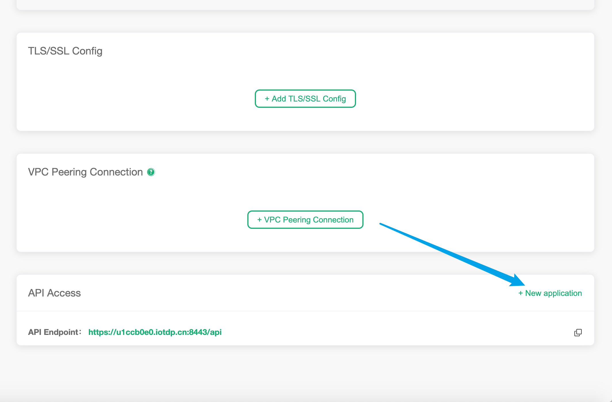
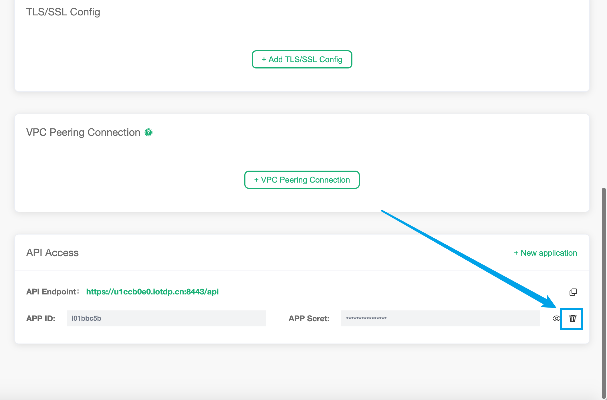

# API access settings

You can use API keys to integrate with external systems, such as querying client information, publishing messages, and creating rules.

You can enter the API management section in the following ways:

1. Login to [EMQ X Cloud console](https://cloud.emqx.io/console)
2. Click to enter the corresponding deployment
3. At the bottom of the page, find the `API Access` module

For how to use the API, you can go to the guide—— [REST API](../api.md)

## Create API key

Click on the `+ New Application` of API access to generate random APP ID and APP Secret

## Delete API key

Click the delete button to the right of each APP key to delete

