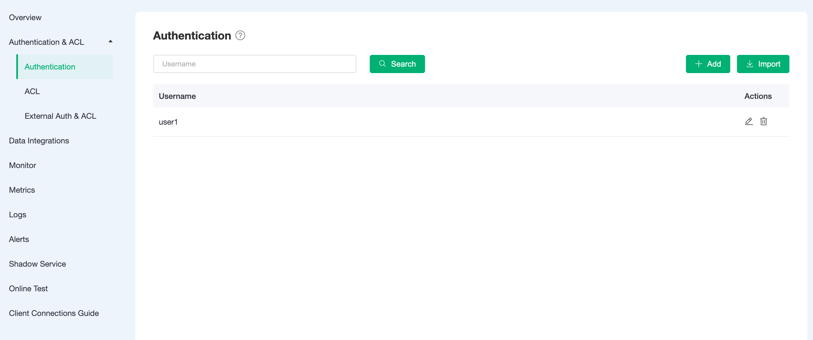
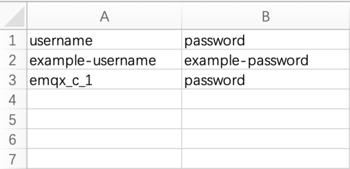
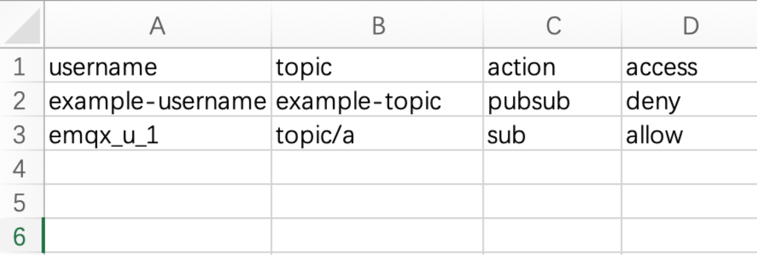

# Authentication & ACL
Authentication is a significant part of most applications. The MQTT protocol supports username and password authentication. Enabling authentication is an effective way to prevent illegal clients from connecting. Authentication in EMQ X Cloud means that when a client connects to the EMQ X Cloud, the configuration on the server-side controls the client's permission to connect to the server.

EMQ X Cloud authentication support includes two levels:
1. The MQTT protocol itself specifies the username and password in the CONNECT message.
2. At the transport level, TLS guarantees client-to-server authentication using client certificates and ensures that the server validates the server certificate to the client.

## Authentication

### Check Authentication Information
Go to the menu on the left and click on the `Authentication` under `Authentication & ACL` to view the authentication information.

### Add Authentication Information
Enter the username and password in the input box at the top of the page, and click the `Add` button to complete the addition of authentication information

### Batch Add Authentication Information
Certification information can be imported in bulk through CSV files.

1. Download the template
2. Fill in the authentication information and submit the file

   The sample template file is shown below:

   

3. Click `import` button

   

### Edit Authentication Information

Click the `edit` button to the right of the authentication information to change the password of the username.

### Delete Authentication Information
Click the `delete` button to the right of the authentication information to delete the authentication information.

## Access Control (ACL)
Authorization refers to the control of permissions on PUBLISH/SUBSCRIBE operations

Access control controls permissions for three granularity:
1. Client ID
2. Username
3. All users: That is, permissions on the topic are controlled without any distinction between client ID and username.

Note: By default, access control is in blacklist mode, and only the latest record is valid for the same clientid/username + topic record.

### View ACL Information
In the `ACL` page of `Authentication & ACL` menu on the left, access control information can be viewed, and the corresponding access control information can be viewed by switching the three granularity at the top.

### Add ACL Information
Fill in the client id, topic, allow/deny, pub/sub/pubsub, and then click `Add`.

Same process for `Username` and `All Users`.

### Batch Add ACL Information
ACL information can be imported in bulk through CSV files.

> `All Users` are not supported

1. Download the template
   
2. Fill in the ACL information and submit the file

   The sample template file for `username` is shown below:

   

   The sample template file for `clientid` is shown below:

   

3. Click `import` button

   

### Delete ACL Information
Click the `delete` button to the right of the ACL information to delete the ACL information.

