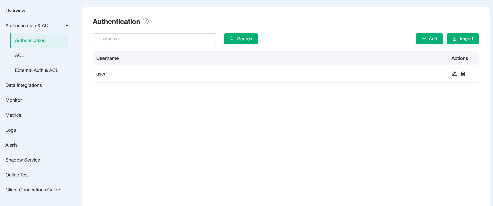
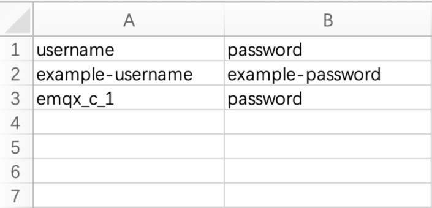
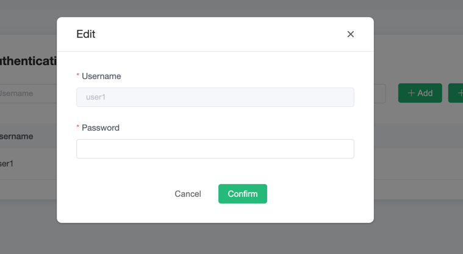
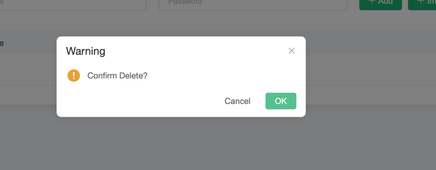

# Authentication

## Check Authentication Information

Go to the menu on the left and click on the `Authentication` under `Authentication & ACL` to view the authentication information.

## Add Authentication Information

Enter the username and password in the input box at the top of the page, and click the `Add` button to complete the addition of authentication information

## Batch Add Authentication Information

Certification information can be imported in bulk through CSV files.

1. Download the template
2. Fill in the authentication information and submit the file

   The sample template file is shown below:

   

3. Click `import` button

   

## Edit Authentication Information

Click the `edit` button to the right of the authentication information to change the password of the username.

## Delete Authentication Information

Click the `delete` button to the right of the authentication information to delete the authentication information.

