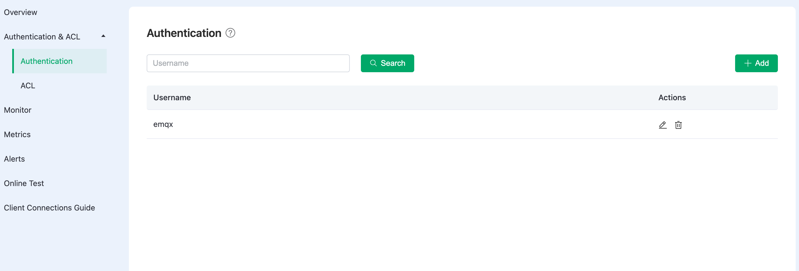
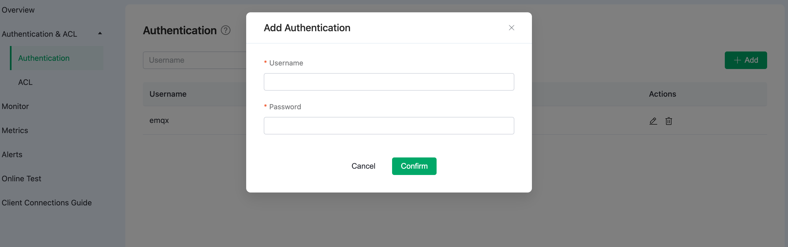
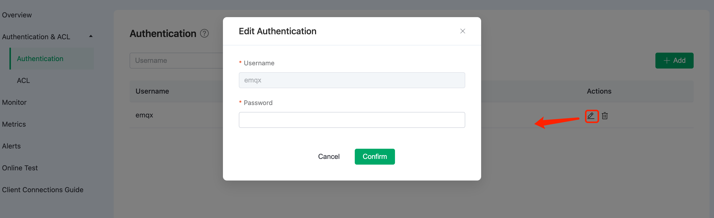

# Authentication in Serverless Plan

## View Authentication Policy

Click **Authentication & ACL** -> **Authentication** on the left navigation menu. 

## Add Authentication Policy

Input **Username** and **Password** in the **Add Authentication** dialog box and click **Confirm** to complete the action.

## Edit Authentication Policy

Click the edit icon to the right of the target authentication policy to change the username and password.

## Delete Authentication Policy

Click the delete icon to the right of the target authentication policy to delete the username and password.

