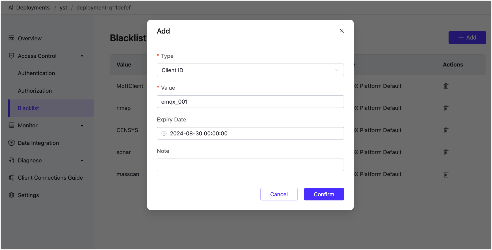

# Blacklist

The blacklist is used to prohibit client connections from being matched and is suitable for restricting a small number of clients. The control of the blacklist will expire after the validity period.

## Add Blacklist

From the left-navigation menu of EMQX Platform Console, select **Access Control** -> **Blacklist**. Click **+ Add** on the top right to add a client to the blacklist.

### Type and Value

The client to be added to the blacklist can be identified by the following types. Select the type and set the value accordingly based on the requirements:

- Client ID: Letters, numbers and some special characters (_, -, /, +, #, $, %, @, & and .), up to 256 characters.
- Username: Letters, numbers and some special characters (_, -, /, +, #, $, %, @, & and .), up to 256 characters.
- Client IP: IPv4 address.

### Expiration Time

The maximum expiration time is 99 year. The minimum expiration time is 5 minutes, and it cannot be earlier than the current time.

::: warning
EMQX Platform comes with a default 'Flapping' protection mechanism. This mechanism aims to protect your broker from potential malicious connection attempts. If a client reconnects more than 120 times within one minute, it will be automatically added to the blacklist. The client ID will be retained in the blacklist for 60 minutes, during which time the specific client ID will be unable to reconnect to your deployment.

If you believe this repetitive behavior is normal for the MQTT client, you can visit the 'Blacklist' in the 'Authentication and Access Control' section and manually remove the client ID from the blacklist.
:::

## Delete Blacklist

In the blacklist list, find the blacklist to be deleted, and click the **Delete** icon in the operation column to delete it.
