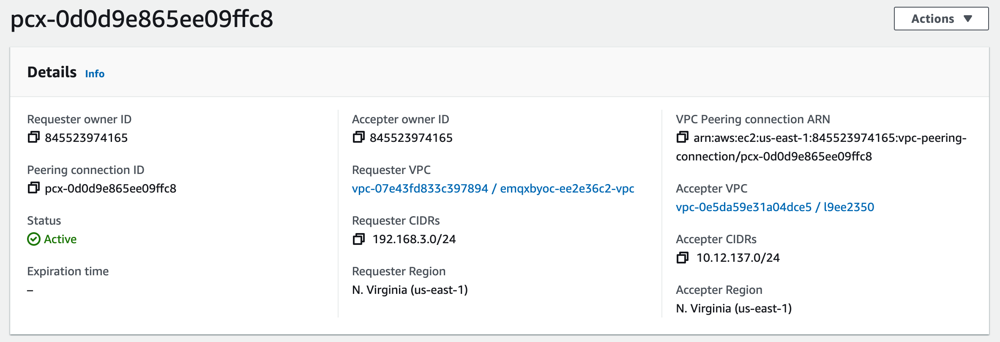
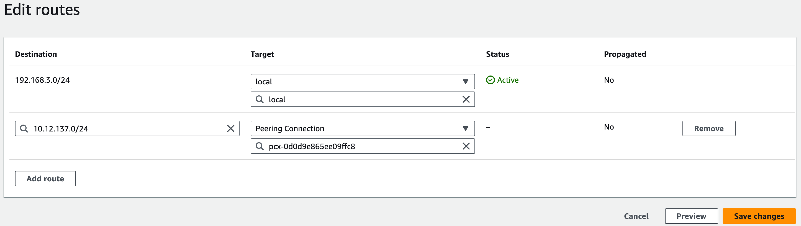
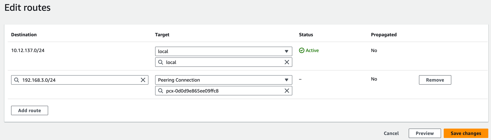
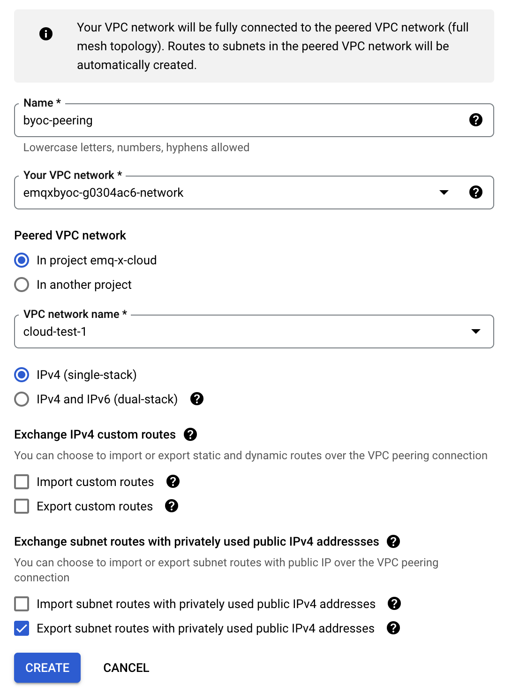
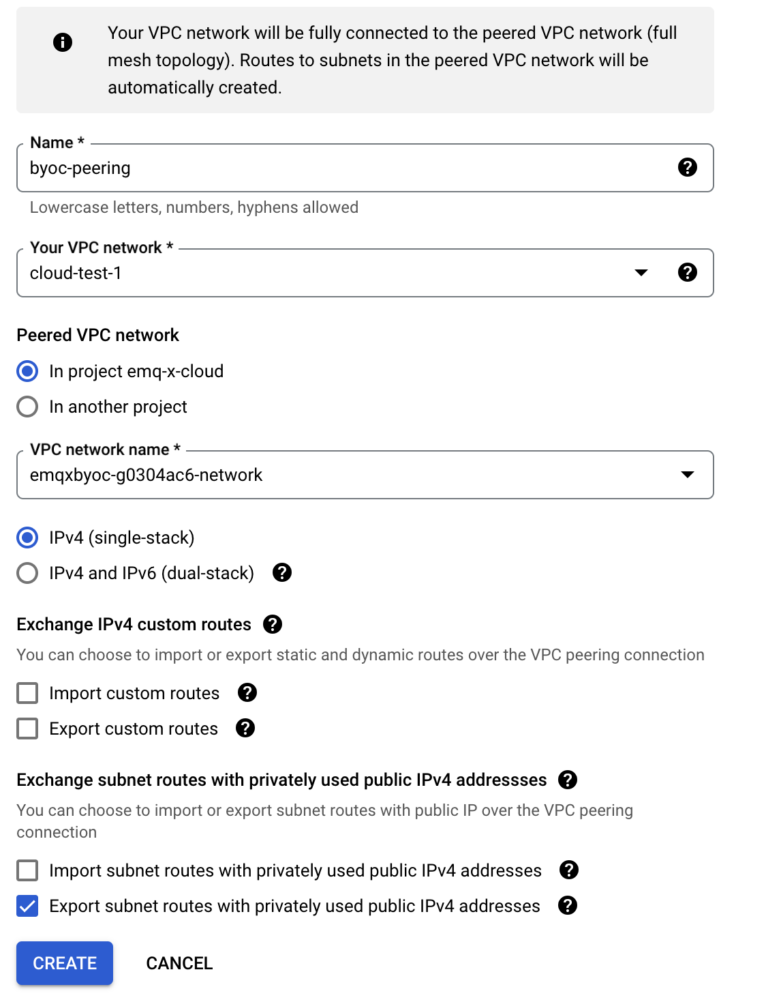

# Create VPC Peering Connections

A Virtual Private Cloud (VPC) peering connection is a networking connection between two VPCs that enables you to route traffic between them privately. Instances in either VPC can communicate as if they are within the same network. 

If you need to transfer data between EMQX Cloud BYOC deployment and other cloud services, you need to configure a peer connection between the VPC where the deployment is located and your other VPCs. This guide describes how to create a peering connection and configure the relevant settings in the cloud platforms when the BYOC is deployed in AWS and Google Cloud Platform.

## Precautions

1. You can create VPC peering connections within the same or different regions. Cross-region peering connections may incur charges.
2. When creating a BYOC deployment, it's essential to consider the CIDR (Classless Inter-Domain Routing). Ensure that the chosen CIDR does not overlap with the CIDR used by the VPC **housing other services**. Make sure to plan your VPC CIDR range accordingly in advance.

## VPC Peering Connection in AWS

This section describes how to create a VPC peering connection and create routing and security group rules in AWS. You can find more about [VPC peering connection](https://docs.aws.amazon.com/vpc/latest/peering/working-with-vpc-peering.html).

::: tip Concepts
- Requester VPC : VPC of BYOC deployment.
- Accepter VPC: VPC where the services are located.
:::

### Create a VPC Peering Connection

1. Open the Amazon VPC console at https://console.aws.amazon.com/vpc/. 

2. In the navigation pane, select **Peering connections**, and then select **Create peering connection**.

3. Configure the peering connection settings, and click **Create peering connection** when you are done:

    * Enter a name for this VPC peering connection.
    * In the **Select a local VPC to peer with** area, configure the following options:
      * **VPC ID (Requester)**: Select the requester VPC in your account with which you want to create the VPC peering connection. It is the VPC where the BYOC deployment is located, with a name like `emqxbyoc-XXXX-vpc`.
      * Save the requestor **VPC CIDRs** for later use.

    * In the **Select another VPC to peer with** area, configure the following options:
      * **Account**: Select `My account`.
      * **Region**: Select `This Region` as the region for the accepter VPC, which means you create VPCs in the same account and Region.
      * **VPC ID (Accepter)**: Select the accepter VPC of the service to which you want to transfer the data.
      * Save the accepter **VPC CIDRs **for later use.

    

4. Select **Actions**, **Accept request**. 

5. When prompted for confirmation, select **Accept request**. The status of VPC peering connection will be **Active**.

6. Save the **Peering connection ID** starting with `pcx-`.

    

7. Select **Modify my route tables now** to add a route to the VPC route table so that you can send and receive traffic across the peering connection. For more information, see [Configure Route Tables](#configure-route-tables).

### Configure Route Tables

#### Requester VPC

1. Open the Amazon VPC console at https://console.aws.amazon.com/vpc/.

2. In the navigation pane, select **Route tables**. 

3. Find the route table of the Requester VPC, with the name `emqxbyoc-xxxx-private-route-table`. Then select **Edit routes**.

4. Click **Add route**, and enter the accepter **VPC CIDRs** in **Destination**. Enter the **Peer Connection ID** beginning with `pcx-` in **Target**.

5. Click **Save changes**.

    

#### Accepter VPC

1. Open the Amazon VPC console at https://console.aws.amazon.com/vpc/.

2. In the navigation pane, select **Route tables**. 

3. Find the route table of Accepter VPC.

4. Click **Add route**, and enter the requester **VPC CIDRs** in **Destination**. Enter the **Peer Connection ID** beginning with `pcx-` in **Target**.

5. Click **Save changes**.

    

### Configure Security Group

1. Open the Amazon VPC console at https://console.aws.amazon.com/vpc/.

2. In the navigation pane, select **Security groups**. 

3. Find the Security group of Requester VPC. In **Inbound rules** section, click **Edit inbound rules**, and add a new rule. Select **All TCP** and add the accepter **VPC CIDRs**.

4. Find the Security group of Accepter VPC. In **Inbound rules** section, click **Edit inbound rules**, and add a new rule. Select **All TCP** and add the requester **VPC CIDRs**.

## VPC Peering Connection in GCP

This section demonstrates how to create a VPC peering connections in GCP. You can find more detailed instructions in [Use VPC Network Peering](https://cloud.google.com/vpc/docs/using-vpc-peering).

1. In the Google Cloud console, go to the **VPC Network Peering** page. 

2. Click **Create connection**, and click **Continue**.

3. Configure Peering Connection for BYOC VPC.
    * In the **Name** field, enter a name for your peering configuration.
    * Under **Your VPC network**, select VPC of BYOC deployment, with a name like `emqxbyoc-xxxx-network`.
    * Select the network to peer with. 
      * If the network that you want to peer with is in the same project, select **In project [NAME-OF-YOUR-PROJECT]** and then the network to peer with. In this demonstration, select `In project emq-x-cloud` and select `cloud-test-1` as VPC network name.
      * If the network that you want to peer with is in a different project, select **In another project**. Specify the project ID that includes the network you want to peer with and the name of the VPC network.
    * You can configure the other options based on your actual situation.
    * Click **Create**.
      

    The status of peering connection will be inactive. You need to set up the peering connection from the target service VPC to complete the connection.

4. Configure Peering Connection for target service VPC.
    * In the **Name** field, enter a name for your peering configuration.
    * Under **Your VPC network**, select VPC of target service.
    * Select `In project emq-x-cloud` as the peered VPC network. 
    * Select the VPC of BYOC deployment, with the name like `emqxbyoc-xxxx-network`.
    * You can configure the other options based on your actual situation.
    * Click **Create**.
    

    After creating the peering connection from both sides, you need to wait for the status of VPC network peering to be active.
