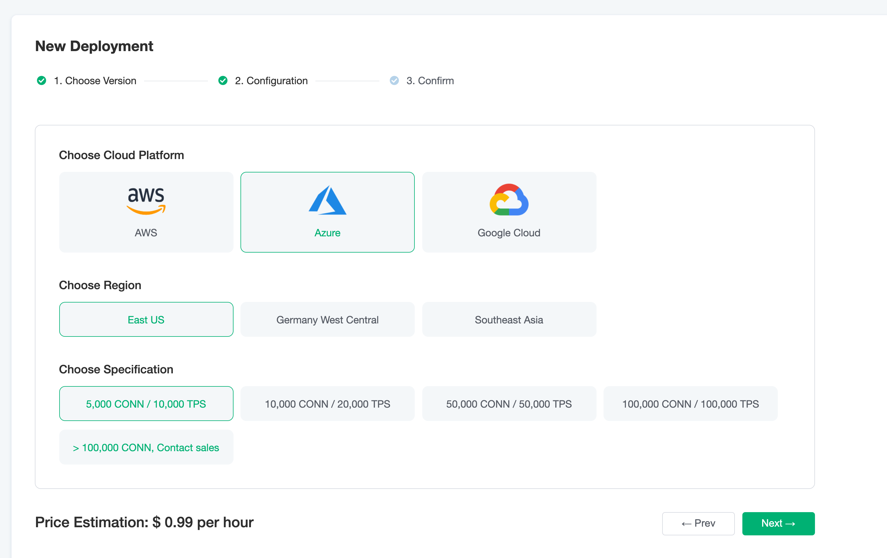

# Price Estimation

EMQ X Cloud pricing calculator allows you to estimate the cost of creating deployments on the EMQ X Cloud based on actual business requirements. EMQ X Cloud pricing calculator is useful for customers who have never used EMQ X Cloud before and who want to reorganize or extend the EMQ X Cloud deployment specifications.

## Visit EMQ X Cloud Price Estimation

- For users who are **unregistered** with EMQ X Cloud, you can go to [Pricing](https://cloud.emqx.io/pricing) page to estimate price.

  

- For users who are **registered** to EMQ X Cloud, you can go to [Price Estimate](https://cloud.emqx.io/console/deployments/0?oper=new) to select plan, use price estimation and create a deployment.

  

## Get the Hourly Price for Deployment

You can select cloud platform, region, and specifications to get the hourly price of deployment.

> Basic Plan: Choose AWS Cloud Platform, US East (N. Virginia) area, the maximum number of connections is 1000, the message upstream and downstream TPS is 1000, the hourly price is 0.18, and the monthly basic cost is: 0.18 * 730 = 131.4.
  
  

## Supported Cloud Service Providers and Regions

EMQ X Cloud currently supports cloud service providers: AWS Cloud. If you need other cloud service providers or regions, you can submit [tickets](../contact.md) or email(cloud@emqx.io) to contact us.

| Platform | Region                                                       |
| -------- | ------------------------------------------------------------ |
| AWS      | US East(N.Virginia), US West(Oregon), EU(Ireland), Asia Pacific(Singapore), Asia Pacific (Mumbai) |
