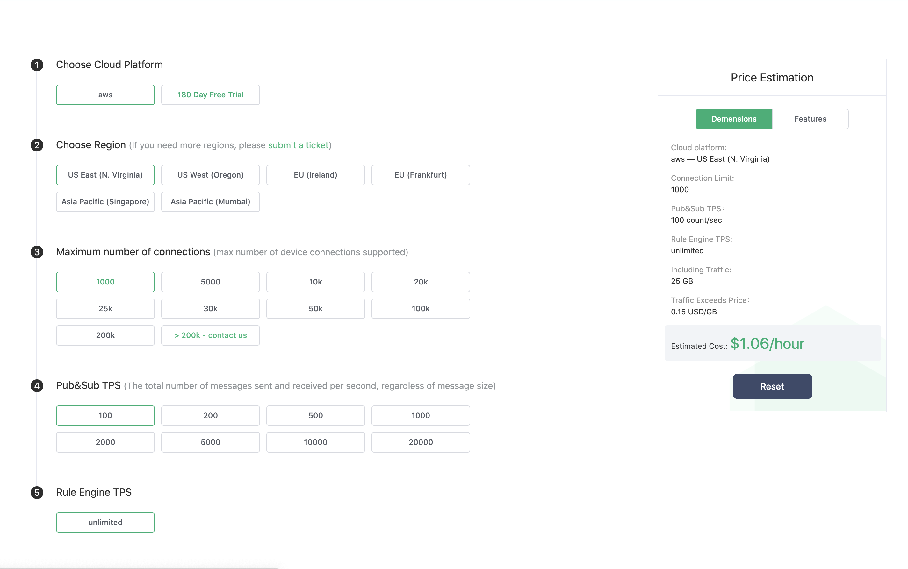
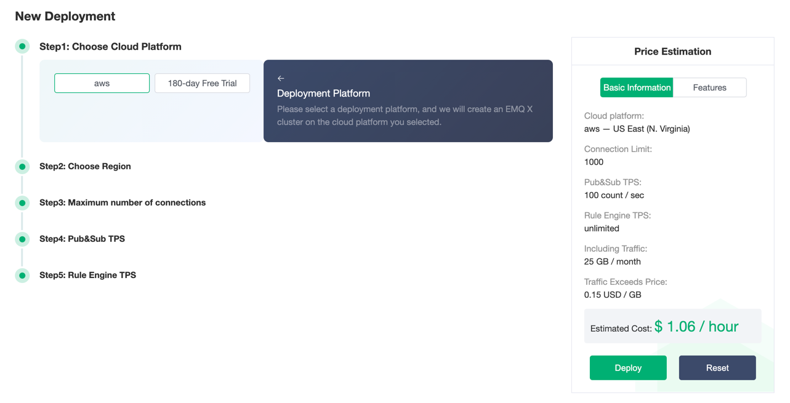

# Price Estimation

EMQ X Cloud pricing calculator allows you to estimate the cost of creating deployments on the EMQ X Cloud based on actual business requirements. EMQ X Cloud pricing calculator is useful for customers who have never used EMQ X Cloud before and who want to reorganize or extend the EMQ X Cloud deployment specifications.

## Visit EMQ X Cloud Price Estimation

- For users who are **unregistered** with EMQ X Cloud, you can go to [Price Estimate](https://cloud.emqx.io/calculator) page to estimate price.

  

- For users who are **registered** to EMQ X Cloud, you can go to [Price Estimate](https://cloud.emqx.io/console/deployments/0?oper=new) to use price estimation and create a deployment.

  

## Get the Hourly Price for Deployment

You can select cloud platform, region, estimated maximum number of connections, peak value of TPS, and TPS of rule engine to get the hourly price of deployment.

> Choose AWS Cloud Platform, US East (N. Virginia) area, the maximum number of connections is 1000, the message uplink and downlink TPS is 100, the hourly price is 1.06, and the monthly basic cost is: 1.06 \* 730 = 773.9.
  
  

## Supported Cloud Service Providers and Regions

EMQ X Cloud currently supports cloud service providers: AWS Cloud. If you need other cloud service providers or regions, you can submit a [tickets](../contact.md) or email(cloud@emqx.io) to get in touch with us.

| Platform | Region                                                       |
| -------- | ------------------------------------------------------------ |
| AWS      | US East(N.Virginia), US West(Oregon), EU(Ireland), Asia Pacific(Singapore), Asia Pacific (Mumbai) |
