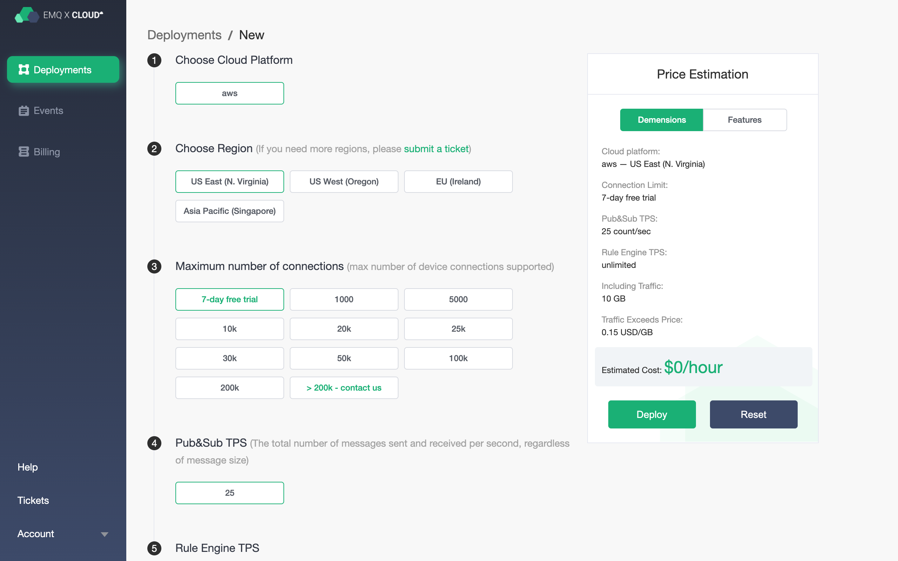
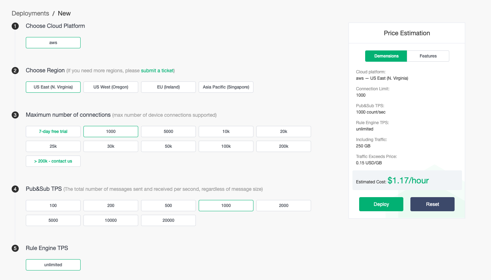

# Price estimatation

The price estimatation of EMQ X Cloud allows you to estimate the cost of creating a deployment on EMQX Cloud based on actual business needs. EMQ X Cloud price estimatation is very useful for customers who have never used EMQ X Cloud before and users who want to reorganize or expand EMQ X Cloud deployment specifications.

## Visit EMQ X Cloud price estimatation

* For users who are **unregistered** with EMQ X Cloud, you can go to [Price Estimate](https://cloud.emqx.io/calculator) to use price estimation.

  

* For users who **log in** to EMQ X Cloud, you can go to [Price Estimate](https://cloud.emqx.io/console/deployments/0?oper=new) to use price estimation and create a deployment.

  

## Get the hourly price for deployment

You can select cloud platform, region, estimated maximum number of connections, and TPS of message uplink and downlink to get the hourly price of deployment.

> Choose AWS Cloud Platform, US East (N. Virginia) area, the maximum number of connections is 1000, the message uplink and downlink TPS is 1000, the hourly price is 1.17, and the monthly basic cost is: 1.17 * 730 = 854.1.

## Supported cloud service providers and regions

EMQ X Cloud currently supports cloud service providers: AWS Cloud. If you need other cloud service providers or regions, you can submit a [ticket](../contact.md) or email(cloud@emqx.io) to get in touch with us.

| Platform     | Region                                |
| ------------ | ------------------------------------- |
| AWS    | US East(N.Virginia), US West(Oregon), EU(Ireland), Asia Pacific(Singapore) |

