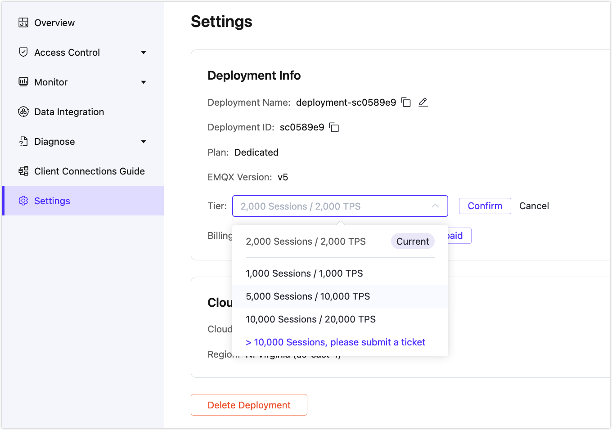

# Change Deployment Tiers

The EMQX Platform allows users to scale up or down their Dedicated/Premium deployments by changing the deployment tiers to handle more or fewer MQTT connections or messages per second, depending on the deployment's needs.

::: tip

Serverless and BYOC deployments do not support changing tiers.

:::

This page provides a guide for changing deployment tiers in the EMQX Platform Console. Access permissions and restrictions are set to ensure secure and controlled scaling operations.

## Overview

The changing tiers feature allows users with the appropriate permissions to:

- Scale their running deployments through the EMQX Platform Console.
- Perform tier-changing actions directly, with limitations in place to prevent frequent changes.
- Roll back tier changes if necessary.

### Feature Availability

This feature is only available for specific deployment types and statuses. Refer to the table below for availability:

| Deployment Type                                     | Scaling Option Availability | Action                                                       |
| --------------------------------------------------- | --------------------------- | ------------------------------------------------------------ |
| Serverless / BYOC                                   | Not Available               | No changing tier option displayed.                           |
| Non-trial Running Dedicated (Hourly Billing Method) | Available                   | Changing tier directly in the Console without submitting a support ticket. |
| Running Dedicated (Annual Prepaid Method)           | Limited                     | **Change Tier** button displayed, prompting ticket submission. |
| Running Premium                                     | Limited                     | **Change Tier** button displayed, prompting ticket submission. |

### Permissions

Only users with root, administrator, or project administrator permissions can access the changing tier option for deployments.

## Change Tier for a Dedicated Deployment

Before your start, make sure your deployment is in the running state.

1. Go to your deployment and click **Settings** from the left menu.

2. Navigate to **Tier**, and click **Change Tier**.

3. Select the desired tier option from the dropdown and click the **Confirm** button next to the dropdown. After selecting the specifications, click **Confirm** to proceed.

   - For the `>10,000 Sessions` option, you have to submit a ticket. You will be redirected to the [Tickets](../feature/tickets.md) page and prompt to fill in the ticket.

   

4. A **Change Tier** pop-up dialogue will appear to prevent unintended actions. Click **Confirm** to initiate the request.

Once confirmed, the request will be sent to the backend, and you will be redirected to the **Deployment Overview** page. A notification will inform you that the scaling process has started. You will receive a prompt when the scaling process is complete.

## Restriction on Changing Tiers

To prevent misuse, changing tiers are limited to **one action per 24 hours**. If you attempt to initiate another changing tier action within this period, an error message will notify you of the restriction.

## Rollback for Changing Tiers

In case of any issues with the scaling change, a rollback option is available through EMQX support. This feature allows you to revert to the previous specifications if problems occur after scaling. [Submit a ticket](../feature/tickets.md#create-a-ticket) if rollback assistance is needed.