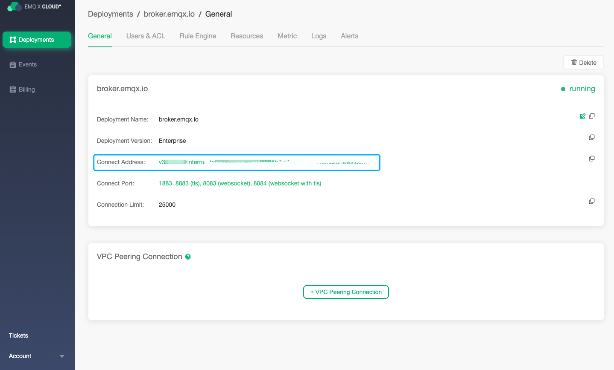
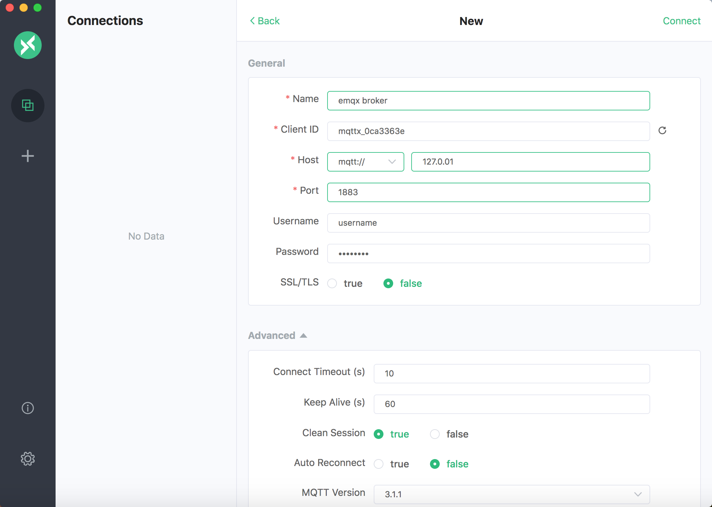
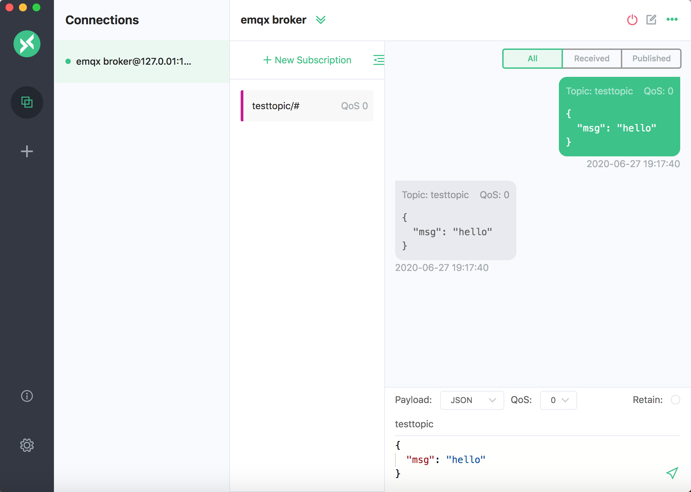

# Deployment Connection Guide

Before connecting to deployment, you need to ensure that the deployment status is `running`.

### Get deployment connection address

The deployment connection address is the load balance address of the cloud platform where the deployment is located.

1. Login [EMQ X Cloud console](https://cloud.emqx.io/console/).
2. Click the deployment you want to connect, and you will enter the deployment details page.
3. Click the Copy button on the right side of the the details page to copy the connection address.

### Add client authentication information

Client authentication is enabled by default for the deployment created by EMQ X Cloud. Therefore, you need to add client authentication information on the **Users & ACL** page before connecting.

1. Login [EMQ X Cloud console](https://cloud.emqx.io/console/).
2. Click the deployment you want to connect, and you will enter the deployment details page.
2. Click Users & ACL, you will be redirected to the Users & ACL page.
3. Enter the user name and password and click the Add button on the right side.
4. View the added information in the list.

### MQTT client connection

You can use [EMQ X Tools](<http://tools.emqx.io/>) or [MQTTX](<https://mqttx.app/>) to connect and test.

> Note: We use EMQ X Tools/MQTTX tools to simplify the connection process. However, you are free to use any tool or method you like to complete the connection test.

####  EMQ X Tools simulates client connection

1. Click Add Connection.

2. Enter the deployment connection information, the client username and password, and click Connect.

   

3. Publish/subscribe test

   

####  MQTTX simulates client connection

1. Click Add Connection button on the right side.

2. Enter the deployment connection information, the client username and password, and click Connect.

   

3. Publish/subscribe test.

   

