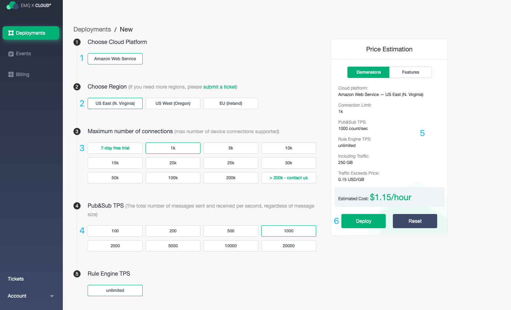
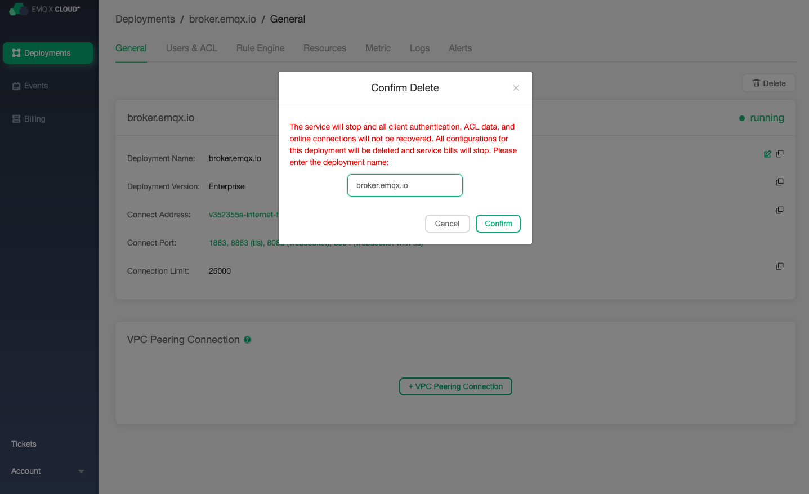

# Create and delete deployments

To manage your deployment, navigate to [EMQ X Cloud Console](https://cloud.emqx.io/console/)

### Create deployments

Before creating a formal deployment, you need to ensure that the account balance is not less than the 24-hour cost of the created deployment. You can complete the balance recharge on the[Payment Overview Page](https://cloud.emqx.io/console/billing/payments).

1. Enter the console, click the New button in the upper right corner, and you will enter the deployment creation page.

2. According to your situation, select the cloud platform, region, maximum number of connections, and message upstream and downstream TPS.

   > Note: Please carefully choose the maximum number of connections and the upstream and downstream TPS of the message, which will affect your actual use later.

3. Check the deployment information in the basic information column on the right side.

4. Click Deploy Now and agree to the EMQ X Cloud Terms of Service, and you will jump to the console deployment page.

5. Wait for the status of deployment to be `running`.

6. Start[deployment connection and test ](./connections.md).

### Delete deployments

Before deleting the deployment, you need to make sure that the status of deployment is `running`.

1. Enter the console, click on the deployment you need to delete, and you will enter the deployment details page.

2. Click the delete button and enter the name of deployment in the pop-up box

   > Note: Deleting the deployment will clear the data of the users and ACL and rules engine and disconnect the online connection. At the same time, we will stop billing of the deployment.

3. Click Confirm to complete the deployment deletion.

