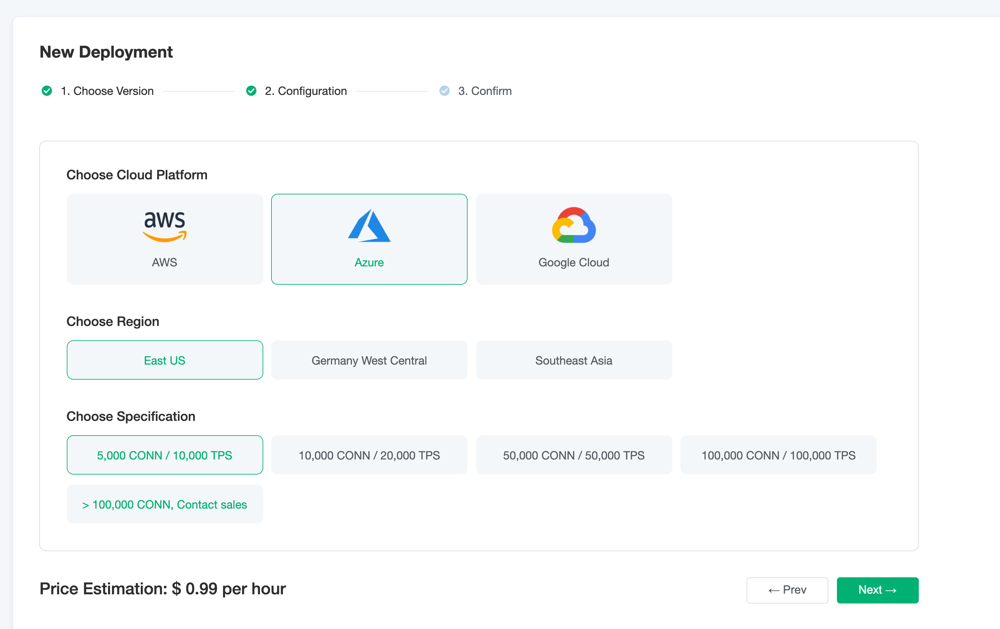

# Create a New Deployment
In this tutorial, you will learn how to create a new EMQ X Cloud deployment. To learn how to delete an existing EMQ X Cloud deployment, please refer to [Delete Deployment](./delete_deployment.md).

## Limitation

* Before the deployment is created, you need to bind credit card payment information in the [Billing](https://cloud.emqxcloud.com/console/billing/overview) page.

## Create Deployment

1. Log in to your account and navigate to EMQ X Cloud [Console](https://cloud.emqxcloud.com/console/).
2. Click the **New** button in the upper right corner to enter the deployment price estimation page.
3. Choose the deployment of the corresponding specifications according to your needs.
   * Choose cloud platform: EMQ X Cloud temporarily supports AWS. If you have other cloud service provider requirements, you can submit a [ticket](../contact.md) or email (cloud@emqx.io) )  us.
   * Select region: EMQ X Cloud temporarily supports AWS (US East(N.Virginia), US West(Oregon), EU(Ireland), Asia Pacific(Singapore)). If you have other regional requirements, you can submit [Ticket](../contact.md) Or contact us via email (cloud@emqx.io).
   * Select the maximum number of connections: For the maximum number of client connections allowed, you can increase or decrease the maximum number of connections through [Upgrade Deployment Specifications](./upgrade_deployment.md) later.
   * Select peak value of TPS: the total number of messages sent and received per second of deployment. You can increase and decrease the message uplink and downlink TPS through [Upgrade Deployment Specifications](./upgrade_deployment.md) later.
4. Check the deployment information in the **Basic Information** column on the right.
5. Click **Deploy** and agree to the EMQ X Cloud Terms of Service. You will be redirected to the console deployment details page.
6. Wait 5 ~ 10 minutes until the deployment status is **running**.
7. You can go to [Connect to Deployment](../connect_to_deployments/introduction.md) to see more ways to connect to deployment.

