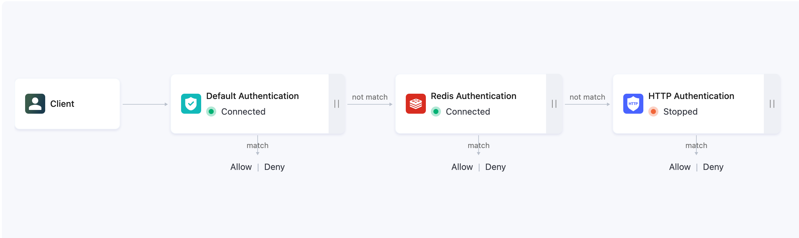

# Extended Authentication

Extended Authentication enables users to utilize their own services for authentication, supporting external databases such as MySQL and Redis as data sources, or connecting to HTTP services for authentication and authorization.

## Extended Authentication Data Sources

[HTTP Authentication](./http_auth.md)

[MySQL Authentication](./mysql_auth.md)

[PostgreSQL Authentication](./pgsql_auth.md)

[Redis Authentication](./redis_auth.md)

[JWT Authentication](./jwt_auth.md)

::: tip

A maximum of 2 extended authentication data sources can be created. 

:::

## Authentication Order

After adding extended authentication data sources, users can sort the authentication sources. On the Extended Authentication page, click **Authentication Order** to enter the sorting page. The deployment will authenticate in the order from left to right, with the default authentication chain order being default authentication -> extended authentication.

- If authentication succeeds, the authentication chain is terminated, and the client is allowed to connect.
- If authentication fails, the authentication chain is terminated, and the client is denied access.
- If the current data source does not match, it moves to the next authentication source for authentication.

Custom authentication chains: Authentication data source icons can be dragged and arranged left and right to organize the order of authentication. 
