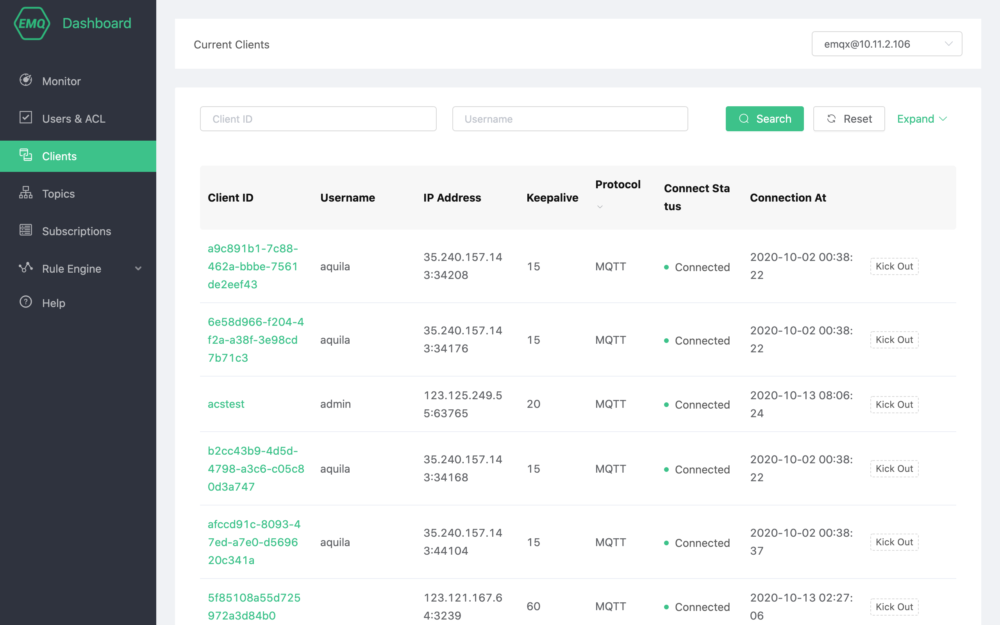
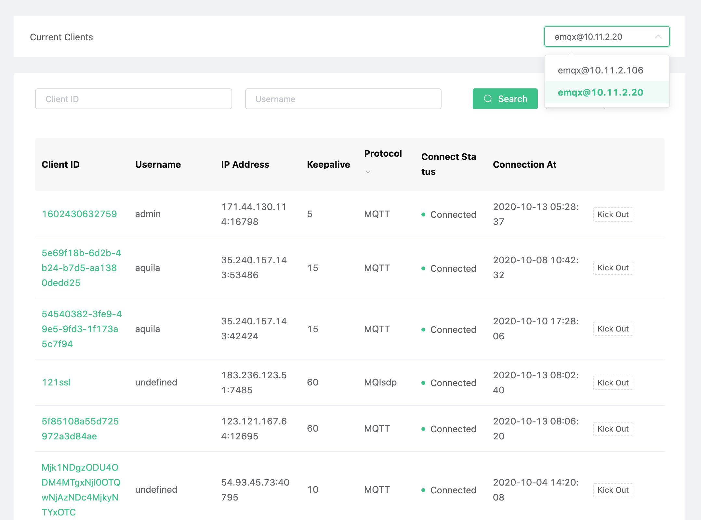
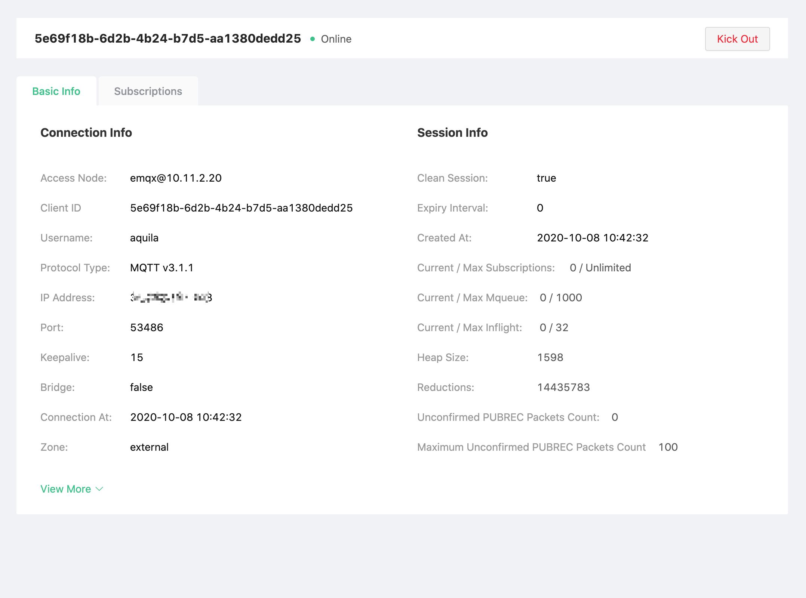
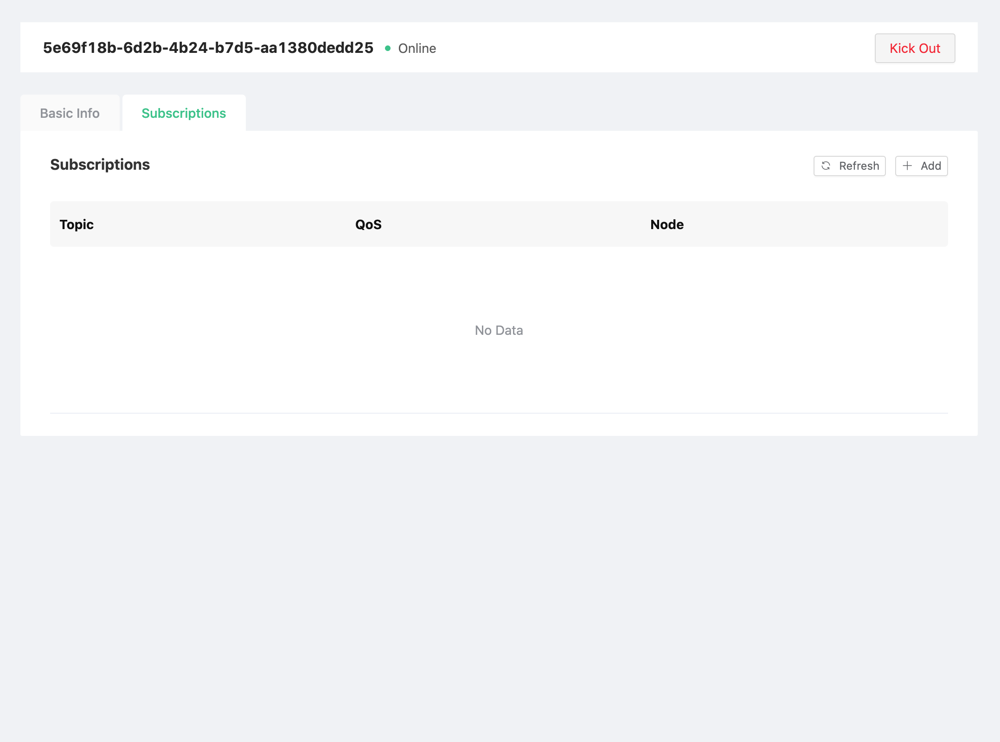
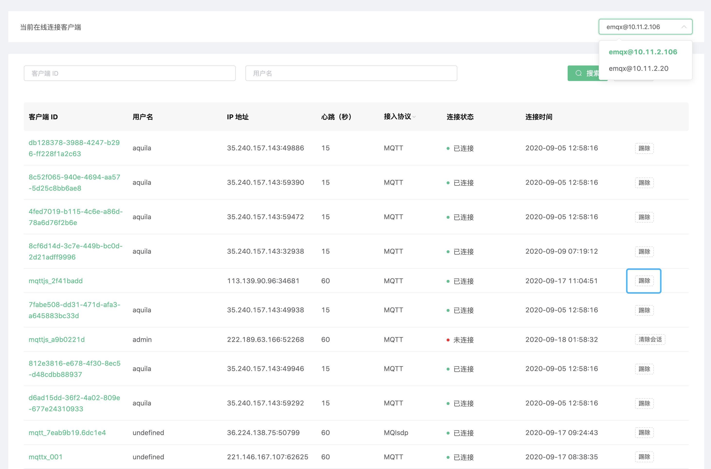

# Client

In EMQ X, the devices that communicate with the EMQ X server through MQTT and other protocols are collectively referred to as the client. You can view the client connection information, subscription list and other information here, and you can kick out the client on the interface.

## Client list

The client list page displays a list of currently connected clients. Click the drop-down list in the upper right corner to see the online status of clients on different nodes. Several important information in the list are as follows:

- Client ID, Username: They refer to MQTT Client ID and MQTT Username respectively, click the green **Client ID** to view client details and subscription list information;
- IP address: client IP + port information;
- Connection status: the online status of the client. If the client has been disconnected, but **Clean Session** is enabled and the session has not expired, it will be displayed here as **not connected**;
- Disconnect/Clear Session: For online clients, the connection will be disconnected and the session will be cleared. If the client is not online, clicking Clear Session will clear the client’s subscription relationship and other session information.

## View basic details of client 

Click the green **Client ID** to view client details. **Basic Information** contains the selected client connection information and session information, including key business information such as message traffic and message statistics.

### View client subscription list

Click the green **Client ID** to view the client subscription list information, and the **Subscription List** contains the following subscription information of the selected client:

- Cancel subscription: Click the cancel button to delete the subscription relationship between the device and the topic, and this operation is insensitive to the device;
- Add subscription: subscribe to the specified topic for the selected client agent.

## Remove the client

On the right side of the client list, you can click the **Remove** button to remove the specified client. There are following precautions for that action:

* The operation of removing the client will terminate the connection and the session together.
* After removing the client, if the client has a reconnection mechanism, it can still continue to connect to the EMQ X cluster

