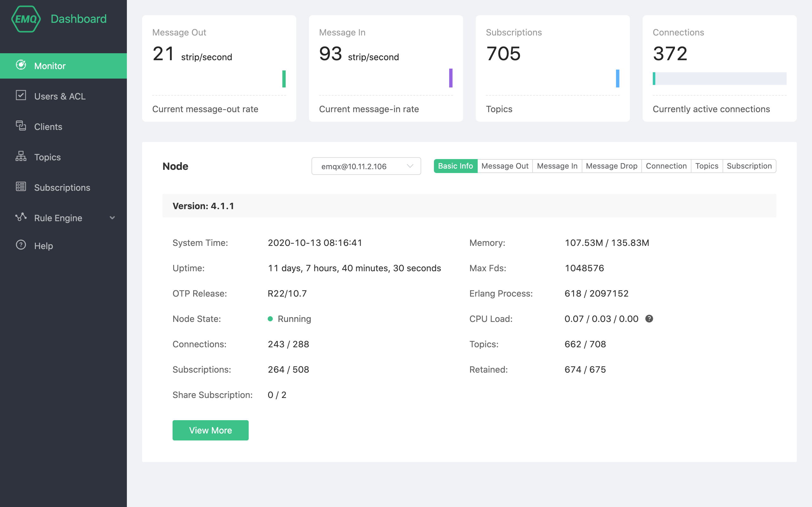
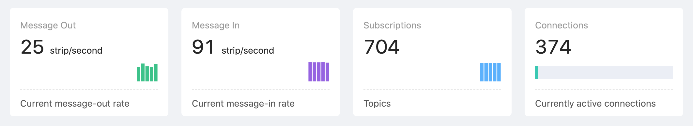
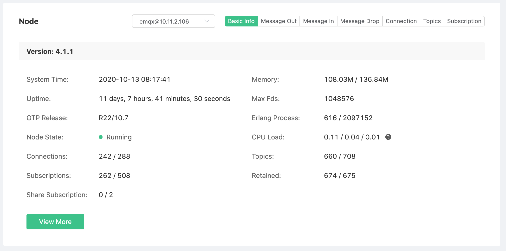
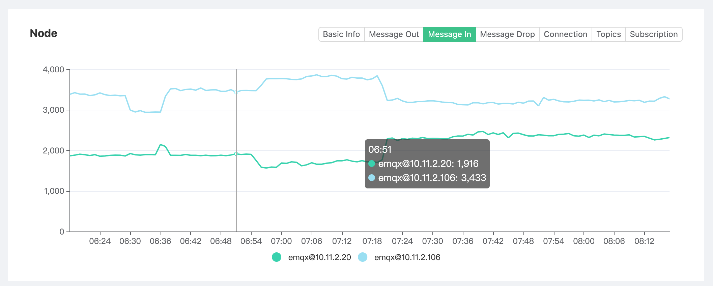
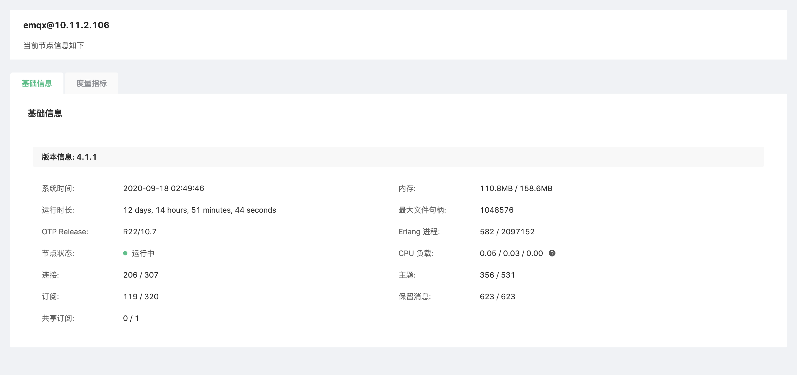

# Monitor

Through monitoring, we can view the running indicators of the current deployment cluster, which allow users and operation and maintenance personnel to understand the current service status based on these indicators.

## Cluster operation indicators

The four indicator cards at the top of the page include the cluster's `message sending rate`, `message inflow rate`, `subscriptions` and `current connections`.

## Node data

Click the node drop-down list to switch to view the basic information of the node, including EMQ X version information, running time, resource occupation, connection and subscription data. Part of the information is explained as follows:

* Memory: The current memory/maximum memory used by the Erlang virtual machine. The maximum memory is automatically applied to the system by EMQ X based on resource usage, not the physical memory of the node server where EMQ X is located so that **Users do not need to intervene**.
* Maximum file handles: The number of file handles that are allowed to be opened by the current session/process. If the value is too small, it will limit the concurrent performance of EMQ X. When it is far less than the maximum number of connections authorized by the license, please refer to the test tuning or contact the EMQ technical staff for modification;
* Erlang process, connection, topic, subscription, retained message, shared subscription: the four values are divided into two groups by /, which are the current value and the maximum value.

## Indicator data

Click the button group on the right side of the **Node Data** area to switch to view the recent cluster operation indicator data chart. The chart values are the actual values during the sampling period.

## Node details

Click the **View Details** button under the node data to jump to the node details, and view the **basic information**, **listener** and connection status of the current node, **metrics** and other information.

