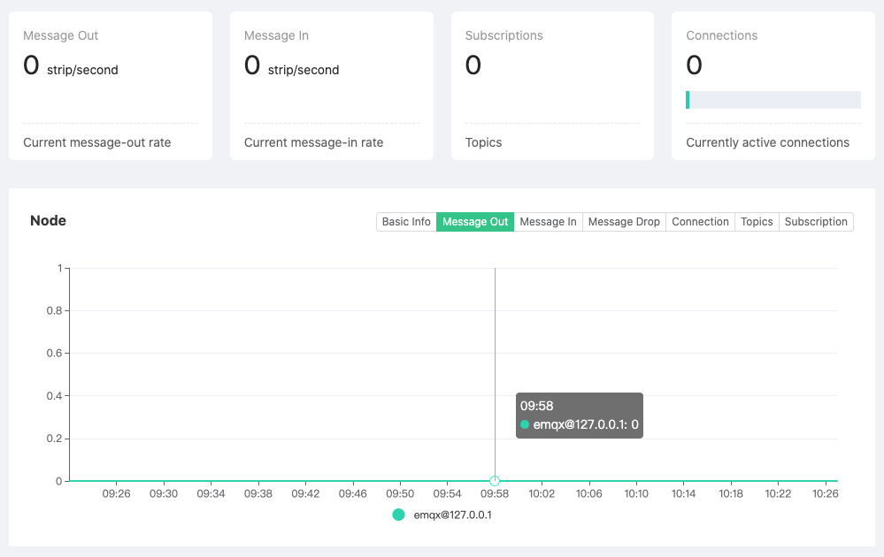

# Monitor

We can view the running indicators of the current deployment cluster by monitor

1. Log in to [EMQ X Cloud console](https://cloud.emqx.io/console/)

2. Click on the deployment for the connection, and you will enter the deployment details page

3. Click the dashboard address in the deployment details page, and you will enter the dashboard

4. Click `monitoring` on the left menu of the dashboard

   

 

### Cluster running indicators

There are four indicator cards at the top of the page, which include the number of messages sent by the **cluster**, the rate of message inflow, the number of subscriptions, and the number of current connections.

### Node data

Click the node drop-down list to switch to view the basic information of the node, including EMQ X version information, running time, resource occupation, connection and subscription data.

### Historical data

Click the button group on the right side of the **Node Data** area to view the recent cluster running data graph, and the graph values are the actual values during the sampling period

 

### Node details

Click the **View Details** button under the node data to jump to the node details to view the **Basic Information**, **Listener** and connection status of the current node, **Metrics** and other information.

